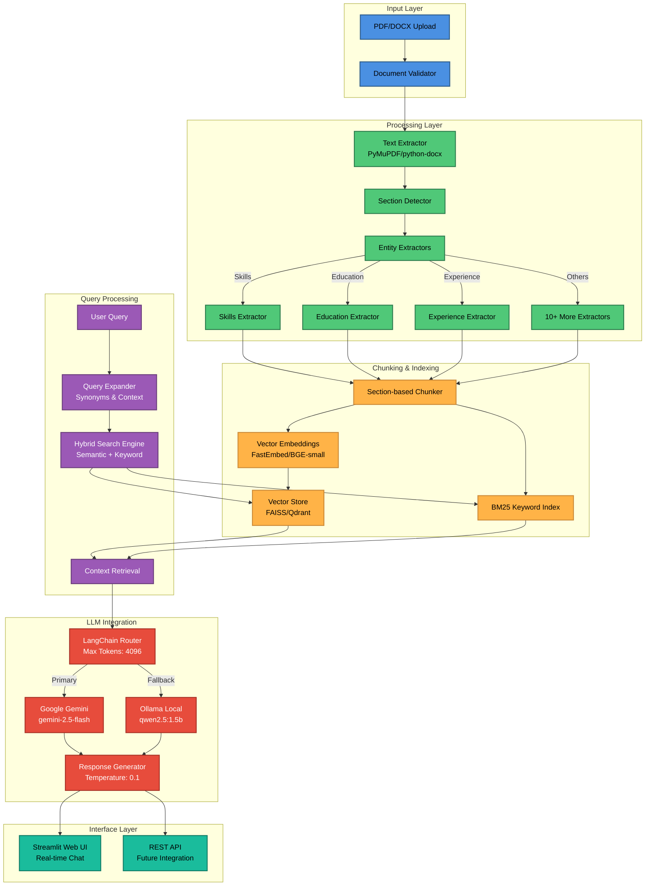

# Resume Analysis Agent

An advanced AI-powered resume analysis system utilizing Retrieval-Augmented Generation (RAG) technology with intelligent document parsing, section-based chunking, and hybrid search capabilities. This system provides comprehensive resume analysis, entity extraction, and natural language querying functionality for HR professionals, recruiters, and talent acquisition teams.

[](https://www.python.org/downloads/)
[](https://opensource.org/licenses/MIT)
[](https://streamlit.io/)
[](https://langchain.com/)

## System Architecture



## Features

### Core Capabilities

- **Multi-format Processing**: PDF and DOCX support with advanced text extraction
- **Intelligent Entity Extraction**: Skills, education, experience, certifications (with level detection and acronym expansion), projects, publications, achievements, activities, and more
- **Extended Response Length**: Up to 4096 tokens per response for comprehensive analysis and detailed answers
- **Real-time Analysis**: Fast processing and querying with optimized parallel document ingestion
- **Web Interface**: User-friendly Streamlit application with interactive chat and session management

### Advanced RAG Features

#### Hybrid Retrieval System
Combines the best of both worlds for superior search accuracy:

- **Enhanced Semantic Search (Dense Retrieval)**: 
  - Uses FastEmbed with BAAI/bge-small-en-v1.5 embeddings (384 dimensions)
  - Asymmetric instruction prefixes: "Represent this resume query/passage for retrieval"
  - FAISS vector similarity search with L2 normalization
  - Multi-metric similarity scoring (cosine, euclidean, dot product ensemble)
  - Understands context and meaning, not just keywords
  
- **Enhanced Keyword Search (Sparse Retrieval)**:
  - BM25Okapi with advanced tokenization pipeline
  - Stop word filtering (24 common words)
  - Simple stemming for morphological variants
  - Protected technical terms (Python, Kubernetes, AWS, etc.)
  - Bigram generation for phrase matching
  - Excellent for technical terms, acronyms, and specific phrases

- **Weighted Fusion Strategy**:
  - Default: 70% semantic + 30% keyword (configurable)
  - Adaptive weights based on query type (technical vs. conceptual)
  - Reciprocal rank fusion for optimal result combination
  - Section-aware boosting (30% boost for target sections)

- **Query Expansion**:
  - Automatically generates 2-3 query variations
  - Synonym and term variation substitution
  - Increases recall without sacrificing precision

- **Diverse Retrieval Guarantee**:
  - Ensures at least one result from every indexed resume
  - Critical for fair candidate comparison queries
  - Prevents high-scoring resumes from dominating results
  - Automatically enabled for comparison/aggregation queries

**Performance**: Maintains sub-second response times through efficient indexing and parallel retrieval.

#### Cross-Encoder Reranking
Two-stage retrieval with intelligent optimization for maximum precision:

- **Stage 1: Bi-Encoder Retrieval**
  - Fast initial retrieval of top N*3 candidates
  - Broad coverage with acceptable accuracy
  
- **Stage 2: Smart Cross-Encoder Reranking**
  - Model: `cross-encoder/ms-marco-MiniLM-L-6-v2`
  - Processes query + document pairs together
  - More accurate scoring (but more expensive)
  - Re-ranks top candidates to surface best matches
  
- **Intelligent Optimization**:
  - **Score Caching**: LRU cache for repeated query-document pairs (max 1000 entries)
  - **Ambiguity Detection**: Skips reranking when scores are clearly separated (CV < 0.5)
  - Can be disabled entirely for faster responses (configurable)

**Trade-off**: Adds ~100-200ms latency for first-time queries, but significantly improved relevance and repeat-query performance.

#### Aggregation & Deduplication
Intelligent result processing for cleaner outputs:

- **Union Aggregation**: 
  - Merges results from multiple resumes
  - Removes duplicates while preserving provenance
  - Use case: "Show all unique skills across candidates"

- **Intersection Aggregation**:
  - Finds common elements across all resumes
  - Groups by resume first, then computes intersection
  - Use case: "What skills do ALL candidates have?"

- **Resume-Level Ranking**:
  - Groups chunks by resume
  - Calculates aggregate scores (sum + average)
  - Returns top N candidates with evidence
  - Includes top 3 most relevant chunks per resume

- **Smart Deduplication**:
  - Jaccard similarity-based (threshold: 0.85)
  - Removes near-duplicate information
  - Keeps highest-scoring version of similar content
  - Reduces noise in multi-resume queries

**Efficiency**: Set-based operations and in-memory processing ensure no performance degradation.

#### Query Understanding & Expansion
Advanced natural language processing for better intent detection:

- **Query Type Classification**:
  - `ranking`: "Who has the most Python experience?"
  - `comparison`: "Compare Java skills between candidates"
  - `aggregation_union`: "List all programming languages"
  - `aggregation_intersection`: "Common skills across all"
  - `filtering`: "Candidates with AWS certification"
  - `exact_match`: "5+ years of experience"
  - `semantic` / `hybrid`: Context-based queries

- **Entity Extraction & Disambiguation**:
  - **Skills**: Python, AWS, Docker, ML, etc.
  - **Roles**: Engineer, Developer, Scientist, Manager
  - **Experience**: Years/months via regex patterns
  - **Education**: Bachelor, Master, PhD, degrees
  - **Certifications**: AWS, Azure, PMP, etc.
  - **Focus Sections**: Determines which resume sections to prioritize

- **Terminology Normalization**:
  - Maps variations to canonical forms
  - Examples: "ml" → "machine learning", "k8s" → "kubernetes", "py" → "python"
  - 50+ term mappings across technical and domain vocabulary
  - Handles acronyms, abbreviations, and synonyms

- **Query Expansion with Synonyms**:
  - Domain-specific synonym dictionary (25+ categories)
  - Technical variations (react/reactjs, docker/containerization)
  - Context-aware replacement (max 2-3 expansions)
  - Preserves original query for hybrid matching

**Adaptive Strategy**: Automatically adjusts search weights, result count, and section filters based on detected query type.

### Multi-LLM Support
- **Google Gemini** (primary): gemini-2.5-flash with 4096 token responses
- **Ollama** (fallback): Local deployment with qwen2.5:1.5b
- **Configurable providers**: Easy to add OpenAI, Anthropic, HuggingFace

## Complete Repository Structure

```
Resume-Analysis-Agent/
├── app/                                   # Core application modules
│   ├── extractors/                        # Specialized entity extractors (13 total)
│   │   ├── achievements_extractor.py      # Awards, honors, recognition extraction
│   │   ├── activities_extractor.py        # Extracurricular activities, volunteer work
│   │   ├── certification_extractor.py     # Professional certifications, licenses
│   │   ├── education_extractor.py         # Educational background, degrees, institutions
│   │   ├── experience_extractor.py        # Work experience, job titles, responsibilities
│   │   ├── hobbies_extractor.py           # Hobbies and personal interests
│   │   ├── hyperlink_extractor.py         # URLs, LinkedIn, portfolio links
│   │   ├── languages_extractor.py         # Spoken/written languages proficiency
│   │   ├── name_extractor.py              # Candidate name identification
│   │   ├── project_extractor.py           # Technical projects, portfolio work
│   │   ├── publications_extractor.py      # Research publications, papers, articles
│   │   ├── skills_extractor.py            # Technical & soft skills, competencies
│   │   └── summary_extractor.py           # Professional summary, objective statements
│   ├── main.py                            # Command-line interface entry point
│   ├── parser.py                          # Main document parsing orchestrator
│   ├── rag_engine.py                      # Advanced RAG with hybrid search
│   ├── streamlit_app.py                   # Web interface application
│   └── utils.py                           # Common utilities and helpers
├── .env                                   # Environment configuration (not in git)
├── .gitignore                             # Git ignore patterns
├── LICENSE                                # MIT license file
├── README.md                              # Project documentation (quick start guide)
├── TECHNICAL_DOCUMENTATION.md             # Comprehensive A-Z technical reference
├── requirements.txt                       # Python dependencies specification
└── setup.py                               # Automated installation & setup script
```

### Core Module Details

**app/main.py** - Command-line interface
- CLI entry point for batch processing
- Non-interactive resume analysis
- Script-based automation support
- Testing and development utilities

**app/parser.py** - Central document processing engine
- Text extraction from PDF/DOCX formats
- Document structure analysis and section detection
- Section-aware semantic chunking with optimal sizes:
  - Skills: 256 tokens with 17% overlap
  - Experience: 512 tokens with 17% overlap  
  - Education/Projects: 384 tokens with 17% overlap
- Parallel entity extraction with ThreadPoolExecutor (max 6 workers)
- Timeout protection (300s) and graceful error handling
- Entity recognition coordination
- Metadata extraction and preservation

**app/rag_engine.py** - Advanced RAG implementation
- Section-aware intelligent chunking with optimal sizes per section type
  - Skills: 256 tokens, Experience: 512 tokens, Education/Projects: 384 tokens
  - 17% overlap for context continuity
- Hybrid search combining enhanced semantic + keyword matching
- Smart cross-encoder reranking with score caching (1000-entry LRU cache)
- Multi-metric similarity ensemble (cosine 50%, euclidean 20%, dot product 30%)
- Diverse retrieval guarantee for fair candidate comparison
- Multi-LLM provider support with fallback mechanisms
- Vector storage and retrieval optimization (FAISS/Qdrant)
- Query expansion with domain-specific synonyms

**app/streamlit_app.py** - Web interface
- Document upload and validation
- Real-time processing status updates
- Interactive chat interface for querying
- Session management with file limits
- Processing history and analytics dashboard

**app/utils.py** - System utilities
- File handling and validation
- Data preprocessing functions
- Configuration management helpers
- Logging and error handling utilities

## Installation & Setup

### Prerequisites

- **Python 3.8+** (recommended: Python 3.10+)
- **4GB+ RAM** (8GB recommended for optimal performance)
- **Internet connection** for model downloads and API access
- **Git** for repository cloning

### Automated Installation (Recommended)

The automated setup script handles all dependencies, environment configuration, and optional components:

```bash
git clone https://github.com/arjun-christopher/Resume-Analysis-Agent.git
cd Resume-Analysis-Agent
python setup.py
```

**Setup Script Features:**
- Automatically installs Python dependencies from `requirements.txt`
- Creates optimized `.env` configuration file
- Sets up required directory structure (`data/uploads`, `data/index`, `data/cache`)
- Optional Ollama installation for local LLM support
- Validates system requirements and Python version
- Downloads and configures embedding models
- Provides interactive configuration prompts

### Manual Installation

For advanced users who prefer manual control:

```bash
# Clone repository
git clone https://github.com/arjun-christopher/Resume-Analysis-Agent.git
cd Resume-Analysis-Agent

# Install dependencies
pip install -r requirements.txt

# Create data directories
mkdir -p data/{uploads,index,cache}

# Setup environment (see Configuration section)
# The setup.py script creates a .env file automatically, or create one manually
```

## Configuration

### Configuration Parameters Reference

| Parameter | Default | Description |
|-----------|---------|-------------|
| `GOOGLE_API_KEY` | *required* | Google AI Studio API key ([Get Here](https://makersuite.google.com/app/apikey)) |
| `LLM_FALLBACK_ORDER` | `google,ollama` | Priority order for LLM providers |
| `LLM_MAX_TOKENS` | `4096` | Maximum tokens in chatbot response (controls response length) |
| `LLM_TEMPERATURE` | `0.1` | LLM creativity level (0.0-1.0, lower is more focused) |
| `MAX_CHUNK_SIZE` | `1000` | Maximum characters per document chunk |
| `SEMANTIC_WEIGHT` | `0.7` | Weight for semantic search (0.0-1.0) |
| `BM25_WEIGHT` | `0.3` | Weight for keyword search (0.0-1.0) |
| `EMBEDDING_BATCH_SIZE` | `32` | Batch size for embedding generation |
| `MAX_FILE_SIZE_MB` | `50` | Maximum upload file size |
| `SIMILARITY_THRESHOLD` | `0.75` | Minimum similarity score for results |

### Setup Script Configuration

The `setup.py` script provides interactive configuration:

- **API Key Setup**: Guides through Google API key configuration
- **LLM Provider Selection**: Choose between Google Gemini, Ollama, or both
- **Performance Tuning**: Optimizes settings based on system resources
- **Directory Structure**: Creates required folders with proper permissions
- **Dependency Validation**: Checks and installs missing packages
- **Model Downloads**: Downloads required embedding models

## Technology Stack

### Core Technologies
- **Python 3.8+**: Primary programming language with async support
- **Streamlit 1.28+**: Web application framework with real-time updates
- **LangChain 0.1+**: LLM integration and prompt management
- **FAISS**: Facebook's vector similarity search engine
- **Qdrant**: Vector database for efficient similarity search
- **FastEmbed**: High-performance embedding generation

### Document Processing
- **PyMuPDF (fitz)**: Advanced PDF parsing with layout preservation
- **python-docx**: Microsoft Word document processing
- **dateparser**: Intelligent date extraction and normalization
- **phonenumbers**: International phone number validation

### Machine Learning & NLP
- **sentence-transformers**: State-of-the-art embedding models
- **transformers**: Hugging Face transformer models
- **spaCy**: Industrial-strength NLP processing (optional)
- **numpy & pandas**: Numerical computing and data manipulation

### Search & Retrieval
- **BM25Okapi**: Probabilistic keyword search ranking
- **FAISS**: Efficient similarity search and clustering
- **Qdrant**: Vector database with filtering capabilities
- **rank-bm25**: Python implementation of BM25 algorithm

### LLM Providers
- **Google Gemini**: Primary LLM with advanced reasoning
- **Ollama**: Local LLM deployment for privacy
- **OpenAI GPT**: Optional integration support
- **Anthropic Claude**: Future integration planned

## Troubleshooting

### Common Issues

**Import Errors**
```bash
# Fix: Ensure all dependencies are installed
pip install -r requirements.txt --upgrade
```

**Google API Key Issues**
```bash
# Verify API key is valid and has proper permissions
# Check quotas at https://console.cloud.google.com/
```

**Ollama Connection Problems**
```bash
# Start Ollama service
ollama serve

# Verify model is pulled
ollama list
ollama pull qwen2.5:1.5b
```

**Memory Issues**
- Reduce `EMBEDDING_BATCH_SIZE` in `.env`
- Increase system swap space
- Process documents in smaller batches

**Slow Performance**
- Enable `CACHE_EMBEDDINGS=true`
- Use SSD storage for vector indices
- Optimize `CHUNK_SIZE` parameters

## Contributing

We welcome contributions! Please see our contributing guidelines:

1. **Fork the repository** and create your feature branch
2. **Make your changes** with proper documentation
3. **Add tests** for new functionality
4. **Run the test suite** to ensure no regressions
5. **Submit a pull request** with a clear description

### Development Guidelines

- Follow PEP 8 style guidelines
- Add type hints for all functions
- Write comprehensive docstrings
- Include unit tests for new features
- Update documentation as needed

## License

This project is licensed under the MIT License - see the [LICENSE](LICENSE) file for details.

## Support

For questions, issues, or feature requests:

- **GitHub Issues**: [Create an issue](https://github.com/arjun-christopher/Resume-Analysis-Agent/issues)
- **Documentation**: 
  - **Quick Start**: This README for installation and basic usage
  - **Technical Reference**: [TECHNICAL_DOCUMENTATION.md](TECHNICAL_DOCUMENTATION.md) - Comprehensive A-Z guide covering:
    - System architecture and design patterns
    - NLP and entity extraction (all 13 extractors)
    - RAG engine internals (embeddings, hybrid search, reranking)
    - LLM integration and prompt engineering
    - Performance optimization and caching strategies
    - Data processing and storage mechanisms
    - API design and interface implementation
    - Testing, debugging, and troubleshooting
  - **Code Documentation**: Inline docstrings in source files

## Disclaimer

**Educational Purpose**: This project was developed for educational and learning purposes to demonstrate the practical application of Retrieval-Augmented Generation (RAG) technology, natural language processing, and AI-powered document analysis.

**Accuracy**: While the system strives for high accuracy in resume parsing and analysis, results may vary depending on:
- Resume format and structure
- Document quality and clarity
- Complexity of content
- Language variations and terminology

**Development Status**: This is an ongoing project that may be upgraded and improved over time. Future enhancements may include:
- Additional extraction capabilities
- Enhanced accuracy and performance
- Support for more document formats
- Advanced AI model integrations
- Extended platform support