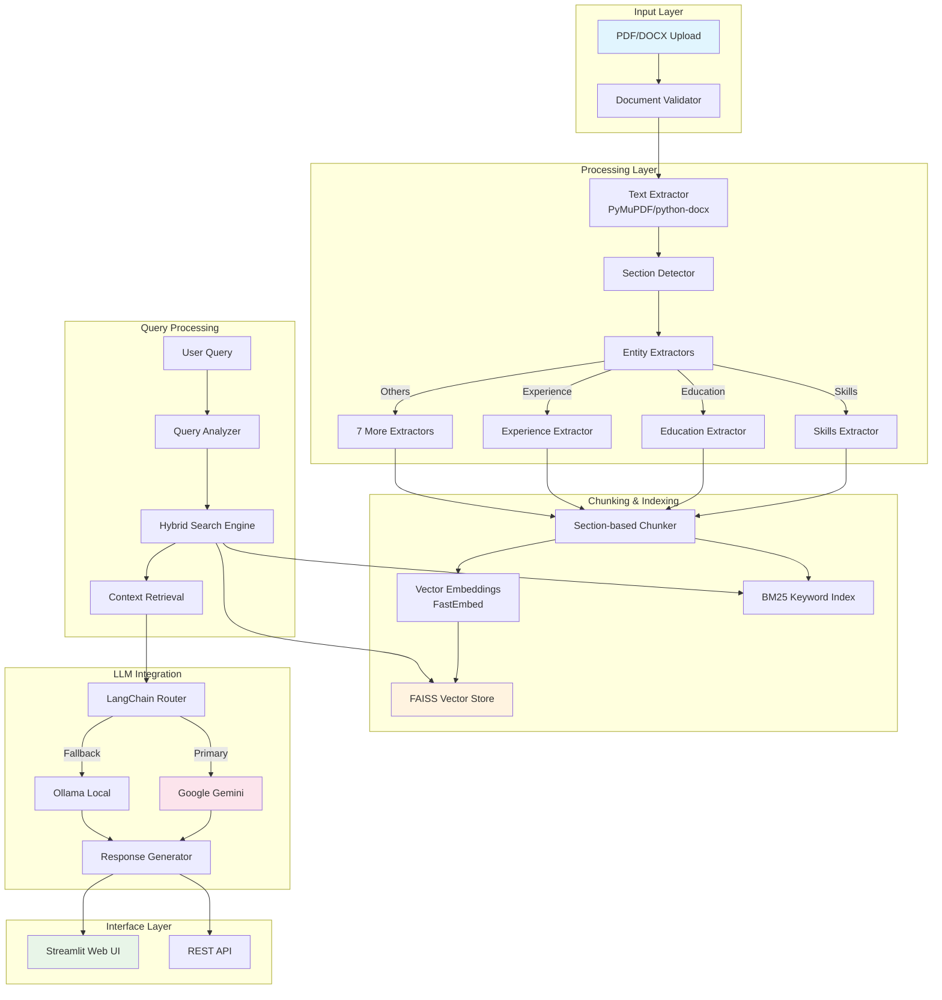

# Resume Analysis Agent

An advanced AI-powered resume analysis system utilizing Retrieval-Augmented Generation (RAG) technology with intelligent document parsing, section-based chunking, and hybrid search capabilities. This system provides comprehensive resume analysis, entity extraction, and natural language querying functionality for HR professionals, recruiters, and talent acquisition teams.

[](https://www.python.org/downloads/)
[](https://opensource.org/licenses/MIT)
[](https://streamlit.io/)
[](https://langchain.com/)

## System Architecture



## Features

- **Multi-format Processing**: PDF and DOCX support with advanced text extraction
- **Intelligent Entity Extraction**: Skills, education, experience, certifications, projects, publications, achievements, activities
- **Hybrid Search**: Combines FAISS semantic search with BM25 keyword matching
- **Multi-LLM Support**: Google Gemini primary, Ollama fallback
- **Real-time Analysis**: Fast processing and querying with sub-second response times
- **Web Interface**: User-friendly Streamlit application

## Complete Repository Structure

```
Resume-Analysis-Agent/
├── app/                                    # Core application modules
│   ├── extractors/                        # Specialized entity extractors
│   │   ├── achievements_extractor.py      # Awards, honors, recognition extraction
│   │   ├── activities_extractor.py        # Extracurricular activities, volunteer work
│   │   ├── certification_extractor.py     # Professional certifications, licenses
│   │   ├── education_extractor.py         # Educational background, degrees, institutions
│   │   ├── experience_extractor.py        # Work experience, job titles, responsibilities
│   │   ├── project_extractor.py           # Technical projects, portfolio work
│   │   ├── publications_extractor.py      # Research publications, papers
│   │   └── skills_extractor.py            # Technical & soft skills, competencies
│   ├── parser.py                          # Main document parsing orchestrator
│   ├── rag_engine.py                      # Advanced RAG with hybrid search
│   ├── streamlit_app.py                   # Web interface application
│   └── utils.py                           # Common utilities and helpers
├── requirements.txt                       # Python dependencies specification
├── setup.py                              # Automated installation & setup script
├── .gitignore                            # Git ignore patterns
├── LICENSE                               # MIT license file
└── README.md                             # Project documentation
```

### Core Module Details

**app/parser.py** - Central document processing engine
- Text extraction from PDF/DOCX formats
- Document structure analysis and section detection
- Entity recognition coordination
- Metadata extraction and preservation

**app/rag_engine.py** - Advanced RAG implementation
- Section-based intelligent chunking
- Hybrid search combining semantic + keyword matching
- Multi-LLM provider support with fallback mechanisms
- Vector storage and retrieval optimization

**app/streamlit_app.py** - Web interface
- Document upload and validation
- Real-time processing status updates
- Interactive chat interface for querying
- Processing history and analytics dashboard

**app/utils.py** - System utilities
- File handling and validation
- Data preprocessing functions
- Configuration management helpers
- Logging and error handling utilities

## Installation & Setup

### Prerequisites

- **Python 3.8+** (recommended: Python 3.10+)
- **4GB+ RAM** (8GB recommended for optimal performance)
- **Internet connection** for model downloads and API access
- **Git** for repository cloning

### Automated Installation (Recommended)

The automated setup script handles all dependencies, environment configuration, and optional components:

```bash
git clone https://github.com/arjun-christopher/Resume-Analysis-Agent.git
cd Resume-Analysis-Agent
python setup.py
```

**Setup Script Features:**
- Automatically installs Python dependencies from `requirements.txt`
- Creates optimized `.env` configuration file
- Sets up required directory structure (`data/uploads`, `data/index`, `data/advanced_rag`)
- Optional Ollama installation for local LLM support
- Validates system requirements and Python version
- Downloads and configures embedding models
- Provides interactive configuration prompts

### Manual Installation

For advanced users who prefer manual control:

```bash
# Clone repository
git clone https://github.com/arjun-christopher/Resume-Analysis-Agent.git
cd Resume-Analysis-Agent

# Install dependencies
pip install -r requirements.txt

# Create data directories
mkdir -p data/{uploads,index,advanced_rag}

# Setup environment (see Configuration section)
# The setup.py script creates a .env file automatically, or create one manually
```

## Configuration

### Configuration Parameters Reference

| Parameter | Default | Description |
|-----------|---------|-------------|
| `GOOGLE_API_KEY` | *required* | Google AI Studio API key ([Get Here](https://makersuite.google.com/app/apikey)) |
| `LLM_FALLBACK_ORDER` | `google,ollama` | Priority order for LLM providers |
| `MAX_CHUNK_SIZE` | `1000` | Maximum characters per document chunk |
| `SEMANTIC_WEIGHT` | `0.7` | Weight for semantic search (0.0-1.0) |
| `BM25_WEIGHT` | `0.3` | Weight for keyword search (0.0-1.0) |
| `EMBEDDING_BATCH_SIZE` | `32` | Batch size for embedding generation |
| `MAX_FILE_SIZE_MB` | `50` | Maximum upload file size |
| `SIMILARITY_THRESHOLD` | `0.75` | Minimum similarity score for results |

### Setup Script Configuration

The `setup.py` script provides interactive configuration:

- **API Key Setup**: Guides through Google API key configuration
- **LLM Provider Selection**: Choose between Google Gemini, Ollama, or both
- **Performance Tuning**: Optimizes settings based on system resources
- **Directory Structure**: Creates required folders with proper permissions
- **Dependency Validation**: Checks and installs missing packages
- **Model Downloads**: Downloads required embedding models

## API Reference

### Core Classes

**AdvancedRAGEngine**
```python
class AdvancedRAGEngine:
    def add_documents(self, documents: List[str], metadata: List[Dict] = None) -> Dict
    def query(self, query: str, k: int = 5, semantic_weight: float = None) -> Dict
    def get_stats(self) -> Dict
    def clear_index(self) -> bool
```

**SectionBasedChunker**
```python
class SectionBasedChunker:
    def chunk_document(self, document: str) -> List[Dict]
    def get_section_boundaries(self, text: str) -> List[int]
```

### Response Format

All query responses follow this standardized format:
```python
{
    "answer": str,                    # Generated response
    "sources": List[Dict],            # Source documents with metadata
    "query": str,                     # Original query
    "processing_time": float,         # Response time in seconds
    "model_used": str,               # LLM model identifier
    "confidence_score": float,       # Answer confidence (0.0-1.0)
    "search_results": List[Dict],    # Raw search results
    "chunk_count": int               # Number of chunks processed
}
```

## Technology Stack

### Core Technologies
- **Python 3.8+**: Primary programming language with async support
- **Streamlit 1.28+**: Web application framework with real-time updates
- **LangChain 0.1+**: LLM integration and prompt management
- **FAISS**: Facebook's vector similarity search engine
- **FastEmbed**: High-performance embedding generation

### Document Processing
- **PyMuPDF (fitz)**: Advanced PDF parsing with layout preservation
- **python-docx**: Microsoft Word document processing
- **dateparser**: Intelligent date extraction and normalization
- **phonenumbers**: International phone number validation

### Machine Learning & NLP
- **sentence-transformers**: State-of-the-art embedding models
- **transformers**: Hugging Face transformer models
- **spaCy**: Industrial-strength NLP processing (optional)
- **numpy & pandas**: Numerical computing and data manipulation

### Search & Retrieval
- **BM25Okapi**: Probabilistic keyword search ranking
- **FAISS**: Efficient similarity search and clustering
- **rank-bm25**: Python implementation of BM25 algorithm

### LLM Providers
- **Google Gemini**: Primary LLM with advanced reasoning
- **Ollama**: Local LLM deployment for privacy
- **OpenAI GPT**: Optional integration support
- **Anthropic Claude**: Future integration planned

## Troubleshooting

### Common Issues

**Import Errors**
```bash
# Fix: Ensure all dependencies are installed
pip install -r requirements.txt --upgrade
```

**Google API Key Issues**
```bash
# Verify API key is valid and has proper permissions
# Check quotas at https://console.cloud.google.com/
```

**Ollama Connection Problems**
```bash
# Start Ollama service
ollama serve

# Verify model is pulled
ollama list
ollama pull qwen2.5:1.5b
```

**Memory Issues**
- Reduce `EMBEDDING_BATCH_SIZE` in `.env`
- Increase system swap space
- Process documents in smaller batches

**Slow Performance**
- Enable `CACHE_EMBEDDINGS=true`
- Use SSD storage for vector indices
- Optimize `CHUNK_SIZE` parameters

## Contributing

We welcome contributions! Please see our contributing guidelines:

1. **Fork the repository** and create your feature branch
2. **Make your changes** with proper documentation
3. **Add tests** for new functionality
4. **Run the test suite** to ensure no regressions
5. **Submit a pull request** with a clear description

### Development Guidelines

- Follow PEP 8 style guidelines
- Add type hints for all functions
- Write comprehensive docstrings
- Include unit tests for new features
- Update documentation as needed

## License

This project is licensed under the MIT License - see the [LICENSE](LICENSE) file for details.

## Support

For questions, issues, or feature requests:

- **GitHub Issues**: [Create an issue](https://github.com/arjun-christopher/Resume-Analysis-Agent/issues)
- **Documentation**: Check this README and inline code documentation
- **Community**: Join discussions in GitHub Discussions