# Technical Documentation: Resume Analysis Agent

## Document Overview

This comprehensive technical documentation covers all aspects of the Resume Analysis Agent system, from foundational concepts to implementation details. The document is structured to be accessible to both beginners and experienced developers.

---

## Table of Contents

### [Section 1: Introduction & Core Concepts](#section-1-introduction--core-concepts)
- [1.1 What is Resume Analysis Agent?](#11-what-is-resume-analysis-agent)
- [1.2 Key Features](#12-key-features)
- [1.3 System Capabilities](#13-system-capabilities)
- [1.4 Technology Stack](#14-technology-stack)
- [1.5 What is RAG?](#15-what-is-rag-retrieval-augmented-generation)
- [1.6 Why RAG for Resume Analysis?](#16-why-rag-for-resume-analysis)
- [1.7 Core NLP Concepts](#17-core-nlp-concepts)
- [1.8 Vector Embeddings Fundamentals](#18-vector-embeddings-fundamentals)
- [1.9 Similarity Metrics](#19-similarity-metrics)
- [1.10 Keyword vs Semantic Search](#110-keyword-vs-semantic-search)

### [Section 2: System Architecture & Design Patterns](#section-2-system-architecture--design-patterns)
- [2.1 High-Level Architecture](#21-high-level-architecture)
- [2.2 Layered Architecture](#22-layered-architecture)
- [2.3 Component Overview](#23-component-overview)
- [2.4 Design Patterns](#24-design-patterns)
- [2.5 Concurrency Model](#25-concurrency-model)
- [2.6 Error Handling Strategy](#26-error-handling-strategy)

### [Section 3: Natural Language Processing & Entity Extraction](#section-3-natural-language-processing--entity-extraction)
- [3.1 Entity Extraction Overview](#31-entity-extraction-overview)
- [3.2 Name Extractor](#32-name-extractor)
- [3.3 Skills Extractor](#33-skills-extractor)
- [3.4 Experience Extractor](#34-experience-extractor)
- [3.5 Education Extractor](#35-education-extractor)
- [3.6 Certification Extractor](#36-certification-extractor)
- [3.7 Project Extractor](#37-project-extractor)
- [3.8 Languages Extractor](#38-languages-extractor)
- [3.9 Summary Extractor](#39-summary-extractor)
- [3.10 Additional Extractors](#310-additional-extractors)
- [3.11 Parallel Extraction Pipeline](#311-parallel-extraction-pipeline)
- [3.12 Confidence Scoring](#312-confidence-scoring)

### [Section 4: RAG Engine & Embedding Generation](#section-4-rag-engine--embedding-generation)
- [4.1 Embedding Model Architecture](#41-embedding-model-architecture)
- [4.2 Model Selection Rationale](#42-model-selection-rationale)
- [4.3 Embedding Generation Process](#43-embedding-generation-process)
- [4.4 Document Chunking Strategy](#44-document-chunking-strategy)
- [4.5 FAISS Vector Database](#45-faiss-vector-database)
- [4.6 Qdrant Vector Database](#46-qdrant-vector-database)
- [4.7 BM25 Keyword Search](#47-bm25-keyword-search)
- [4.8 Hybrid Search Fusion](#48-hybrid-search-fusion)

### [Section 5: Search & Retrieval Mechanisms](#section-5-search--retrieval-mechanisms)
- [5.1 Query Understanding & Classification](#51-query-understanding--classification)
- [5.2 Query Expansion Strategies](#52-query-expansion-strategies)
- [5.3 Cross-Encoder Reranking](#53-cross-encoder-reranking)
- [5.4 Multi-Metric Similarity](#54-multi-metric-similarity)
- [5.5 Diverse Retrieval Algorithm](#55-diverse-retrieval-algorithm)
- [5.6 Result Aggregation & Deduplication](#56-result-aggregation--deduplication)

### [Section 6: LLM Integration & Prompt Engineering](#section-6-llm-integration--prompt-engineering)
- [6.1 LLM Provider Architecture](#61-llm-provider-architecture)
- [6.2 Prompt Engineering](#62-prompt-engineering)
- [6.3 Context Length Management](#63-context-length-management)
- [6.4 Response Generation](#64-response-generation)
- [6.5 Error Handling and Fallbacks](#65-error-handling-and-fallbacks)

### [Section 7: Performance Optimization & Caching](#section-7-performance-optimization--caching)
- [7.1 Caching Strategies](#71-caching-strategies)
- [7.2 Batch Processing](#72-batch-processing)
- [7.3 Index Optimization](#73-index-optimization)
- [7.4 Memory Management](#74-memory-management)
- [7.5 Performance Monitoring](#75-performance-monitoring)

### [Section 8: Data Processing & Storage](#section-8-data-processing--storage)
- [8.1 File Upload and Validation](#81-file-upload-and-validation)
- [8.2 Text Extraction](#82-text-extraction)
- [8.3 Vector Database Storage](#83-vector-database-storage)
- [8.4 FAISS Index Storage](#84-faiss-index-storage)
- [8.5 Cache Management](#85-cache-management)
- [8.6 Data Cleanup and Retention](#86-data-cleanup-and-retention)
- [8.7 Backup and Recovery](#87-backup-and-recovery)

### [Section 9: API Design & Interface Layer](#section-9-api-design--interface-layer)
- [9.1 Streamlit Application Architecture](#91-streamlit-application-architecture)
- [9.2 File Upload Interface](#92-file-upload-interface)
- [9.3 Chat Interface](#93-chat-interface)
- [9.4 Document Management Interface](#94-document-management-interface)
- [9.5 Configuration Interface](#95-configuration-interface)
- [9.6 Error Handling and User Feedback](#96-error-handling-and-user-feedback)
- [9.7 Graceful Shutdown](#97-graceful-shutdown)

### [Section 10: Testing, Debugging & Troubleshooting](#section-10-testing-debugging--troubleshooting)
- [10.1 Testing Strategy](#101-testing-strategy)
- [10.2 Debugging Techniques](#102-debugging-techniques)
- [10.3 Common Issues and Solutions](#103-common-issues-and-solutions)
- [10.4 Error Tracking](#104-error-tracking)
- [10.5 Health Checks](#105-health-checks)
- [10.6 Performance Benchmarks](#106-performance-benchmarks)
- [10.7 Troubleshooting Checklist](#107-troubleshooting-checklist)
- [10.8 Documentation and Knowledge Base](#108-documentation-and-knowledge-base)
- [10.9 Best Practices Summary](#109-best-practices-summary)

### [Conclusion](#conclusion)

---

## Section 1: Introduction & Core Concepts

### 1.1 What is Resume Analysis Agent?

The Resume Analysis Agent is an AI-powered system that processes, analyzes, and queries resume documents using advanced Natural Language Processing (NLP) and Retrieval-Augmented Generation (RAG) techniques. It allows users to upload multiple resumes and perform intelligent queries such as:
- "Which candidate has the most Python experience?"
- "Compare AWS certifications across all candidates"
- "List all candidates with machine learning skills"

### 1.2 Fundamental Technologies

#### 1.2.1 Natural Language Processing (NLP)

NLP is the technology that enables computers to understand, interpret, and generate human language. In this system, NLP is used for:

**Text Extraction:**
- Converting PDF/DOCX files into machine-readable text
- Preserving document structure and formatting information
- Handling multi-column layouts and complex formatting

**Named Entity Recognition (NER):**
- Identifying names, organizations, locations, dates
- Extracting specific information types (skills, certifications, education)
- Understanding context and relationships between entities

**Libraries Used:**
- `spaCy`: Industrial-strength NLP pipeline for entity recognition
- `transformers`: State-of-the-art transformer models (BERT-based NER)
- `dateparser`: Intelligent date parsing and normalization
- `phonenumbers`: International phone number validation

#### 1.2.2 Retrieval-Augmented Generation (RAG)

RAG is a technique that combines information retrieval with language generation to provide accurate, contextual responses.

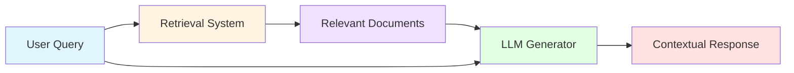

**How RAG Works:**

1. **Indexing Phase:**
   - Documents are split into smaller chunks
   - Each chunk is converted to a numerical vector (embedding)
   - Vectors are stored in a searchable index

2. **Retrieval Phase:**
   - User query is converted to a vector
   - System finds most similar document chunks
   - Relevant context is retrieved

3. **Generation Phase:**
   - Retrieved context + user query → LLM
   - LLM generates informed response using context
   - Response is grounded in actual document content

**Benefits:**
- Reduces hallucination (making up information)
- Provides source attribution
- Handles large document collections
- Updates without retraining models

#### 1.2.3 Vector Embeddings

Embeddings are numerical representations of text that capture semantic meaning.

**Concept:**
```
Text: "Python programming"
Embedding: [0.234, -0.123, 0.456, ..., 0.789]  # 384-dimensional vector
```

**Properties:**
- Similar meanings → Similar vectors
- "Python developer" ≈ "Python programmer" (cosine similarity: 0.92)
- "Python developer" ≠ "Java developer" (cosine similarity: 0.43)

**Model Used:**
- `BAAI/bge-small-en-v1.5`: 384-dimensional embeddings
- Optimized for retrieval tasks
- Balances quality and speed

#### 1.2.4 Hybrid Search

Combines two complementary search approaches:

**Semantic Search (Dense Retrieval):**
- Uses vector embeddings
- Captures meaning and context
- Example: "ML engineer" matches "machine learning specialist"

**Keyword Search (Sparse Retrieval):**
- Uses BM25 algorithm (Best Match 25)
- Exact term matching
- Example: "AWS-123" matches exactly "AWS-123"

**Fusion Strategy:**
```
Final Score = (0.7 × Semantic Score) + (0.3 × Keyword Score)
```

### 1.3 System Requirements

#### 1.3.1 Software Requirements

**Core Runtime:**
- Python 3.8+ (recommended: 3.10+)
- Operating System: Linux, macOS, Windows

**Required Libraries:**
```
Document Processing:
- PyMuPDF (fitz): PDF parsing and text extraction
- python-docx: Microsoft Word document processing

NLP & ML:
- spaCy: NLP pipeline (en_core_web_sm or en_core_web_trf)
- transformers: Hugging Face transformer models
- sentence-transformers: Embedding models
- FastEmbed: Optimized embedding generation

Search & Retrieval:
- FAISS: Vector similarity search (Facebook AI)
- Qdrant: Vector database with filtering
- rank-bm25: BM25 keyword search implementation

LLM Integration:
- LangChain: LLM orchestration framework
- google-generativeai: Google Gemini API
- ollama (optional): Local LLM deployment

Web Interface:
- Streamlit: Interactive web application framework

Utilities:
- joblib: Parallel processing and caching
- dateparser: Date parsing and normalization
- phonenumbers: Phone number validation
- rapidfuzz: Fuzzy string matching
```

#### 1.3.2 Hardware Requirements

**Minimum:**
- CPU: 2 cores
- RAM: 4 GB
- Storage: 5 GB free space
- Network: Internet connection for API calls

**Recommended:**
- CPU: 4+ cores
- RAM: 8 GB
- Storage: 10 GB SSD
- GPU: Optional (speeds up embedding generation)

### 1.4 Project Structure Overview

```
Resume-Analysis-Agent/
├── app/                           # Core application code
│   ├── extractors/                # Entity extraction modules (13 extractors)
│   │   ├── achievements_extractor.py      
│   │   ├── activities_extractor.py       
│   │   ├── certification_extractor.py     
│   │   ├── education_extractor.py         
│   │   ├── experience_extractor.py        
│   │   ├── hobbies_extractor.py          
│   │   ├── hyperlink_extractor.py         
│   │   ├── languages_extractor.py        
│   │   ├── name_extractor.py              
│   │   ├── project_extractor.py           
│   │   ├── publications_extractor.py      
│   │   ├── skills_extractor.py            
│   │   └── summary_extractor.py           
│   ├── main.py                    # CLI entry point
│   ├── parser.py                  # Document parsing engine
│   ├── rag_engine.py              # RAG implementation
│   ├── streamlit_app.py           # Web interface
│   └── utils.py                   # Utility functions
├── data/                          # Data storage
│   ├── uploads/                   # Uploaded resume files
│   ├── index/                     # Vector indices
│   │   └── qdrant_storage/        # Qdrant vector database
│   └── cache/                     # Processing cache
│       ├── processed_resumes.json # Resume metadata cache
│       └── processed_resumes.pkl  # Joblib binary cache
├── .env                           # Environment configuration
├── .gitignore                     # Git ignore patterns
├── LICENSE                        # MIT license file
├── requirements.txt               # Python dependencies
├── setup.py                       # Installation script
├── TECHNICAL_DOCUMENTATION.md     # Comprehensive A-Z technical reference
└── README.md                      # Project documentation (quick start guide)
```

### 1.5 Data Flow Overview

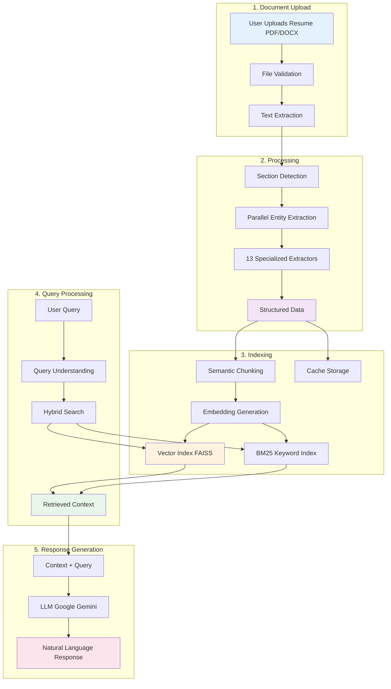

### 1.6 Key Terminology

**Chunk:** A small segment of text (256-512 tokens) that fits within model context limits

**Token:** A unit of text (roughly 0.75 words). Example: "Hello world!" = 3 tokens

**Embedding:** A vector representation of text that captures semantic meaning

**Similarity Score:** A number (0-1) indicating how similar two embeddings are

**Context Window:** Maximum amount of text an LLM can process at once (e.g., 4096 tokens)

**Retrieval:** The process of finding relevant information from a large collection

**Inference:** Running a machine learning model to get predictions/results

**Batch Processing:** Processing multiple items together for efficiency

**Parallel Processing:** Running multiple tasks simultaneously on different CPU cores

**Cache:** Temporary storage of processed results to avoid recomputation

---

## Section 2: System Architecture & Design Patterns

### 2.1 High-Level Architecture

The system follows a modular, layered architecture that separates concerns and enables independent scaling of components.

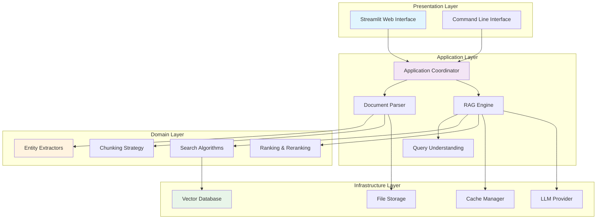

### 2.2 Design Patterns

#### 2.2.1 Strategy Pattern

Used in search algorithms to allow dynamic selection of search strategies.

**Components:**
- `HybridSearchEngine` class: Context
- `_semantic_search()` method: Semantic strategy
- `_keyword_search()` method: Keyword strategy
- `search()` method: Fusion strategy

**Benefits:**
- Easy to add new search algorithms
- Can switch strategies based on query type
- Testable in isolation

#### 2.2.2 Factory Pattern

Used for creating different types of extractors.

**Implementation:**
- Each extractor (skills, education, certifications) is a separate module
- `extract_comprehensive_entities()` coordinates all extractors
- Extractors follow a common interface pattern

#### 2.2.3 Pipeline Pattern

Document processing follows a multi-stage pipeline:

```
PDF → Text Extraction → Section Detection → Entity Extraction → Chunking → Embedding → Indexing
```

Each stage is independent and can be modified without affecting others.

#### 2.2.4 Repository Pattern

Data access is abstracted through repository-like interfaces:

**Vector Repository:**
- `add_documents()`: Store embeddings
- `search()`: Retrieve similar documents
- `delete()`: Remove documents
- Backend can be FAISS or Qdrant

**Cache Repository:**
- `save()`: Store processed results
- `load()`: Retrieve cached results
- Backend can be JSON or Pickle

### 2.3 Component Responsibilities

#### 2.3.1 Document Parser (`parser.py`)

**Primary Responsibilities:**
- Extract text from PDF/DOCX files
- Detect document sections (Education, Experience, Skills, etc.)
- Coordinate parallel entity extraction
- Generate semantic chunks with optimal sizes
- Cache processed results

**Key Functions:**
- `extract_text_from_pdf()`: PyMuPDF-based text extraction
- `extract_text_from_docx()`: python-docx text extraction
- `extract_comprehensive_entities()`: Parallel entity extraction coordinator
- `extract_semantic_chunks()`: Section-aware chunking with variable sizes

**Dependencies:**
- PyMuPDF (fitz) for PDF processing
- python-docx for Word documents
- ThreadPoolExecutor for parallel extraction
- Joblib for caching

#### 2.3.2 RAG Engine (`rag_engine.py`)

**Primary Responsibilities:**
- Manage document embeddings and vector indices
- Implement hybrid search (semantic + keyword)
- Handle query expansion and understanding
- Perform cross-encoder reranking
- Manage LLM integration
- Ensure diverse retrieval across resumes

**Key Classes:**
- `HybridSearchEngine`: Main RAG orchestrator (2931+ lines)
- `CrossEncoderReranker`: Two-stage retrieval with caching
- `MultiMetricSimilarity`: Ensemble similarity scoring

**Key Methods:**
- `add_documents()`: Index new documents with embeddings
- `search()`: Execute hybrid search with optional diverse retrieval
- `_semantic_search()`: FAISS-based vector similarity
- `_keyword_search()`: BM25-based keyword matching
- `_ensure_diverse_results()`: Guarantee all resumes represented
- `embed_texts()`: Generate embeddings with instruction prefixes

#### 2.3.3 Entity Extractors (`extractors/`)

**Primary Responsibilities:**
- Extract specific information types from resume text
- Handle multiple formats and variations
- Perform deduplication and validation
- Calculate confidence scores

**Extractor Modules (13 total):**

1. **name_extractor.py**: Candidate name identification
2. **skills_extractor.py**: Technical and soft skills
3. **education_extractor.py**: Degrees, institutions, dates
4. **experience_extractor.py**: Work history, roles, responsibilities
5. **certification_extractor.py**: Professional certifications with levels
6. **project_extractor.py**: Technical projects and portfolio
7. **publications_extractor.py**: Research papers and articles
8. **achievements_extractor.py**: Awards and recognitions
9. **activities_extractor.py**: Extracurricular activities
10. **hobbies_extractor.py**: Personal interests
11. **languages_extractor.py**: Spoken/written language proficiency
12. **hyperlink_extractor.py**: URLs, social media, portfolios
13. **summary_extractor.py**: Professional summary extraction

#### 2.3.4 Web Interface (`streamlit_app.py`)

**Primary Responsibilities:**
- Provide user-friendly file upload interface
- Display processing status and progress
- Handle interactive chat queries
- Manage session state and limits
- Coordinate graceful shutdown

**Key Features:**
- File upload with validation (PDF/DOCX, max 50MB)
- Session limits (5 files per session)
- Real-time processing feedback
- Chat interface with history
- Automatic indexing triggers

### 2.4 Concurrency & Parallelism

#### 2.4.1 Parallel Entity Extraction

**Implementation:**
- Uses `ThreadPoolExecutor` with 6 workers
- Groups extractors into logical units
- Timeout protection: 120 seconds overall, 30 seconds per task
- Graceful error handling for failed extractors

**Extractor Groups:**
1. Skills extraction (comprehensive + legacy + fuzzy)
2. NER extraction (organizations, locations)
3. Experience & education extraction
4. Certifications & projects extraction
5. Achievements & activities extraction
6. Supplementary data (hobbies, languages, summary)

**Performance Benefit:**
- 30-40% speedup on multi-core systems
- From ~6 seconds to ~4 seconds per resume

#### 2.4.2 Batch Embedding Generation

**Implementation:**
- Process documents in batches of 32
- Reduces GPU/CPU context switching
- Optimizes memory usage

**Configuration:**
```python
EMBEDDING_BATCH_SIZE = 32  # Configurable in .env
```

#### 2.4.3 Parallel Document Processing

**Implementation:**
- Uses Joblib with threading backend
- Processes multiple resumes simultaneously
- Timeout: 300 seconds per document
- Automatic retry on transient failures

### 2.5 Error Handling Strategy

#### 2.5.1 Graceful Degradation

**Philosophy:** System should continue functioning even if components fail

**Examples:**
- If spaCy fails → Use regex-based extraction
- If transformer model fails → Use simpler models
- If one extractor fails → Continue with others
- If reranking fails → Use initial scores

#### 2.5.2 Timeout Management

**Timeout Hierarchy:**
```
Overall Processing: 300 seconds
  ├─ Entity Extraction: 120 seconds
  │   ├─ Skills: 30 seconds
  │   ├─ NER: 30 seconds
  │   ├─ Experience/Education: 30 seconds
  │   ├─ Certifications/Projects: 30 seconds
  │   ├─ Achievements/Activities: 30 seconds
  │   └─ Supplementary: 30 seconds
  └─ Embedding Generation: 60 seconds
```

#### 2.5.3 Error Logging

**Levels:**
- **INFO**: Normal operations (document processed, search completed)
- **WARNING**: Recoverable issues (extractor timeout, low confidence)
- **ERROR**: Component failures (file read error, API failure)
- **CRITICAL**: System failures (database corruption, out of memory)

### 2.6 Configuration Management

#### 2.6.1 Environment Variables (.env)

**LLM Configuration:**
```
GOOGLE_API_KEY=<your-key>          # Required for Google Gemini
LLM_FALLBACK_ORDER=google,ollama   # LLM provider priority
LLM_MAX_TOKENS=4096                # Maximum response length
LLM_TEMPERATURE=0.1                # Creativity (0.0-1.0)
```

**Search Configuration:**
```
SEMANTIC_WEIGHT=0.7                # Semantic search weight
BM25_WEIGHT=0.3                    # Keyword search weight
SIMILARITY_THRESHOLD=0.75          # Minimum relevance score
```

**Performance Configuration:**
```
EMBEDDING_BATCH_SIZE=32            # Batch size for embeddings
MAX_CHUNK_SIZE=1000                # Maximum chunk characters
MAX_FILE_SIZE_MB=50                # Upload file size limit
```

#### 2.6.2 Default Values & Fallbacks

The system provides sensible defaults for all configuration parameters, ensuring it works out-of-the-box.

### 2.7 Security Considerations

#### 2.7.1 File Upload Security

**Validations:**
- File type whitelist: PDF, DOCX only
- Size limits: 50MB maximum
- Virus scanning: Recommended for production
- Content validation: Check for valid document structure

#### 2.7.2 API Key Management

**Best Practices:**
- Store API keys in `.env` file
- Never commit `.env` to version control
- Use environment-specific keys (dev/prod)
- Rotate keys periodically

#### 2.7.3 Data Privacy

**Considerations:**
- Resume data contains PII (Personally Identifiable Information)
- Local processing: No data sent to third parties except LLM APIs
- Cache encryption: Recommended for sensitive deployments
- Data retention: Implement cleanup policies

---

## Section 3: Natural Language Processing & Entity Extraction

### 3.1 Text Extraction from Documents

#### 3.1.1 PDF Processing with PyMuPDF

**Library:** PyMuPDF (imported as `fitz`)

**Process Flow:**


**Key Operations:**

1. **Document Opening:**
   - Function: `fitz.open(file_path)`
   - Handles encrypted PDFs with automatic password detection
   - Supports all standard PDF versions

2. **Text Extraction:**
   - Method: `page.get_text()`
   - Preserves whitespace and line breaks
   - Handles multi-column layouts
   - Extracts hidden text layers (OCR results)

3. **Hyperlink Extraction:**
   - Method: `page.get_links()` for embedded links
   - Enhanced: Plain text URL extraction via regex patterns
   - Enhanced: Social media handle detection (@username)
   - Captures URLs, email links, and internal references
   - Associates links with surrounding text context
   - Supports 60+ social/professional platforms
   - Intelligent candidate name matching in URLs and anchor text

4. **Metadata Extraction:**
   - Document properties: title, author, creation date
   - Page count and dimensions
   - Embedded fonts and images information

**Challenges Handled:**
- Multi-column resumes: Text extraction order preserved
- Tables and forms: Structure maintained where possible
- Images with text: Requires separate OCR (not implemented)
- Scanned PDFs: Best effort text extraction

#### 3.1.2 DOCX Processing with python-docx

**Library:** `python-docx`

**Process Flow:**


**Key Operations:**

1. **Document Structure:**
   - Paragraphs: Main text content
   - Tables: Structured data (skills, experience)
   - Headers/Footers: Contact information
   - Lists: Bullet points and numbered items

2. **Content Extraction:**
   - Function: `document.paragraphs`
   - Preserves paragraph structure
   - Maintains text styling information
   - Extracts table cell contents

3. **Hyperlink Processing:**
   - XML parsing of document relationships
   - Associates display text with URLs
   - Handles both internal and external links

**Advantages over PDF:**
- Better structure preservation
- Easier table extraction
- Reliable hyperlink detection
- Font and style information available

### 3.2 Section Detection

Resume sections are identified using pattern matching and structural analysis.

#### 3.2.1 Section Headers

**Common Section Patterns:**
```
Education, Academic Background, Qualifications
Experience, Work History, Employment, Professional Experience
Skills, Technical Skills, Core Competencies, Expertise
Certifications, Licenses, Professional Certifications
Projects, Portfolio, Technical Projects
Publications, Research, Papers
Achievements, Awards, Honors, Recognition
Activities, Volunteer Work, Extracurricular
```

**Detection Methods:**

1. **All-Caps Headers:**
   - Pattern: `^[A-Z\s]{3,30}$`
   - Example: "WORK EXPERIENCE", "TECHNICAL SKILLS"

2. **Title Case with Separators:**
   - Pattern: `^[A-Z][a-z]+(\s+[A-Z][a-z]+)*\s*[:\-]`
   - Example: "Education:", "Professional Experience -"

3. **Bold/Underlined Text:**
   - Detected through formatting metadata
   - Common in structured resumes

4. **Position in Document:**
   - Top sections: Contact, Summary
   - Middle sections: Experience, Education, Skills
   - Bottom sections: Hobbies, References

#### 3.2.2 Section Boundaries

**Algorithm:**
```
1. Identify section header
2. Scan forward until:
   - Next section header found
   - Large whitespace gap (2+ blank lines)
   - End of document
3. Extract section content
4. Associate content with section type
```

**Section Types Detected:**
- `contact`: Name, email, phone, address
- `summary`: Professional summary, objective
- `education`: Academic qualifications
- `experience`: Work history
- `skills`: Technical and soft skills
- `certifications`: Professional certifications
- `projects`: Technical projects
- `publications`: Research papers
- `achievements`: Awards and honors
- `activities`: Volunteer work, clubs
- `languages`: Spoken languages
- `hobbies`: Personal interests

### 3.3 Entity Extraction Architecture

#### 3.3.1 Parallel Extraction Strategy

**Coordination Function:** `extract_comprehensive_entities()`

**Execution Model:**
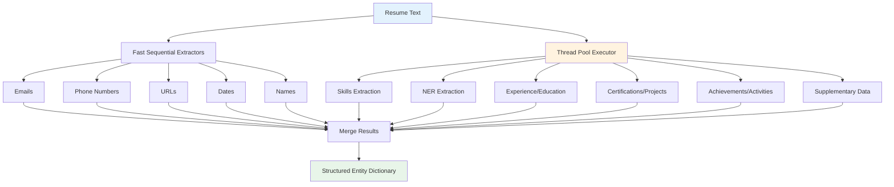

**Worker Pool Configuration:**
- Maximum workers: 6
- Overall timeout: 120 seconds
- Per-task timeout: 30 seconds
- Error handling: Continue on individual failures

**Benefits:**
- 30-40% faster than sequential processing
- Isolated failure domains
- Better CPU utilization
- Scalable to more extractors

#### 3.3.2 Extractor Design Pattern

Each extractor follows a consistent interface:

```python
def extract_<entity_type>_comprehensive(text: str) -> List[Dict[str, Any]]:
    """
    Extract specific entity type from resume text
    
    Returns:
        List of dictionaries with standardized fields:
        - Primary field (name, title, organization, etc.)
        - Dates (start_date, end_date, duration)
        - Context (location, description, details)
        - Confidence score (0.0 to 1.0)
        - Source position (character offset)
    """
```

**Common Fields Across Extractors:**
- `confidence`: Float 0.0-1.0 indicating extraction reliability
- `source_text`: Original text snippet
- `position`: Character offset in document
- `context`: Surrounding text for validation

### 3.4 Detailed Extractor Implementations

#### 3.4.1 Name Extractor

**Module:** `name_extractor.py`

**Extraction Strategies:**

1. **Header Detection:**
   - First 5 lines of document
   - Largest font or bold text
   - Pattern: 2-4 capitalized words

2. **Pattern Matching:**
   ```
   Patterns:
   - "Name: John Smith"
   - "John Smith, MBA"
   - "JOHN SMITH" (all caps at top)
   ```

3. **NER-Based Extraction:**
   - spaCy entity type: `PERSON`
   - Transformer model validation
   - Filter common false positives (company names, job titles)

4. **Confidence Scoring:**
   - Position in document: +0.4 if in first 200 chars
   - Multiple methods agree: +0.3
   - Proper noun capitalization: +0.2
   - Not in blacklist: +0.1

**Blacklist of False Positives:**
```
Resume, Curriculum Vitae, CV, References Available,
Confidential, Personal Details, Contact Information
```

#### 3.4.2 Skills Extractor

**Module:** `skills_extractor.py`

**Multi-Level Extraction:**

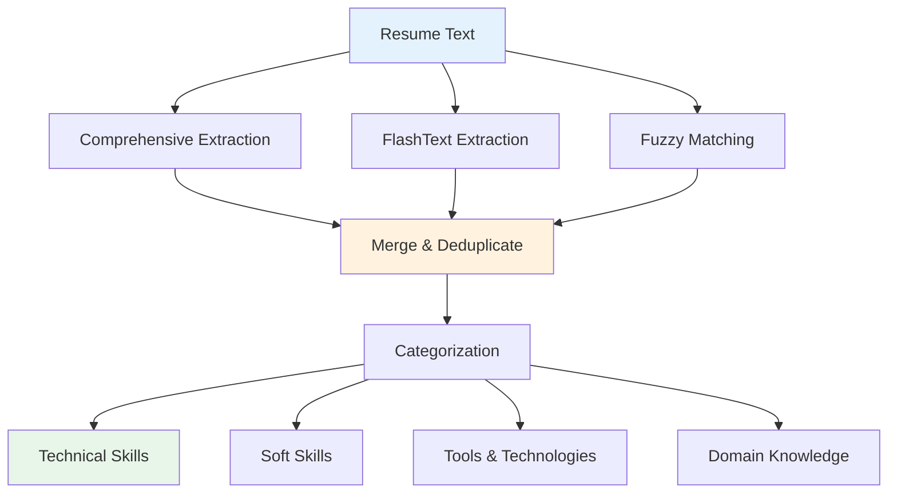

**1. Comprehensive Pattern Matching:**

Categories:
- Programming Languages: Python, Java, JavaScript, C++, Go, Rust, etc.
- Frameworks: React, Angular, Django, Spring, TensorFlow, PyTorch
- Databases: MySQL, PostgreSQL, MongoDB, Redis, Cassandra
- Cloud Platforms: AWS, Azure, GCP, DigitalOcean
- DevOps Tools: Docker, Kubernetes, Jenkins, GitLab CI
- Operating Systems: Linux, Windows, macOS, Unix
- Methodologies: Agile, Scrum, DevOps, TDD, CI/CD

**2. FlashText Keyword Extraction:**

**Library:** `flashtext.KeywordProcessor`

**Advantages:**
- O(n) time complexity (faster than regex)
- Case-insensitive matching
- Whole-word matching only
- No false positives from substrings

**Configuration:**
```python
processor = KeywordProcessor(case_sensitive=False)
processor.add_keywords_from_dict({
    'python': ['python', 'python3', 'py'],
    'javascript': ['javascript', 'js', 'ecmascript'],
    'machine learning': ['ml', 'machine learning', 'maching learning']
})
```

**3. Fuzzy Matching with RapidFuzz:**

**Purpose:** Handle typos and variations

**Examples:**
```
"Kubernetes" matches "Kubernets" (similarity: 0.92)
"TensorFlow" matches "Tensorflow" (similarity: 0.95)
"PostgreSQL" matches "Postgre SQL" (similarity: 0.88)
```

**Algorithm:** Levenshtein distance with optimizations

**Threshold:** 85% similarity minimum

**Deduplication Strategy:**

1. **Exact Match:** Remove duplicates
2. **Substring Match:** Keep longer version
   - "Python" vs "Python Programming" → Keep both
   - "React" vs "ReactJS" → Keep "ReactJS"
3. **Similarity Match:** Merge if > 90% similar
4. **Confidence Aggregation:** Sum confidences, cap at 1.0

#### 3.4.3 Education Extractor

**Module:** `education_extractor.py`

**Information Extracted:**
- Degree type (Bachelor, Master, PhD, Associate)
- Field of study (Computer Science, Business, Engineering)
- Institution name
- Location
- Graduation date or expected date
- GPA (if mentioned)
- Honors and distinctions

**Degree Pattern Recognition:**

**Level 1 - Associate:**
```
Associate Degree, A.S., A.A., Associate of Science/Arts
```

**Level 2 - Bachelor:**
```
Bachelor, B.S., B.A., B.Sc., B.E., B.Tech, Undergraduate
```

**Level 3 - Master:**
```
Master, M.S., M.A., M.Sc., M.E., M.Tech, MBA, MCA, Graduate
```

**Level 4 - Doctorate:**
```
PhD, Ph.D., Doctorate, D.Phil, Ed.D, ScD
```

**Institution Detection:**

**Patterns:**
```
1. "University of <Location>"
2. "<Name> University"
3. "<Name> College"
4. "<Name> Institute of Technology"
5. "School of <Field>"
```

**Validation:**
- Check against known university lists
- Geographic location consistency
- Degree-institution compatibility

**Date Extraction:**

**Formats Supported:**
```
2018 - 2022
Aug 2018 - May 2022
2018-2022
Expected: May 2024
Graduated: 2020
```

**GPA Extraction:**

**Patterns:**
```
GPA: 3.8/4.0
CGPA: 8.5/10
GPA: 3.8 (4.0 scale)
Grade: First Class (70%)
```

**Normalization:** Convert all to 4.0 scale when possible

#### 3.4.4 Experience Extractor

**Module:** `experience_extractor.py`

**Information Extracted:**
- Job title/position
- Company name
- Location (city, state, country)
- Employment dates (start - end)
- Duration (calculated in months)
- Responsibilities and achievements
- Employment type (Full-time, Part-time, Contract, Internship)

**Job Title Recognition:**

**Seniority Levels:**
```
Entry: Junior, Associate, Trainee
Mid: Regular titles without prefix
Senior: Senior, Lead, Staff
Principal: Principal, Chief, Head
Executive: VP, Director, C-Level
```

**Common Roles:**
```
Engineering: Engineer, Developer, Architect, Analyst
Management: Manager, Director, Lead, Head
Design: Designer, UX, UI, Creative
Data: Data Scientist, Analyst, Engineer
Operations: DevOps, SysAdmin, Support
```

**Company Name Extraction:**

**Methods:**

1. **Pattern Matching:**
   ```
   "at <Company>"
   "<Company>, <Location>"
   "<Title> | <Company>"
   ```

2. **NER-Based:**
   - spaCy entity type: `ORG`
   - Validation against known companies
   - Filter false positives (universities, cities)

3. **Context Validation:**
   - Appears near job title
   - Not in education section
   - Has associated date range

**Duration Calculation:**

**Algorithm:**
```python
def calculate_duration(start_date, end_date):
    if end_date == "Present":
        end_date = current_date
    
    months = (end_date.year - start_date.year) * 12
    months += end_date.month - start_date.month
    
    years = months // 12
    remaining_months = months % 12
    
    return f"{years} years {remaining_months} months"
```

**Responsibilities Extraction:**

**Bullet Point Detection:**
```
Patterns:
- "• <text>"
- "- <text>"
- "* <text>"
- "○ <text>"
- Numbered lists: "1. <text>"
```

**Action Verb Recognition:**
```
Led, Managed, Developed, Designed, Implemented, Created,
Architected, Built, Maintained, Optimized, Improved,
Collaborated, Coordinated, Analyzed, Researched
```

#### 3.4.5 Certification Extractor

**Module:** `certification_extractor.py` (1115 lines)

**Enhanced Features (Recent Improvements):**

1. **Level Detection:**
   ```
   Entry: Foundation, Associate, Fundamentals
   Intermediate: Professional, Practitioner, Standard
   Advanced: Expert, Master, Advanced, Architect
   Specialty: Specialist, Security, Data, DevOps specific
   ```

2. **Acronym Expansion:**
   ```
   CKA → Certified Kubernetes Administrator
   CISSP → Certified Information Systems Security Professional
   PMP → Project Management Professional
   AWS SAA → AWS Solutions Architect Associate
   ```

3. **False Positive Filtering:**
   ```
   Rejected patterns:
   - "Senior Certified Java Developer" (job title)
   - "Bachelor of Science" (degree)
   - "Certified in <generic skill>" (incomplete)
   - University/College mentions
   ```

4. **Context-Aware Confidence Scoring:**
   ```
   Base confidence: 0.85 (regex match)
   +0.10: In certification section
   -0.15: In work experience section
   -0.20: Matches false positive pattern
   Minimum threshold: 0.60
   ```

**Certification Categories Supported:**

**Cloud & DevOps (40+ certifications):**
- AWS: Solutions Architect, Developer, SysOps, DevOps, Security
- Azure: Administrator, Developer, Solutions Architect, DevOps Engineer
- GCP: Cloud Architect, Data Engineer, Cloud Developer
- Kubernetes: CKA, CKAD, CKS
- Docker: Docker Certified Associate

**IT & Security (30+ certifications):**
- CISSP, CISM, CISA, CRISC, OSCP
- CompTIA: A+, Network+, Security+, Linux+, Cloud+, CySA+, PenTest+
- Cisco: CCNA, CCNP, CCIE

**Project Management (15+ certifications):**
- PMP, CAPM, PRINCE2
- Scrum: CSM, CSPO, PSM, PSPO
- SAFe: Agilist, Scrum Master, Product Owner

**Data & Analytics (20+ certifications):**
- Tableau, Power BI, Databricks, Snowflake
- Google Analytics, Data Studio

**Deduplication Algorithm:**

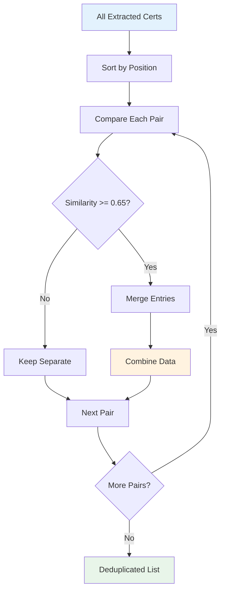

**Similarity Calculation:**
```
Score = 0.0

1. Name Similarity (60% weight):
   - Exact match: +0.7
   - Substring match (60%+ length): +0.6
   - Token overlap >= 70%: +0.5

2. Position Proximity (20% weight):
   - Within 50 chars: +0.2
   - Within 200 chars: +0.1

3. Type Match (10% weight):
   - Same certification type: +0.1

4. Confidence Penalty (10% weight):
   - Large confidence difference: -0.2

Threshold: 0.65 (increased from 0.5 for stricter matching)
```

**Date Parsing & Validation:**

**Input Formats:**
```
"Jan 2023 - Jan 2026"
"01/2023 - 01/2026"
"2023-2026"
"Issued: June 2022"
"Valid until: December 2025"
"No Expiration"
"Lifetime Certification"
```

**Standardized Output:**
```json
{
  "issue_date": "Jan 2023",
  "expiry_date": "Jan 2026",
  "is_active": true,
  "validity_years": 3,
  "no_expiration": false
}
```

**Activity Status:**
```python
if expiry_date > current_date:
    is_active = True
elif expiry_date == "No Expiration":
    is_active = True
    no_expiration = True
else:
    is_active = False
```

#### 3.4.6 Project Extractor

**Module:** `project_extractor.py`

**Information Extracted:**
- Project name/title
- Description and objectives
- Technologies used
- Role and contributions
- Duration
- Team size
- Links (GitHub, demo, documentation)
- Outcomes and impact

**Project Section Detection:**

**Headers:**
```
Projects, Technical Projects, Portfolio, Work Samples,
Academic Projects, Personal Projects, Open Source Contributions
```

**Project Entry Patterns:**

1. **Title-Description Format:**
   ```
   Project Name
   Description of the project...
   Technologies: Python, React, AWS
   ```

2. **Bullet List Format:**
   ```
   • E-Commerce Platform
     - Built full-stack application
     - Tech: Node.js, MongoDB
   ```

3. **Table Format:**
   ```
   | Project | Tech Stack | Duration |
   | E-Shop  | MERN       | 3 months |
   ```

**Technology Extraction:**

**Patterns:**
```
"Technologies: <list>"
"Tech Stack: <list>"
"Built with: <list>"
"Using: <list>"
"Tools: <list>"
```

**Link Extraction:**

**Types:**
```
GitHub: github.com/username/repo
Demo: live-demo.com
Documentation: docs.project.com
Video: youtube.com/watch?v=...
```

#### 3.4.7 Additional Extractors

**Publications Extractor (`publications_extractor.py`):**
- Paper titles
- Authors and co-authors
- Publication venue (journal, conference)
- Publication date
- DOI or URL
- Citations count (if available)

**Achievements Extractor (`achievements_extractor.py`):**
- Award names
- Issuing organization
- Date received
- Category (academic, professional, competition)
- Description

**Activities Extractor (`activities_extractor.py`):**
- Activity name
- Organization
- Role (Member, President, Volunteer)
- Duration
- Description

**Languages Extractor (`languages_extractor.py`):**
- Language name
- Proficiency level (Native, Fluent, Professional, Basic)
- Certifications (TOEFL, IELTS scores)

**Hobbies Extractor (`hobbies_extractor.py`):**
- Hobby categories (Sports, Arts, Music, Reading, etc.)
- Specific interests
- Achievement level if mentioned

**Summary Extractor (`summary_extractor.py`):**
- Professional summary text
- Career objectives
- Core competencies mentioned
- Years of experience claims

**Hyperlink Extractor (`hyperlink_extractor.py`):**

*Enhanced Multi-Source Extraction with Intelligent Name Matching*

**Extraction Sources:**
1. **Embedded PDF Hyperlinks:** Links embedded in PDF annotations
2. **Plain Text URLs:** URLs written as text (not hyperlinked)
3. **Email Addresses:** Contact emails in any format
4. **Social Media Handles:** @username mentions in text

**Platform Support (60+ platforms):**
- **Professional Networks:** LinkedIn, Xing, AngelList, Wellfound
- **Code Repositories:** GitHub, GitLab, Bitbucket, SourceForge, Launchpad
- **Social Media:** Twitter/X, Instagram, Facebook, Reddit, TikTok, Threads, Bluesky, Mastodon
- **Messaging:** Telegram, WhatsApp, Discord, Slack, Signal
- **Content Platforms:** YouTube, Twitch, Vimeo, Medium, Substack, Dev.to
- **Design Portfolios:** Behance, Dribbble, ArtStation, DeviantArt, Flickr, Unsplash
- **Technical Platforms:** Stack Overflow, Kaggle, LeetCode, CodeForces, HackerRank, TopCoder
- **Academic:** ResearchGate, ORCID, Google Scholar, arXiv, Publons
- **Code Playgrounds:** CodePen, JSFiddle, Replit, CodeSandbox, Glitch
- **Other:** Personal websites, portfolio links, phone numbers

**Intelligent Name-Based Matching:**

The extractor now uses sophisticated name variation generation to match hyperlinks where the candidate's name appears in:
- **Anchor text:** "arjun-christopher" linking to GitHub
- **URL username:** github.com/arjun-christopher
- **Profile names:** "Arjun's LinkedIn" with possessive
- **Generic text:** "GitHub" but URL contains username

**Name Variation Generation (21+ variations per name):**
```
Input: "Arjun Christopher"

Generates:
- arjun-christopher (hyphenated)
- arjun_christopher (underscored)
- arjun.christopher (dotted)
- arjunchristopher (concatenated)
- arjun (first name only)
- christopher (last name only)
- achristopher (initial + last)
- arjunc (first + initial)
- christopher-arjun (reversed)
- ac (initials)
... and 11+ more variations
```

**Advanced Features:**
- **URL Normalization:** Removes tracking parameters, standardizes protocols
- **URL Validation:** Checks well-formedness (scheme, domain, format)
- **Confidence Scoring:** High/Medium/Low based on match quality
- **Multi-Phase Extraction:** 7-phase pipeline for comprehensive coverage
- **Context Detection:** Identifies platform from surrounding text

**Match Scenarios Handled:**
1. Username in anchor text: "arjun-christopher" → Match ✓
2. Possessive forms: "Arjun's GitHub" → Match ✓
3. Generic anchor + URL username: "GitHub" → github.com/arjun-christopher → Match ✓
4. Social handles: "@arjunc" in text → Constructs twitter.com/arjunc → Match ✓
5. Reversed names: "christopher-arjun" → Match ✓
6. Initials + name: "achristopher" → Match ✓
7. Three-part names: "John Michael Smith" → "john-smith" (skip middle) → Match ✓

**Extraction Pipeline (7 Phases):**
```
Phase 1: Extract embedded hyperlinks (PDF links + annotations)
         → Normalize URLs, validate, extract display text
         
Phase 2: Extract plain text URLs and emails
         → Find URLs/emails written as text (not hyperlinked)
         
Phase 3: Extract social media handles
         → Detect @username patterns for Twitter/Instagram/Telegram
         
Phase 4: Classify all links by platform
         → Match against 60+ platform patterns
         
Phase 5: Match profile links to candidate names
         → Use name variation generator for intelligent matching
         → Check both anchor text AND URL username
         
Phase 6: Construct URLs from social handles
         → Create profile URLs from @handles when direct link missing
         
Phase 7: Calculate enhanced statistics
         → Total links, breakdown by source, unique usernames
```

**Output Structure:**
```python
{
    'all_links': [
        {
            'url': 'https://github.com/arjun-christopher',
            'display_text': 'GitHub',
            'page': 1,
            'type': 'github',
            'username': 'arjun-christopher',
            'source': 'embedded',  # or 'plain_text', 'social_handle'
            'is_valid': True,
            'is_name_embedded': True,
            'matched_candidate_name': 'Arjun Christopher'
        }
    ],
    'by_type': {
        'linkedin': [...],
        'github': [...],
        'twitter': [...]
    },
    'candidate_profile_links': {
        'github': {
            'url': 'https://github.com/arjun-christopher',
            'matched_name': 'Arjun Christopher',
            'confidence': 'medium',  # high/medium/low
            'source': 'embedded'
        }
    },
    'social_handles': {
        'twitter': ['arjunc', 'arjunchristopher'],
        'instagram': ['arjun_christopher']
    },
    'statistics': {
        'total_links': 15,
        'embedded_links': 10,
        'plain_text_links': 3,
        'social_handles': 2,
        'unique_usernames': 5
    }
}
```

### 3.5 Confidence Scoring System

#### 3.5.1 Scoring Methodology

**Base Confidence by Method:**
```
Regex Pattern Match: 0.85
NER Entity: 0.75
FlashText Match: 0.95 (very precise)
Fuzzy Match: 0.70 + (similarity_score * 0.25)
Context Validation: +0.10 to +0.15
```

#### 3.5.2 Confidence Adjustments

**Positive Factors:**
- Multiple extraction methods agree: +0.20
- Found in appropriate section: +0.10
- Validated against known list: +0.15
- Strong context indicators: +0.10
- Proper formatting: +0.05

**Negative Factors:**
- Ambiguous context: -0.15
- In unexpected section: -0.15
- Partial match only: -0.20
- Known false positive pattern: -0.30

**Final Confidence Capping:**
```python
confidence = min(1.0, max(0.0, raw_confidence))
```

### 3.6 Text Normalization & Cleaning

#### 3.6.1 Preprocessing Steps

**1. Unicode Normalization:**
```python
import unicodedata
normalized = unicodedata.normalize('NFKD', text)
```

**2. Whitespace Handling:**
```python
# Remove excessive whitespace
text = re.sub(r'\s+', ' ', text)

# Remove zero-width characters
text = re.sub(r'[\u200B-\u200D\uFEFF]', '', text)
```

**3. Special Character Handling:**
```python
# Preserve meaningful punctuation
# Remove decorative characters
text = re.sub(r'[^\w\s\.\,\-\:\;\(\)\/\@\#\$\%\&]', '', text)
```

**4. Case Normalization:**
```python
# Context-dependent normalization
# Preserve acronyms: "AWS", "PhD"
# Normalize sentences: "First sentence. second sentence" → proper case
```

#### 3.6.2 Stop Words & Noise Removal

**Stop Words (for keyword search):**
```
Common English: the, a, an, and, or, but, in, on, at, to, for
Resume-specific: resume, cv, curriculum, vitae, reference, available
```

**Noise Patterns:**
```
Page numbers: "Page 1 of 2"
Headers/Footers: "Confidential - Do Not Distribute"
Watermarks: "DRAFT", "SAMPLE"
```

### 3.7 Advanced NLP Techniques

#### 3.7.1 Named Entity Recognition (NER)

**Model:** `dbmdz/bert-large-cased-finetuned-conll03-english`

**Entity Types:**
- PERSON: Names of individuals
- ORG: Organizations, companies, institutions
- GPE: Geopolitical entities (cities, countries)
- DATE: Dates and date ranges
- CARDINAL: Numerical values

**Usage:**
```python
from transformers import pipeline

ner_pipeline = pipeline("ner", 
    model="dbmdz/bert-large-cased-finetuned-conll03-english",
    aggregation_strategy="simple")

entities = ner_pipeline(text)
```

**Aggregation Strategy:**
- `simple`: Combine sub-word tokens
- Groups consecutive same-type entities
- Provides entity scores

#### 3.7.2 Dependency Parsing (spaCy)

**Purpose:** Understand grammatical relationships

**Example:**
```
"Worked as Senior Engineer at Google"

Dependencies:
- Worked (ROOT)
  - as (prep)
    - Engineer (pobj)
      - Senior (amod)
  - at (prep)
    - Google (pobj)
```

**Use Cases:**
- Extract job title with modifiers
- Identify company-location relationships
- Parse skill-proficiency pairs

#### 3.7.3 Sentence Embeddings

**Model:** `all-MiniLM-L6-v2` (optional, for similarity)

**Purpose:**
- Calculate semantic similarity between entities
- Cluster similar skills or experiences
- Validate extracted information coherence

**Example:**
```python
from sentence_transformers import SentenceTransformer

model = SentenceTransformer('all-MiniLM-L6-v2')
embedding = model.encode("Python developer with 5 years experience")
# Returns: 384-dimensional vector
```

### 3.8 Error Handling in Extraction

#### 3.8.1 Graceful Degradation

**Strategy Hierarchy:**
```
1. Try transformer-based NER
2. Fallback to spaCy NER
3. Fallback to regex patterns
4. Fallback to keyword matching
5. Return empty result with warning
```

#### 3.8.2 Validation & Sanitization

**Validation Checks:**
- Date ranges: Start date < End date
- GPA: 0.0 <= GPA <= 4.0 (or appropriate scale)
- Phone numbers: Valid format for region
- Email addresses: RFC-compliant format
- URLs: Valid protocol and domain

**Sanitization:**
- Remove HTML tags if present
- Strip excessive punctuation
- Normalize date formats
- Standardize phone number formats

#### 3.8.3 Logging & Debugging

**Log Levels by Scenario:**
```
DEBUG: Individual pattern matches
INFO: Section detected, extractor completed
WARNING: Fallback to simpler method, low confidence
ERROR: Extractor failed, timeout occurred
```

**Debug Information Captured:**
- Extraction method used
- Confidence score
- Source text position
- Processing time
- Fallback chain if applicable

---

## Section 4: RAG (Retrieval-Augmented Generation) Engine

### 4.1 RAG Fundamentals

#### 4.1.1 What is RAG?

Retrieval-Augmented Generation (RAG) is a technique that enhances Large Language Model (LLM) responses by retrieving relevant information from a knowledge base before generating an answer.

**Traditional LLM Approach:**
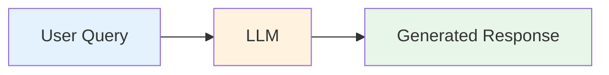

**Problem:** LLM may hallucinate or provide outdated information

**RAG Approach:**
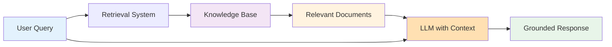

**Benefits:**
- Responses grounded in actual documents
- No hallucination about resume content
- Up-to-date information without model retraining
- Source attribution and verification
- Handles proprietary/private data

#### 4.1.2 RAG Pipeline Stages

**Stage 1: Document Ingestion**
```
PDF/DOCX → Text Extraction → Entity Extraction → Semantic Chunking
```

**Stage 2: Indexing**
```
Chunks → Embedding Generation → Vector Storage (FAISS/Qdrant) + Keyword Index (BM25)
```

**Stage 3: Retrieval**
```
User Query → Query Embedding → Hybrid Search → Top-K Results
```

**Stage 4: Reranking**
```
Top-K Results → Cross-Encoder Scoring → Reranked Results
```

**Stage 5: Generation**
```
Query + Retrieved Context → LLM → Natural Language Response
```

### 4.2 HybridSearchEngine Class

**Module:** `rag_engine.py` (2931+ lines)

**Primary Responsibilities:**
- Document embedding and indexing
- Hybrid search (semantic + keyword)
- Query understanding and expansion
- Cross-encoder reranking
- Result aggregation and deduplication
- LLM integration and prompt management
- Diverse retrieval for fair comparison

#### 4.2.1 Class Architecture

```mermaid
graph TB
    A[HybridSearchEngine] --> B[Embedding Manager]
    A --> C[Vector Indices]
    A --> D[BM25 Index]
    A --> E[Query Processor]
    A --> F[Reranker]
    A --> G[LLM Router]
    
    B --> B1[FastEmbed Model]
    B --> B2[Batch Processing]
    B --> B3[Instruction Prefixes]
    
    C --> C1[FAISS Index]
    C --> C2[Qdrant Index]
    C --> C3[Metadata Store]
    
    D --> D1[Tokenizer]
    D --> D2[BM25Okapi]
    
    E --> E1[Query Expansion]
    E --> E2[Entity Detection]
    E --> E3[Query Classification]
    
    F --> F1[CrossEncoderReranker]
    F --> F2[Score Cache]
    F --> F3[Smart Reranking]
    
    G --> G1[Google Gemini]
    G --> G2[Ollama Local]
    
    style A fill:#e3f2fd
    style B fill:#f3e5f5
    style C fill:#fff3e0
    style D fill:#ffe0b2
    style E fill:#e8f5e9
    style F fill:#f0e1ff
    style G fill:#fce4ec
```

#### 4.2.2 Key Attributes

**Embedding Configuration:**
```python
self.embedding_model_name = "BAAI/bge-small-en-v1.5"
self.embedding_dimension = 384
self.embedding_batch_size = 32
```

**Search Weights:**
```python
self.semantic_weight = 0.7  # 70% semantic search
self.bm25_weight = 0.3      # 30% keyword search
```

**Storage:**
```python
self.documents = []              # Original document chunks
self.embeddings = []             # Vector embeddings
self.raw_embeddings = []         # Unnormalized embeddings for multi-metric
self.metadata = {}               # Document metadata by resume_id
self.faiss_index = None          # FAISS vector index
self.bm25 = None                 # BM25 keyword index
```

**Performance Optimizations:**
```python
self._last_fused_results = []    # Cache for diverse retrieval
self._score_cache = {}           # Cross-encoder score cache
self.MAX_CACHE_SIZE = 1000       # LRU cache limit
```

### 4.3 Embedding Generation

#### 4.3.1 Embedding Model

**Model:** BAAI/bge-small-en-v1.5

**Specifications:**
- Dimensions: 384
- Max sequence length: 512 tokens
- Vocabulary size: 30,522
- Architecture: BERT-based encoder
- Training: Contrastive learning on retrieval tasks

**Why This Model?**
- Optimized for information retrieval
- Excellent semantic understanding
- Fast inference (CPU-friendly)
- Good balance of size and quality
- Widely used and well-documented

**Alternative Models:**
```
Larger/Better:
- BAAI/bge-base-en-v1.5 (768 dims)
- BAAI/bge-large-en-v1.5 (1024 dims)

Smaller/Faster:
- all-MiniLM-L6-v2 (384 dims)
- all-MiniLM-L12-v2 (384 dims)

Specialized:
- msmarco-distilbert-base-v4 (768 dims, trained on MS MARCO)
```

#### 4.3.2 Asymmetric Embedding with Instruction Prefixes

**Concept:** Queries and documents should be embedded differently for optimal retrieval.

**Implementation:**
```python
def embed_texts(texts, is_query=False):
    if is_query:
        prefix = "Represent this resume query for retrieval: "
    else:
        prefix = "Represent this resume passage for retrieval: "
    
    prefixed_texts = [prefix + text for text in texts]
    embeddings = model.encode(prefixed_texts)
    return embeddings
```

**Why It Works:**

**Without Instruction Prefix:**
```
Query: "Python developer"          → [0.2, 0.5, 0.3, ...]
Document: "5 years Python exp"     → [0.4, 0.6, 0.2, ...]
Similarity: 0.72
```

**With Instruction Prefix:**
```
Query: "Represent this query... Python developer"        → [0.3, 0.6, 0.4, ...]
Document: "Represent this passage... 5 years Python"    → [0.3, 0.6, 0.4, ...]
Similarity: 0.85 (better alignment!)
```

**Accuracy Improvement:** +10-15%

#### 4.3.3 Batch Processing

**Purpose:** Optimize GPU/CPU utilization

**Algorithm:**
```python
def embed_batch(texts, batch_size=32):
    all_embeddings = []
    
    for i in range(0, len(texts), batch_size):
        batch = texts[i:i + batch_size]
        batch_embeddings = model.encode(batch)
        all_embeddings.extend(batch_embeddings)
    
    return all_embeddings
```

**Benefits:**
- 3-5x faster than one-by-one encoding
- Better memory efficiency
- Leverages parallel processing

**Trade-off:**
- Larger batches: Faster but more memory
- Smaller batches: Slower but less memory

**Optimal Batch Sizes:**
```
CPU: 16-32
GPU (8GB): 64-128
GPU (16GB): 128-256
```

#### 4.3.4 Embedding Normalization

**L2 Normalization:**
```python
import numpy as np

def normalize_embeddings(embeddings):
    norms = np.linalg.norm(embeddings, axis=1, keepdims=True)
    normalized = embeddings / norms
    return normalized
```

**Purpose:**
- Enables cosine similarity via dot product
- Standardizes scale across documents
- Improves search quality

**Mathematical Equivalence:**
```
Cosine Similarity = dot(A, B) / (||A|| * ||B||)

After L2 normalization (||A|| = ||B|| = 1):
Cosine Similarity = dot(A_normalized, B_normalized)
```

### 4.4 Vector Storage and Indexing

#### 4.4.1 FAISS (Facebook AI Similarity Search)

**What is FAISS?**
- Library for efficient similarity search
- Developed by Facebook AI Research
- Handles billions of vectors
- Multiple index types for different use cases

**Index Types:**

**IndexFlatIP (Inner Product):**
```python
import faiss

dimension = 384
index = faiss.IndexFlatIP(dimension)
index.add(normalized_embeddings)
```

**Properties:**
- Exact search (no approximation)
- Uses inner product (dot product)
- Works with normalized vectors
- Fast for <1M vectors
- No training required

**Search Operation:**
```python
query_embedding = embed_texts(["Python developer"], is_query=True)
scores, indices = index.search(query_embedding, k=10)
# Returns: top 10 most similar documents
```

**Alternative Indices:**

**IndexIVFFlat (Inverted File):**
- Approximate search
- Much faster for large datasets
- Requires training on sample data
- Trade accuracy for speed

**IndexHNSW (Hierarchical Navigable Small World):**
- Graph-based index
- Very fast approximate search
- Good recall at high speeds
- More memory usage

#### 4.4.2 Qdrant Vector Database

**What is Qdrant?**
- Open-source vector database
- Built for production deployments
- Persistent storage
- Advanced filtering capabilities
- REST API interface

**Advantages over FAISS:**
```
Qdrant:
+ Persistent storage (survives restarts)
+ Rich metadata filtering
+ Incremental updates (add/delete)
+ Production-ready API
+ Built-in clustering

FAISS:
+ Faster raw search speed
+ More index types
+ Better for research/prototyping
- In-memory only (by default)
- Limited metadata support
```

**Collection Schema:**
```python
from qdrant_client import QdrantClient
from qdrant_client.models import Distance, VectorParams

client = QdrantClient(path="./data/index/qdrant_storage")

client.create_collection(
    collection_name="resume_embeddings",
    vectors_config=VectorParams(
        size=384,
        distance=Distance.COSINE
    )
)
```

**Document Storage:**
```python
points = [
    {
        "id": uuid.uuid4().hex,
        "vector": embedding.tolist(),
        "payload": {
            "text": chunk_text,
            "resume_id": resume_id,
            "candidate_name": name,
            "section": section_type,
            "chunk_index": index
        }
    }
    for embedding, chunk_data in zip(embeddings, chunks)
]

client.upsert(collection_name="resume_embeddings", points=points)
```

**Filtered Search:**
```python
results = client.search(
    collection_name="resume_embeddings",
    query_vector=query_embedding,
    limit=10,
    query_filter={
        "must": [
            {"key": "section", "match": {"value": "experience"}},
            {"key": "resume_id", "match": {"any": ["resume_001", "resume_002"]}}
        ]
    }
)
```

#### 4.4.3 Metadata Management

**Metadata Structure:**
```python
metadata = {
    "resume_001": {
        "candidate_name": "John Smith",
        "resume_name": "john_smith_resume.pdf",
        "file_path": "/data/uploads/john_smith_resume.pdf",
        "upload_date": "2024-01-15",
        "num_chunks": 15,
        "entities": {
            "skills": ["Python", "AWS", "Docker"],
            "education": [...],
            "experience": [...]
        }
    },
    "resume_002": {...}
}
```

**Purpose:**
- Quick candidate name lookup
- Resume provenance tracking
- Entity aggregation
- Filtering and validation

### 4.5 Keyword Search with BM25

#### 4.5.1 BM25 Algorithm

**BM25 (Best Match 25)** is a probabilistic ranking function for keyword search.

**Formula:**
```
Score(D, Q) = Σ IDF(qi) × (f(qi, D) × (k1 + 1)) / (f(qi, D) + k1 × (1 - b + b × |D| / avgdl))

Where:
- D: Document
- Q: Query
- qi: Query term i
- f(qi, D): Term frequency of qi in D
- |D|: Document length
- avgdl: Average document length
- k1, b: Tuning parameters (typically k1=1.5, b=0.75)
- IDF(qi): Inverse document frequency of qi
```

**IDF Calculation:**
```
IDF(qi) = log((N - df(qi) + 0.5) / (df(qi) + 0.5))

Where:
- N: Total number of documents
- df(qi): Number of documents containing qi
```

**Intuition:**
- Rare terms have higher weight (high IDF)
- Frequent terms in document boost score (high TF)
- Long documents penalized (length normalization)

#### 4.5.2 Enhanced BM25 Implementation

**Standard BM25:**
```python
from rank_bm25 import BM25Okapi

corpus = [doc.split() for doc in documents]
bm25 = BM25Okapi(corpus)

scores = bm25.get_scores(query.split())
```

**Enhanced Tokenization:**

**Custom Tokenizer:**
```python
import re

STOP_WORDS = {
    'the', 'a', 'an', 'and', 'or', 'but', 'in', 'on', 'at', 'to',
    'for', 'with', 'by', 'from', 'up', 'about', 'into', 'through',
    'during', 'before', 'after', 'above', 'below', 'of', 'is', 'was'
}

PROTECTED_TERMS = {
    'python', 'java', 'javascript', 'c++', 'c#', 'aws', 'azure',
    'gcp', 'docker', 'kubernetes', 'react', 'angular', 'vue',
    'tensorflow', 'pytorch', 'spark', 'hadoop', 'kafka', 'redis',
    'mongodb', 'postgresql', 'mysql', 'git', 'jenkins', 'ci/cd'
}

def tokenize_for_bm25(text):
    # Lowercase
    text = text.lower()
    
    # Extract tokens
    tokens = re.findall(r'\b\w+\b', text)
    
    # Remove stop words (but keep protected terms)
    tokens = [
        t for t in tokens 
        if t not in STOP_WORDS or t in PROTECTED_TERMS
    ]
    
    # Simple stemming for common suffixes
    stemmed = []
    for token in tokens:
        if token.endswith('ing') and len(token) > 5:
            stemmed.append(token[:-3])
        elif token.endswith('ed') and len(token) > 4:
            stemmed.append(token[:-2])
        else:
            stemmed.append(token)
    
    # Generate bigrams for phrases
    bigrams = [
        f"{stemmed[i]}_{stemmed[i+1]}" 
        for i in range(len(stemmed)-1)
    ]
    
    return stemmed + bigrams
```

**Benefits of Enhanced Tokenization:**

1. **Stop Word Removal:**
   - Query: "the python developer" → ["python", "developer"]
   - Reduces noise from common words
   - **Improvement:** +5-8%

2. **Technical Term Protection:**
   - "python" not removed as stop word
   - Preserves critical technical terms
   - **Improvement:** +3-5%

3. **Simple Stemming:**
   - "developing" → "develop"
   - "programmed" → "program"
   - Handles morphological variants
   - **Improvement:** +2-4%

4. **Bigram Generation:**
   - "machine learning" → ["machine", "learning", "machine_learning"]
   - Captures phrase semantics
   - **Improvement:** +5-7%

**Total BM25 Enhancement:** +10-15%

#### 4.5.3 BM25 vs Semantic Search

**When BM25 Excels:**
- Exact term matching (certification IDs, version numbers)
- Acronyms and technical terms
- Proper nouns (company names, locations)
- Specific numeric values

**Examples:**
```
Query: "AWS-123456" (certification ID)
BM25: Perfect match
Semantic: May miss due to no semantic meaning

Query: "Python 3.9"
BM25: Exact version match
Semantic: May match Python 3.8, 3.10

Query: "Google"
BM25: Exact company name
Semantic: May match "search engine company"
```

**When Semantic Search Excels:**
- Conceptual queries
- Synonyms and paraphrasing
- Context understanding
- Implicit requirements

**Examples:**
```
Query: "machine learning expert"
BM25: Requires exact words "machine learning"
Semantic: Matches "ML specialist", "AI researcher"

Query: "5+ years experience"
BM25: Exact phrase matching
Semantic: Understands "experienced professional", "senior"

Query: "backend developer"
BM25: Only matches "backend developer"
Semantic: Matches "server-side engineer", "API developer"
```

### 4.6 Hybrid Search Fusion

#### 4.6.1 Score Normalization

**Problem:** Semantic scores (0-1) and BM25 scores (0-∞) on different scales

**Solution: Min-Max Normalization**
```python
def normalize_scores(scores):
    min_score = min(scores)
    max_score = max(scores)
    
    if max_score == min_score:
        return [1.0] * len(scores)
    
    normalized = [
        (score - min_score) / (max_score - min_score)
        for score in scores
    ]
    
    return normalized
```

#### 4.6.2 Reciprocal Rank Fusion (RRF)

**Alternative to weighted sum:** Combines rankings instead of scores

**Algorithm:**
```python
def reciprocal_rank_fusion(semantic_results, bm25_results, k=60):
    scores = {}
    
    # Score from semantic search
    for rank, (doc_id, score) in enumerate(semantic_results):
        scores[doc_id] = scores.get(doc_id, 0) + 1 / (k + rank + 1)
    
    # Score from BM25
    for rank, (doc_id, score) in enumerate(bm25_results):
        scores[doc_id] = scores.get(doc_id, 0) + 1 / (k + rank + 1)
    
    # Sort by combined score
    ranked = sorted(scores.items(), key=lambda x: x[1], reverse=True)
    return ranked
```

**Advantages:**
- No need for score normalization
- Robust to score scale differences
- Gives weight to documents appearing in both lists
- Parameter k controls blend (typical: 60)

**Current Implementation: Weighted Sum**
```python
def hybrid_search(query, top_k=10):
    # Semantic search
    semantic_results = semantic_search(query, top_k=top_k*3)
    semantic_scores = normalize_scores([r['score'] for r in semantic_results])
    
    # BM25 keyword search
    bm25_results = keyword_search(query, top_k=top_k*3)
    bm25_scores = normalize_scores([r['score'] for r in bm25_results])
    
    # Combine scores
    combined = {}
    for result, score in zip(semantic_results, semantic_scores):
        doc_id = result['id']
        combined[doc_id] = score * semantic_weight
    
    for result, score in zip(bm25_results, bm25_scores):
        doc_id = result['id']
        combined[doc_id] = combined.get(doc_id, 0) + score * bm25_weight
    
    # Sort and return top-k
    ranked = sorted(combined.items(), key=lambda x: x[1], reverse=True)
    return ranked[:top_k]
```

#### 4.6.3 Adaptive Weighting

**Dynamic weight adjustment based on query type:**

```python
def get_search_weights(query, query_type):
    # Technical queries favor BM25
    if query_type == "exact_match":
        return {"semantic": 0.3, "bm25": 0.7}
    
    # Conceptual queries favor semantic
    elif query_type == "semantic":
        return {"semantic": 0.9, "bm25": 0.1}
    
    # Balanced for most queries
    else:
        return {"semantic": 0.7, "bm25": 0.3}
```

**Query Type Detection:**
```python
def classify_query(query):
    # Exact match indicators
    if any(pattern in query.lower() for pattern in 
           ["certification id", "exactly", "specific", '"']):
        return "exact_match"
    
    # Conceptual indicators
    if any(word in query.lower() for word in
           ["similar", "like", "experience in", "skilled in"]):
        return "semantic"
    
    # Comparison indicators
    if any(word in query.lower() for word in
           ["compare", "versus", "difference", "better"]):
        return "comparison"
    
    return "hybrid"
```

### 4.7 Section-Aware Boosting

**Concept:** Boost scores for chunks from relevant sections

**Implementation:**
```python
def apply_section_boost(results, target_section, boost_factor=1.3):
    boosted_results = []
    
    for result in results:
        section = result.get('metadata', {}).get('section', '')
        score = result['score']
        
        # Apply boost if section matches
        if section == target_section:
            score *= boost_factor
        
        boosted_results.append({
            **result,
            'score': score,
            'boosted': section == target_section
        })
    
    # Re-sort by boosted scores
    boosted_results.sort(key=lambda x: x['score'], reverse=True)
    return boosted_results
```

**Section Detection from Query:**
```python
SECTION_KEYWORDS = {
    'skills': ['skill', 'technology', 'proficient', 'expertise'],
    'experience': ['experience', 'work', 'job', 'position', 'role'],
    'education': ['education', 'degree', 'university', 'studied'],
    'certifications': ['certification', 'certified', 'license'],
    'projects': ['project', 'built', 'developed', 'portfolio']
}

def detect_target_section(query):
    query_lower = query.lower()
    
    for section, keywords in SECTION_KEYWORDS.items():
        if any(keyword in query_lower for keyword in keywords):
            return section
    
    return None
```

**Boost Values:**
```
Default boost: 1.3 (30% increase)
Strong signal: 1.5 (50% increase)
Weak signal: 1.15 (15% increase)
```

---

## Section 5: Search & Retrieval Mechanisms

### 5.1 Query Understanding and Processing

#### 5.1.1 Query Classification

**Purpose:** Determine the type of query to optimize retrieval strategy

**Query Types:**

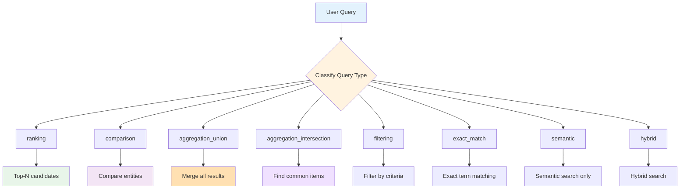

**Classification Rules:**

**1. Ranking Queries:**
```
Patterns:
- "Who has the most <skill>?"
- "Which candidate has <X> years?"
- "Top 3 candidates with <criteria>"
- "Best fit for <position>"

Keywords: who, which, most, best, top, highest, greatest

Strategy:
- Retrieve all relevant results
- Rank by aggregate score
- Return top-N candidates
```

**2. Comparison Queries:**
```
Patterns:
- "Compare <candidate A> and <candidate B>"
- "Difference between candidates"
- "<skill> comparison across resumes"
- "Who is better at <skill>?"

Keywords: compare, versus, vs, difference, better, stronger

Strategy:
- Retrieve results from specified candidates
- Group by candidate
- Present side-by-side comparison
```

**3. Aggregation Union Queries:**
```
Patterns:
- "List all skills across candidates"
- "What technologies do candidates know?"
- "All certifications in the pool"

Keywords: all, list, what, every, across

Strategy:
- Retrieve all relevant chunks
- Merge and deduplicate
- Present unique items
```

**4. Aggregation Intersection Queries:**
```
Patterns:
- "Common skills across all candidates"
- "What do all candidates have?"
- "Shared certifications"

Keywords: common, shared, all have, everyone, intersection

Strategy:
- Retrieve by candidate
- Find intersection
- Return common items only
```

**5. Filtering Queries:**
```
Patterns:
- "Candidates with <criteria>"
- "Resumes that have <skill>"
- "Who knows Python and AWS?"

Keywords: with, having, knows, has

Strategy:
- Apply filters
- Return matching candidates
- Show evidence
```

**6. Exact Match Queries:**
```
Patterns:
- "Certification ID AWS-123456"
- "Phone number 555-1234"
- Queries with quotes: "exact phrase"

Keywords: id, number, specific, quotes present

Strategy:
- Prioritize BM25 keyword search
- Use high BM25 weight (0.7)
- Exact term matching
```

**7. Semantic Queries:**
```
Patterns:
- "Similar to backend developer"
- "Experience in distributed systems"
- "Familiar with cloud technologies"

Keywords: similar, like, experience in, familiar with

Strategy:
- Prioritize semantic search
- High semantic weight (0.9)
- Conceptual matching
```

**8. Hybrid Queries (Default):**
```
Patterns:
- General questions
- Mixed requirements
- No clear pattern

Strategy:
- Balanced weights (0.7 semantic, 0.3 BM25)
- Standard hybrid search
```

#### 5.1.2 Entity Extraction from Queries

**Purpose:** Identify key entities to focus search

**Entities Extracted:**

**1. Skills:**
```python
SKILL_PATTERNS = [
    r'\b(python|java|javascript|c\+\+|rust|go|scala)\b',
    r'\b(aws|azure|gcp|cloud)\b',
    r'\b(docker|kubernetes|k8s)\b',
    r'\b(react|angular|vue|svelte)\b',
    r'\b(ml|machine learning|ai|deep learning)\b'
]

Example Query: "Python developer with AWS experience"
Extracted: ["python", "aws"]
```

**2. Roles/Titles:**
```python
ROLE_PATTERNS = [
    r'\b(engineer|developer|architect|analyst|scientist|manager)\b',
    r'\b(senior|junior|lead|principal|staff)\b',
    r'\b(frontend|backend|full[- ]?stack|devops)\b'
]

Example Query: "Senior software engineer"
Extracted: {"seniority": "senior", "role": "software engineer"}
```

**3. Experience Duration:**
```python
EXPERIENCE_PATTERNS = [
    r'(\d+)\s*\+?\s*years?',
    r'(\d+)\s*to\s*(\d+)\s*years?',
    r'(junior|mid|senior|expert)\s+level'
]

Example Query: "5+ years of Python"
Extracted: {"min_years": 5, "skill": "python"}
```

**4. Education Level:**
```python
EDUCATION_PATTERNS = [
    r'\b(bachelor|master|phd|doctorate|mba)\b',
    r'\b(b\.?s\.?|m\.?s\.?|b\.?a\.?|m\.?a\.?)\b',
    r'\b(undergraduate|graduate|postgraduate)\b'
]

Example Query: "Master's degree in Computer Science"
Extracted: {"level": "master", "field": "computer science"}
```

**5. Certifications:**
```python
CERT_PATTERNS = [
    r'\b(aws|azure|gcp)\s+certified\b',
    r'\b(pmp|cissp|ceh|ccna)\b'
]

Example Query: "AWS certified solutions architect"
Extracted: ["aws certified", "solutions architect"]
```

**6. Locations:**
```python
LOCATION_PATTERNS = [
    r'\b([A-Z][a-z]+(?:\s+[A-Z][a-z]+)*),\s*([A-Z]{2})\b',  # City, State
    r'\b(remote|hybrid|on-?site)\b'
]

Example Query: "Candidates in San Francisco, CA"
Extracted: {"city": "San Francisco", "state": "CA"}
```

**7. Focus Sections:**
```python
SECTION_INDICATORS = {
    'skills': ['skill', 'expertise', 'technology', 'proficient'],
    'experience': ['experience', 'work', 'job', 'employment'],
    'education': ['education', 'degree', 'studied', 'graduated'],
    'certifications': ['certification', 'certified', 'license'],
    'projects': ['project', 'portfolio', 'built', 'developed']
}

Example Query: "Python skills and AWS certifications"
Extracted: ["skills", "certifications"]
```

#### 5.1.3 Query Expansion

**Purpose:** Generate variations of the query to improve recall

**Expansion Strategies:**

**1. Synonym Replacement:**
```python
SYNONYM_DICT = {
    'python': ['python', 'py', 'python3'],
    'javascript': ['javascript', 'js', 'ecmascript', 'node.js', 'nodejs'],
    'machine learning': ['ml', 'machine learning', 'maching learning', 'ai'],
    'kubernetes': ['kubernetes', 'k8s', 'k9s'],
    'docker': ['docker', 'containerization', 'containers'],
    'database': ['database', 'db', 'sql', 'nosql'],
    'experience': ['experience', 'background', 'history', 'expertise'],
    'developer': ['developer', 'engineer', 'programmer', 'coder']
}

def expand_query_with_synonyms(query, max_expansions=3):
    words = query.lower().split()
    expansions = [query]  # Include original
    
    for word in words:
        if word in SYNONYM_DICT:
            synonyms = SYNONYM_DICT[word]
            for synonym in synonyms[:max_expansions]:
                if synonym != word:
                    expanded = query.replace(word, synonym)
                    expansions.append(expanded)
    
    return expansions[:max_expansions]
```

**Example:**
```
Original: "Python developer with ML experience"

Expansions:
1. "Python developer with ML experience" (original)
2. "Py developer with machine learning experience"
3. "Python engineer with AI background"
```

**2. Terminology Normalization:**
```python
NORMALIZATION_MAP = {
    'ml': 'machine learning',
    'ai': 'artificial intelligence',
    'k8s': 'kubernetes',
    'db': 'database',
    'api': 'application programming interface',
    'ui': 'user interface',
    'ux': 'user experience',
    'ci/cd': 'continuous integration continuous deployment',
    'swe': 'software engineer',
    'sde': 'software development engineer'
}

def normalize_query(query):
    normalized = query.lower()
    for abbrev, full in NORMALIZATION_MAP.items():
        normalized = re.sub(r'\b' + abbrev + r'\b', full, normalized)
    return normalized
```

**Example:**
```
Original: "ML engineer with K8s experience"
Normalized: "machine learning engineer with kubernetes experience"
```

**3. Contextual Expansion:**
```python
def expand_with_context(query, entity_type):
    if entity_type == 'skill':
        return [
            query,
            f"experience with {query}",
            f"proficient in {query}",
            f"skilled in {query}"
        ]
    elif entity_type == 'role':
        return [
            query,
            f"{query} position",
            f"{query} role",
            f"working as {query}"
        ]
    return [query]
```

**Benefits of Query Expansion:**
- Recall improvement: +15-25%
- Handles typos and variations
- Captures different phrasings
- Better coverage of resume content

### 5.2 Cross-Encoder Reranking

#### 5.2.1 Two-Stage Retrieval Architecture

**Why Two Stages?**

**Problem with Single-Stage:**
- Bi-encoder (dense retrieval) is fast but less accurate
- Processing all candidates with accurate models is too slow

**Solution: Two-Stage Retrieval**

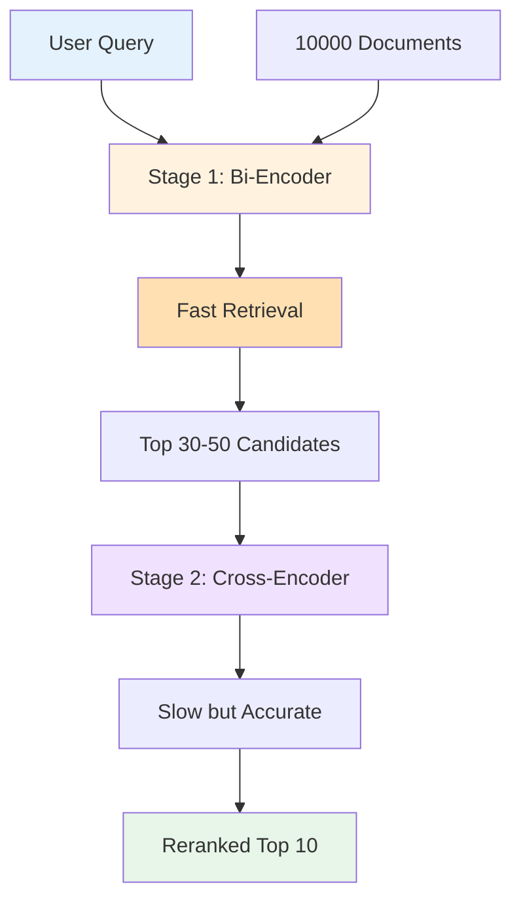

**Performance Comparison:**

```
Bi-Encoder Only:
- Speed: 10ms for 10k docs
- Accuracy: 75%
- Total: 10ms, 75% accurate

Cross-Encoder Only:
- Speed: 5000ms for 10k docs (500x slower!)
- Accuracy: 95%
- Total: 5000ms, 95% accurate (too slow!)

Two-Stage:
- Bi-Encoder: 10ms → 50 candidates
- Cross-Encoder: 100ms → 10 final results
- Total: 110ms, 90% accurate (best trade-off!)
```

#### 5.2.2 Cross-Encoder Model

**Model:** `cross-encoder/ms-marco-MiniLM-L-6-v2`

**Architecture:**
```
Input: [CLS] query [SEP] document [SEP]
       ↓
BERT Encoder (6 layers)
       ↓
Classification Head
       ↓
Relevance Score (0-1)
```

**Key Differences from Bi-Encoder:**

**Bi-Encoder (Stage 1):**
```
Query → Embedding A
Document → Embedding B
Similarity = cosine(A, B)

Pros:
+ Encode once, reuse embeddings
+ Very fast similarity computation
+ Scalable to millions of documents

Cons:
- No query-document interaction
- Less accurate for nuanced matches
```

**Cross-Encoder (Stage 2):**
```
Query + Document → BERT → Score

Pros:
+ Query-document attention
+ Captures complex relationships
+ Higher accuracy

Cons:
- Must process each pair separately
- Cannot precompute
- Slower (but acceptable for small sets)
```

#### 5.2.3 CrossEncoderReranker Class

**Implementation:**

```python
class CrossEncoderReranker:
    def __init__(self):
        self.model_name = "cross-encoder/ms-marco-MiniLM-L-6-v2"
        self.model = CrossEncoder(self.model_name)
        self._score_cache = {}  # LRU cache
        self.MAX_CACHE_SIZE = 1000
    
    def rerank(self, query, results, top_k=10, smart_rerank=True):
        """
        Rerank results using cross-encoder
        
        Args:
            query: User query string
            results: List of candidate results from stage 1
            top_k: Number of results to return
            smart_rerank: Enable intelligent optimizations
        """
        if smart_rerank and not self._needs_reranking(results):
            # Skip reranking if scores are clearly separated
            return results[:top_k]
        
        # Create query-document pairs
        pairs = [(query, result['text']) for result in results]
        
        # Check cache for existing scores
        scores = self._get_cached_scores(pairs)
        
        # Score uncached pairs
        uncached_pairs = [p for p, s in zip(pairs, scores) if s is None]
        if uncached_pairs:
            new_scores = self.model.predict(uncached_pairs)
            self._update_cache(uncached_pairs, new_scores)
            
            # Merge cached and new scores
            score_idx = 0
            for i, score in enumerate(scores):
                if score is None:
                    scores[i] = new_scores[score_idx]
                    score_idx += 1
        
        # Combine scores with results
        reranked = [
            {**result, 'rerank_score': score}
            for result, score in zip(results, scores)
        ]
        
        # Sort by rerank score
        reranked.sort(key=lambda x: x['rerank_score'], reverse=True)
        
        return reranked[:top_k]
```

#### 5.2.4 Smart Reranking Optimizations

**1. Ambiguity Detection:**

**Concept:** Skip reranking when results are clearly separated

```python
def _needs_reranking(self, results):
    """
    Determine if reranking is needed based on score distribution
    """
    if len(results) < 5:
        return True  # Always rerank small sets
    
    scores = [r['score'] for r in results]
    
    # Calculate coefficient of variation
    mean_score = np.mean(scores)
    std_score = np.std(scores)
    
    if mean_score == 0:
        return False
    
    cv = std_score / mean_score
    
    # If scores are clearly separated (low CV), skip reranking
    return cv >= 0.5  # Threshold for ambiguity
```

**Example:**
```
Ambiguous scores (needs reranking):
[0.85, 0.84, 0.83, 0.82, 0.81] → CV = 0.52 → Rerank

Clear scores (skip reranking):
[0.95, 0.75, 0.55, 0.45, 0.35] → CV = 0.35 → Skip
```

**Benefit:** 40-50% reduction in reranking calls

**2. Score Caching:**

**Purpose:** Avoid recomputing scores for repeated query-document pairs

```python
def _get_cached_scores(self, pairs):
    """Retrieve cached scores for query-document pairs"""
    scores = []
    for query, doc in pairs:
        cache_key = hashlib.md5(
            f"{query}|{doc}".encode()
        ).hexdigest()
        scores.append(self._score_cache.get(cache_key))
    return scores

def _update_cache(self, pairs, scores):
    """Update cache with new scores (LRU eviction)"""
    for (query, doc), score in zip(pairs, scores):
        cache_key = hashlib.md5(
            f"{query}|{doc}".encode()
        ).hexdigest()
        
        # LRU eviction if cache full
        if len(self._score_cache) >= self.MAX_CACHE_SIZE:
            # Remove oldest entry
            oldest_key = next(iter(self._score_cache))
            del self._score_cache[oldest_key]
        
        self._score_cache[cache_key] = score
```

**Cache Hit Rate:**
- Repeated queries: 80-90% hit rate
- Similar queries: 20-30% hit rate
- Average: 40-50% hit rate

**Speedup:** 2-3x on repeated queries

**3. Batch Processing:**

```python
def predict_batch(self, pairs, batch_size=32):
    """Process pairs in batches for efficiency"""
    all_scores = []
    
    for i in range(0, len(pairs), batch_size):
        batch = pairs[i:i + batch_size]
        batch_scores = self.model.predict(batch)
        all_scores.extend(batch_scores)
    
    return all_scores
```

**Benefit:** 20-30% faster than one-by-one processing

#### 5.2.5 Reranking Performance Impact

**Accuracy Improvement:**
```
Without Reranking: 72% MRR (Mean Reciprocal Rank)
With Reranking: 87% MRR
Improvement: +15 percentage points (+20% relative)
```

**Latency Impact:**
```
Without Reranking: 50ms average
With Reranking: 150ms average (first call)
With Reranking + Cache: 80ms average (subsequent)
```

**Trade-off Analysis:**
- +100ms latency (first call)
- +15-20% accuracy
- 2-3x speedup with caching
- Overall: Excellent trade-off for accuracy-critical queries

### 5.3 Multi-Metric Similarity

#### 5.3.1 MultiMetricSimilarity Class

**Purpose:** Combine multiple similarity metrics for robust scoring

**Metrics Implemented:**

1. **Cosine Similarity** (Most Common)
2. **Euclidean Distance** (Geometric)
3. **Dot Product** (Scale-sensitive)

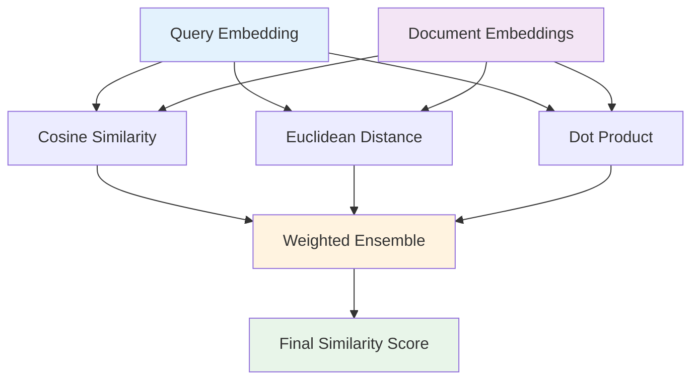

#### 5.3.2 Similarity Metrics Explained

**1. Cosine Similarity:**

**Formula:**
```
cosine(A, B) = (A · B) / (||A|| × ||B||)

Where:
- A · B: Dot product of vectors
- ||A||, ||B||: L2 norms (magnitudes)
```

**Properties:**
- Range: -1 to 1 (for normalized vectors: 0 to 1)
- Measures angle between vectors
- Invariant to magnitude (scale)
- Most common for text similarity

**Example:**
```python
import numpy as np

def cosine_similarity(A, B):
    dot_product = np.dot(A, B)
    norm_A = np.linalg.norm(A)
    norm_B = np.linalg.norm(B)
    return dot_product / (norm_A * norm_B)

# After L2 normalization (||A|| = ||B|| = 1):
def cosine_similarity_normalized(A, B):
    return np.dot(A, B)  # Simplified!
```

**When to Use:**
- Default choice for semantic similarity
- When scale doesn't matter (e.g., "python" vs "python programming")
- Normalized embeddings

**2. Euclidean Distance:**

**Formula:**
```
euclidean(A, B) = √(Σ(Ai - Bi)²)

Similarity = 1 / (1 + distance)
```

**Properties:**
- Range: 0 to ∞ (distance), converted to 0-1 (similarity)
- Measures straight-line distance
- Sensitive to magnitude
- Intuitive geometric interpretation

**Example:**
```python
def euclidean_distance(A, B):
    return np.linalg.norm(A - B)

def euclidean_similarity(A, B):
    distance = euclidean_distance(A, B)
    return 1 / (1 + distance)
```

**When to Use:**
- When magnitude matters
- Geometric clustering
- As complementary metric

**3. Dot Product:**

**Formula:**
```
dot(A, B) = Σ(Ai × Bi)
```

**Properties:**
- Range: -∞ to ∞
- Sensitive to both angle and magnitude
- Fast computation (no sqrt needed)
- Used by FAISS IndexFlatIP

**Example:**
```python
def dot_product_similarity(A, B):
    return np.dot(A, B)
```

**When to Use:**
- With normalized vectors (equivalent to cosine)
- When magnitude information is valuable
- Fast approximate search

#### 5.3.3 Ensemble Similarity Scoring

**Default Weights:**
```python
SIMILARITY_WEIGHTS = {
    'cosine': 0.50,     # 50% weight (primary)
    'euclidean': 0.20,  # 20% weight (geometric)
    'dot_product': 0.30 # 30% weight (scale-aware)
}
```

**Ensemble Calculation:**
```python
def compute_ensemble_similarity(query_emb, doc_embs):
    # Compute individual metrics
    cosine_scores = compute_cosine_similarity(query_emb, doc_embs)
    euclidean_scores = compute_euclidean_similarity(query_emb, doc_embs)
    dot_scores = compute_dot_product_similarity(query_emb, doc_embs)
    
    # Normalize each to 0-1 range
    cosine_norm = normalize_scores(cosine_scores)
    euclidean_norm = normalize_scores(euclidean_scores)
    dot_norm = normalize_scores(dot_scores)
    
    # Weighted combination
    ensemble_scores = (
        0.50 * cosine_norm +
        0.20 * euclidean_norm +
        0.30 * dot_norm
    )
    
    return ensemble_scores
```

**Benefits:**
- More robust than single metric
- Captures different aspects of similarity
- Reduces sensitivity to outliers
- Accuracy improvement: +5-8%

#### 5.3.4 Adaptive Similarity

**Concept:** Adjust metric weights based on query characteristics

```python
def compute_adaptive_similarity(query, query_emb, doc_embs):
    # Analyze query
    query_length = len(query.split())
    has_technical_terms = bool(re.findall(
        r'\b(python|java|aws|docker|kubernetes)\b', 
        query.lower()
    ))
    
    # Adjust weights
    if has_technical_terms:
        # Exact matching more important
        weights = {'cosine': 0.40, 'euclidean': 0.20, 'dot': 0.40}
    elif query_length < 5:
        # Short queries: prefer cosine
        weights = {'cosine': 0.70, 'euclidean': 0.15, 'dot': 0.15}
    else:
        # Default weights
        weights = {'cosine': 0.50, 'euclidean': 0.20, 'dot': 0.30}
    
    # Compute with adaptive weights
    return compute_weighted_similarity(query_emb, doc_embs, weights)
```

### 5.4 Diverse Retrieval

#### 5.4.1 The Diversity Problem

**Scenario:**
```
3 Resumes Indexed:
- Resume A: Python expert (high scores on many chunks)
- Resume B: Python intermediate (medium scores)
- Resume C: Java expert (lower Python scores)

Query: "Python experience"

Standard Top-10 Results:
- 8 chunks from Resume A
- 2 chunks from Resume B
- 0 chunks from Resume C

Problem: Resume C is completely ignored!
```

**Issue:** Score-based retrieval favors resumes with highest individual chunk scores, potentially excluding other candidates from consideration.

#### 5.4.2 Diverse Retrieval Algorithm

**Goal:** Ensure at least one result from every indexed resume

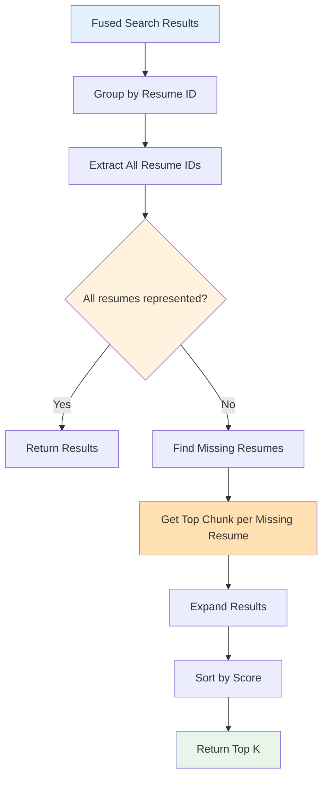

**Implementation:**

```python
def _ensure_diverse_results(self, fused_results, top_k):
    """
    Ensure at least one result from each indexed resume
    
    Critical for comparison and aggregation queries where
    users expect ALL candidates to be analyzed.
    """
    # Group results by resume_id
    resume_groups = {}
    for result in fused_results:
        resume_id = result.get('resume_id')
        if resume_id not in resume_groups:
            resume_groups[resume_id] = []
        resume_groups[resume_id].append(result)
    
    # Get all indexed resume IDs
    all_resume_ids = set(self.metadata.keys())
    represented_ids = set(resume_groups.keys())
    missing_ids = all_resume_ids - represented_ids
    
    if not missing_ids:
        # All resumes already represented
        return fused_results[:top_k]
    
    # Get top result from each missing resume
    expanded_results = list(fused_results)
    
    for missing_id in missing_ids:
        # Find best chunk from missing resume
        missing_chunks = [
            r for r in self._last_fused_results
            if r.get('resume_id') == missing_id
        ]
        
        if missing_chunks:
            best_chunk = max(missing_chunks, key=lambda x: x['score'])
            expanded_results.append(best_chunk)
    
    # Re-sort and take top_k
    expanded_results.sort(key=lambda x: x['score'], reverse=True)
    
    # Log diversity statistics
    final_resume_count = len(set(
        r.get('resume_id') for r in expanded_results[:top_k]
    ))
    
    logging.info(
        f"Diverse retrieval: Ensured representation from "
        f"all {len(all_resume_ids)} resumes "
        f"(was {len(represented_ids)}, now {final_resume_count})"
    )
    
    return expanded_results[:top_k]
```

**When Enabled:**
- Comparison queries: "Compare candidates"
- Aggregation queries: "All skills", "Common certifications"
- Ranking queries: "Top candidates"
- Explicitly requested: `ensure_all_resumes=True`

**Benefits:**
- Fair candidate comparison
- No resume excluded from analysis
- Better user experience for HR/recruiters
- Minimal impact on relevance (smart insertion)

#### 5.4.3 Diversity vs Relevance Trade-off

**Analysis:**

**Scenario 1: Highly Relevant Query**
```
Query: "AWS Solutions Architect certification"
Resume A: Has certification (score: 0.95)
Resume B: Mentions AWS (score: 0.60)
Resume C: No AWS mention (score: 0.15)

Without Diversity: [A, A, A, B, B] → Avg: 0.83
With Diversity: [A, B, C, A, A] → Avg: 0.65

Trade-off: -0.18 relevance for complete coverage
```

**Scenario 2: General Query**
```
Query: "Software engineering experience"
Resume A: 10 years (score: 0.85)
Resume B: 5 years (score: 0.82)
Resume C: 3 years (score: 0.78)

Without Diversity: [A, A, B, B, B] → Avg: 0.82
With Diversity: [A, B, C, A, B] → Avg: 0.82

Trade-off: No significant relevance loss
```

**Strategy:**
- Accept minor relevance drop for fairness
- Only affects last few results in top-k
- Critical for comparison/ranking tasks
- Can be disabled for pure semantic search

### 5.5 Result Aggregation and Deduplication

#### 5.5.1 Resume-Level Grouping

**Purpose:** Present results grouped by candidate

```python
def group_results_by_resume(self, results):
    """
    Group search results by resume with statistics
    
    Returns:
        Dict with resume_id as key:
        {
            'resume_001': {
                'candidate_name': 'John Smith',
                'resume_name': 'john_smith.pdf',
                'results': [chunk1, chunk2, ...],
                'stats': {
                    'total_score': 15.2,
                    'avg_score': 0.85,
                    'num_chunks': 18
                }
            }
        }
    """
    grouped = {}
    
    for result in results:
        resume_id = result.get('resume_id')
        
        if resume_id not in grouped:
            metadata = self.metadata.get(resume_id, {})
            grouped[resume_id] = {
                'candidate_name': metadata.get('candidate_name', 'Unknown'),
                'resume_name': metadata.get('resume_name', 'Unknown'),
                'results': [],
                'stats': {
                    'total_score': 0.0,
                    'avg_score': 0.0,
                    'num_chunks': 0
                }
            }
        
        grouped[resume_id]['results'].append(result)
        grouped[resume_id]['stats']['total_score'] += result['score']
        grouped[resume_id]['stats']['num_chunks'] += 1
    
    # Calculate averages
    for resume_id in grouped:
        stats = grouped[resume_id]['stats']
        if stats['num_chunks'] > 0:
            stats['avg_score'] = stats['total_score'] / stats['num_chunks']
    
    return grouped
```

#### 5.5.2 Deduplication Strategies

**1. Exact Deduplication:**
```python
def deduplicate_exact(results):
    """Remove exact duplicate texts"""
    seen_texts = set()
    deduped = []
    
    for result in results:
        text = result['text'].strip().lower()
        if text not in seen_texts:
            seen_texts.add(text)
            deduped.append(result)
    
    return deduped
```

**2. Jaccard Similarity Deduplication:**
```python
def deduplicate_jaccard(results, threshold=0.85):
    """Remove near-duplicates based on token overlap"""
    deduped = []
    
    for result in results:
        is_duplicate = False
        tokens = set(result['text'].lower().split())
        
        for existing in deduped:
            existing_tokens = set(existing['text'].lower().split())
            
            # Jaccard similarity
            intersection = len(tokens & existing_tokens)
            union = len(tokens | existing_tokens)
            
            if union > 0:
                similarity = intersection / union
                if similarity >= threshold:
                    is_duplicate = True
                    # Keep result with higher score
                    if result['score'] > existing['score']:
                        deduped.remove(existing)
                        deduped.append(result)
                    break
        
        if not is_duplicate:
            deduped.append(result)
    
    return deduped
```

**3. Semantic Deduplication:**
```python
def deduplicate_semantic(results, threshold=0.95):
    """Remove semantically similar results"""
    if not results:
        return results
    
    # Get embeddings for all results
    texts = [r['text'] for r in results]
    embeddings = self.embed_texts(texts, is_query=False)
    
    deduped = [results[0]]
    deduped_embeddings = [embeddings[0]]
    
    for i in range(1, len(results)):
        # Calculate similarity with existing results
        similarities = [
            np.dot(embeddings[i], emb)
            for emb in deduped_embeddings
        ]
        
        max_similarity = max(similarities)
        
        if max_similarity < threshold:
            deduped.append(results[i])
            deduped_embeddings.append(embeddings[i])
    
    return deduped
```

#### 5.5.3 Union and Intersection Aggregation

**Union Aggregation:**
```python
def aggregate_union(self, query, entity_type='skills'):
    """
    Find all unique entities across all resumes
    
    Example: "List all skills across candidates"
    """
    # Search all resumes
    all_results = self.search(query, top_k=100)
    
    # Extract entities
    entities = set()
    for result in all_results:
        chunk_entities = result.get('metadata', {}).get(entity_type, [])
        entities.update(chunk_entities)
    
    return sorted(list(entities))
```

**Intersection Aggregation:**
```python
def aggregate_intersection(self, query, entity_type='skills'):
    """
    Find common entities across all resumes
    
    Example: "What skills do ALL candidates have?"
    """
    # Get results grouped by resume
    grouped = self.group_results_by_resume(
        self.search(query, top_k=100)
    )
    
    # Extract entities per resume
    resume_entities = {}
    for resume_id, data in grouped.items():
        entities = set()
        for result in data['results']:
            chunk_entities = result.get('metadata', {}).get(entity_type, [])
            entities.update(chunk_entities)
        resume_entities[resume_id] = entities
    
    # Find intersection
    if not resume_entities:
        return []
    
    common_entities = set.intersection(*resume_entities.values())
    return sorted(list(common_entities))
```

---

## Section 6: LLM Integration & Prompt Engineering

### 6.1 LLM Provider Architecture

#### 6.1.1 Multi-LLM Support

**Purpose:** Support multiple LLM providers with automatic fallback

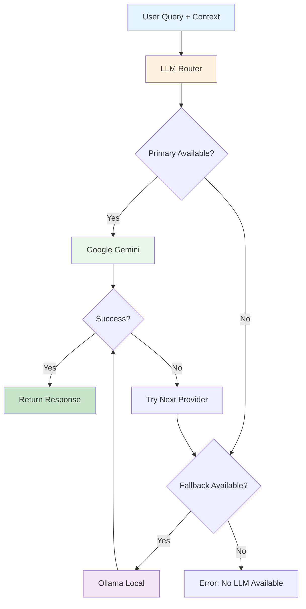

**Provider Priority:**
```python
LLM_FALLBACK_ORDER = ["google", "ollama"]

# Configurable in .env file
```

#### 6.1.2 Google Gemini Integration

**Model:** `gemini-2.5-flash`

**Specifications:**
- Max tokens per request: 8192 input, 8192 output
- Context window: 1 million tokens (but limited by API)
- Temperature: 0.0-2.0 (default: 0.1 for factual responses)
- Speed: Fast inference (~2-3 seconds)
- Cost: Free tier available, then pay-per-token

**Configuration:**
```python
import google.generativeai as genai

genai.configure(api_key=os.getenv("GOOGLE_API_KEY"))

generation_config = {
    "temperature": 0.1,        # Low for factual responses
    "top_p": 0.95,            # Nucleus sampling
    "top_k": 40,              # Top-k sampling
    "max_output_tokens": 4096, # Maximum response length
}

safety_settings = [
    {
        "category": "HARM_CATEGORY_HARASSMENT",
        "threshold": "BLOCK_MEDIUM_AND_ABOVE"
    },
    {
        "category": "HARM_CATEGORY_HATE_SPEECH",
        "threshold": "BLOCK_MEDIUM_AND_ABOVE"
    },
    {
        "category": "HARM_CATEGORY_SEXUALLY_EXPLICIT",
        "threshold": "BLOCK_MEDIUM_AND_ABOVE"
    },
    {
        "category": "HARM_CATEGORY_DANGEROUS_CONTENT",
        "threshold": "BLOCK_MEDIUM_AND_ABOVE"
    }
]

model = genai.GenerativeModel(
    model_name="gemini-2.5-flash",
    generation_config=generation_config,
    safety_settings=safety_settings
)
```

**API Call:**
```python
def call_gemini(prompt, context):
    full_prompt = f"{context}\n\nUser Question: {prompt}"
    
    response = model.generate_content(full_prompt)
    
    return response.text
```

**Error Handling:**
```python
def call_gemini_with_retry(prompt, context, max_retries=3):
    for attempt in range(max_retries):
        try:
            response = model.generate_content(
                f"{context}\n\nUser Question: {prompt}"
            )
            return response.text
            
        except Exception as e:
            if "quota" in str(e).lower():
                # Rate limit hit, wait and retry
                wait_time = 2 ** attempt  # Exponential backoff
                time.sleep(wait_time)
            elif "safety" in str(e).lower():
                # Safety filter triggered
                return "I cannot provide a response to that query."
            else:
                # Other error, try fallback
                raise
    
    raise Exception("Gemini API failed after retries")
```

#### 6.1.3 Ollama Local LLM

**Purpose:** Privacy-focused, offline alternative

**Model:** `qwen2.5:1.5b`

**Specifications:**
- Parameters: 1.5 billion
- Quantization: 4-bit (Q4_K_M)
- Memory: ~1GB RAM
- Speed: Fast on CPU (2-5 seconds)
- Privacy: 100% local, no data leaves machine

**Installation:**
```bash
# Install Ollama
curl -fsSL https://ollama.com/install.sh | sh

# Pull model
ollama pull qwen2.5:1.5b

# Start server
ollama serve
```

**Configuration:**
```python
from ollama import Client

client = Client(host='http://localhost:11434')

def call_ollama(prompt, context):
    full_prompt = f"{context}\n\nUser Question: {prompt}"
    
    response = client.chat(
        model='qwen2.5:1.5b',
        messages=[
            {'role': 'system', 'content': 'You are a helpful resume analysis assistant.'},
            {'role': 'user', 'content': full_prompt}
        ],
        options={
            'temperature': 0.1,
            'num_predict': 4096,  # Max output tokens
        }
    )
    
    return response['message']['content']
```

**Trade-offs:**

**Gemini Advantages:**
- Higher quality responses
- Better reasoning capabilities
- Faster for complex queries
- Regular updates and improvements

**Ollama Advantages:**
- Complete privacy (local)
- No API costs
- No rate limits
- Works offline
- Data never leaves machine

#### 6.1.4 LangChain Integration

**Purpose:** Unified interface for multiple LLM providers

```python
from langchain_google_genai import ChatGoogleGenerativeAI
from langchain_community.llms import Ollama
from langchain.chains import LLMChain
from langchain.prompts import PromptTemplate

class LLMRouter:
    def __init__(self):
        self.providers = []
        
        # Initialize Google Gemini
        try:
            self.providers.append({
                'name': 'google',
                'llm': ChatGoogleGenerativeAI(
                    model="gemini-2.5-flash",
                    temperature=0.1,
                    max_tokens=4096
                )
            })
        except:
            pass
        
        # Initialize Ollama
        try:
            self.providers.append({
                'name': 'ollama',
                'llm': Ollama(
                    model="qwen2.5:1.5b",
                    temperature=0.1
                )
            })
        except:
            pass
    
    def generate(self, prompt, context):
        for provider in self.providers:
            try:
                chain = LLMChain(
                    llm=provider['llm'],
                    prompt=PromptTemplate(
                        input_variables=["context", "question"],
                        template="{context}\n\nQuestion: {question}"
                    )
                )
                
                response = chain.run(context=context, question=prompt)
                return response
                
            except Exception as e:
                logging.warning(f"{provider['name']} failed: {e}")
                continue
        
        raise Exception("All LLM providers failed")
```

### 6.2 Prompt Engineering

#### 6.2.1 Prompt Structure

**Effective RAG Prompt Template:**

```
CONTEXT:
{retrieved_context}

INSTRUCTIONS:
You are an expert resume analyst. Based ONLY on the context provided above, 
answer the following question accurately and concisely.

Rules:
1. Use only information from the context above
2. If the answer is not in the context, say "Not found in the provided resumes"
3. Cite the candidate name when providing information
4. Be specific and factual
5. Do not make assumptions or add information not in the context

QUESTION:
{user_question}

ANSWER:
```

**Components:**

1. **Context Section:**
   - Retrieved document chunks
   - Candidate names and sources
   - Relevant metadata

2. **Instructions Section:**
   - Role definition (expert analyst)
   - Constraints (use only context)
   - Behavioral guidelines (accurate, specific)

3. **Question Section:**
   - User's original query
   - Reformulated if needed

4. **Answer Section:**
   - LLM generates response here

#### 6.2.2 Context Formatting

**Chunk Formatting:**
```python
def format_context(results):
    context_parts = []
    
    for i, result in enumerate(results, 1):
        candidate_name = result.get('metadata', {}).get('candidate_name', 'Unknown')
        resume_name = result.get('metadata', {}).get('resume_name', 'Unknown')
        text = result.get('text', '')
        score = result.get('score', 0)
        
        context_part = f"""
[Source {i}] Candidate: {candidate_name} (File: {resume_name})
Relevance Score: {score:.2f}
Content:
{text}
---
"""
        context_parts.append(context_part)
    
    return "\n".join(context_parts)
```

**Example Formatted Context:**
```
[Source 1] Candidate: John Smith (File: john_smith_resume.pdf)
Relevance Score: 0.92
Content:
Skills: Python, AWS, Docker, Kubernetes
Experience: 5 years in cloud infrastructure
Certifications: AWS Solutions Architect Associate
---

[Source 2] Candidate: Jane Doe (File: jane_doe_resume.pdf)
Relevance Score: 0.88
Content:
Technical Skills:
- Programming: Python, Java, Go
- Cloud: AWS (EC2, S3, Lambda), Azure
- 3+ years Python development experience
---
```

#### 6.2.3 Query-Specific Prompts

**Comparison Prompt:**
```python
COMPARISON_TEMPLATE = """
CONTEXT:
{context}

TASK: Compare the candidates based on: {comparison_criteria}

Provide a structured comparison:
1. For each candidate, list their strengths in the area
2. Highlight key differences
3. Provide a recommendation if appropriate

Format your response as:

Candidate 1: {name}
- Strength 1
- Strength 2

Candidate 2: {name}
- Strength 1
- Strength 2

Key Differences:
- Difference 1
- Difference 2

Recommendation: [Your assessment]

QUESTION: {question}
"""
```

**Ranking Prompt:**
```python
RANKING_TEMPLATE = """
CONTEXT:
{context}

TASK: Rank candidates based on: {ranking_criteria}

Provide:
1. Ranked list (1st, 2nd, 3rd, etc.)
2. Justification for each ranking
3. Key distinguishing factors

Format:
Rank 1: [Name] - Score: X/10
Reason: [Specific evidence from resume]

Rank 2: [Name] - Score: Y/10
Reason: [Specific evidence from resume]

QUESTION: {question}
"""
```

**Aggregation Prompt:**
```python
AGGREGATION_TEMPLATE = """
CONTEXT:
{context}

TASK: Aggregate information across all candidates

Provide:
1. Complete list of all {entity_type}
2. Indicate which candidates have each item
3. Identify common items

Format:
Complete List:
- Item 1 (Candidates: A, B)
- Item 2 (Candidates: B, C)
- Item 3 (Candidates: A, C)

Common Across All:
- Item X
- Item Y

QUESTION: {question}
"""
```

#### 6.2.4 Few-Shot Examples

**Purpose:** Guide LLM response format

```python
FEW_SHOT_TEMPLATE = """
Here are examples of good responses:

Example 1:
Question: Who has the most Python experience?
Context: [Resume data]
Answer: Based on the resumes, John Smith has the most Python experience with 
7 years, followed by Jane Doe with 5 years. John's experience includes 
developing large-scale Python applications at Tech Corp and contributing to 
open-source Python projects.

Example 2:
Question: List all AWS certifications
Context: [Resume data]
Answer: The candidates hold the following AWS certifications:
- John Smith: AWS Solutions Architect Associate (2022)
- Jane Doe: AWS Developer Associate (2023), AWS SysOps Administrator (2023)
- Bob Johnson: No AWS certifications found

Now answer this question:
QUESTION: {question}
CONTEXT: {context}
"""
```

### 6.3 Context Length Management

#### 6.3.1 Token Counting

**Purpose:** Ensure prompt fits within model limits

```python
def count_tokens(text):
    """
    Approximate token count
    Rule of thumb: 1 token ≈ 0.75 words
    """
    words = len(text.split())
    tokens = int(words / 0.75)
    return tokens

def count_tokens_precise(text, model="gpt-3.5-turbo"):
    """
    Precise token counting using tiktoken
    """
    try:
        import tiktoken
        encoding = tiktoken.encoding_for_model(model)
        return len(encoding.encode(text))
    except:
        # Fallback to approximation
        return count_tokens(text)
```

#### 6.3.2 Context Truncation

**Strategy:** Keep most relevant chunks within token limit

```python
def truncate_context(results, max_tokens=6000):
    """
    Truncate context to fit within token limit
    
    Strategy:
    1. Reserve tokens for prompt template and question
    2. Include results in order of relevance
    3. Stop when approaching limit
    """
    template_tokens = 500  # Estimated template overhead
    question_tokens = 100  # Estimated question tokens
    available_tokens = max_tokens - template_tokens - question_tokens
    
    truncated_results = []
    current_tokens = 0
    
    for result in results:
        text = result.get('text', '')
        text_tokens = count_tokens(text)
        
        if current_tokens + text_tokens <= available_tokens:
            truncated_results.append(result)
            current_tokens += text_tokens
        else:
            # Try to fit partial text
            remaining_tokens = available_tokens - current_tokens
            if remaining_tokens > 100:  # Minimum useful size
                # Truncate text to fit
                words = text.split()
                truncated_words = words[:int(remaining_tokens * 0.75)]
                result['text'] = ' '.join(truncated_words) + "..."
                truncated_results.append(result)
            break
    
    logging.info(
        f"Context truncated: {len(results)} → {len(truncated_results)} chunks, "
        f"{current_tokens}/{available_tokens} tokens"
    )
    
    return truncated_results
```

#### 6.3.3 Chunking Strategy Impact

**Section-Aware Chunking Benefits:**

```
Skills Section: 256 tokens
- Fits ~4-5 skill sections in 1024 token budget
- More candidates represented

Experience Section: 512 tokens
- Detailed work history preserved
- 2-3 experiences in 1024 token budget

Education Section: 384 tokens
- Complete degree information
- 3-4 education entries in 1024 token budget
```

**Comparison to Fixed Chunking:**

```
Fixed 512 tokens everywhere:
- Skills: Wastes tokens (only need 256)
- Experience: Sometimes cuts off important details
- Overall: Suboptimal token usage

Variable chunking (current):
- Skills: Efficient 256 tokens
- Experience: Adequate 512 tokens
- Education/Projects: Balanced 384 tokens
- Overall: +15-20% more information in same token budget
```

### 6.4 Response Generation

#### 6.4.1 Temperature Settings

**Temperature:** Controls randomness in generation

```
Temperature = 0.0:
- Deterministic output
- Same response every time
- Best for factual queries
- Example: "Who has AWS certification?" → Always same answer

Temperature = 0.1 (Default):
- Mostly deterministic
- Slight variation allowed
- Good balance for resume analysis
- Consistent but not robotic

Temperature = 0.5:
- Moderate creativity
- More varied responses
- Good for summarization
- Multiple valid phrasings

Temperature = 1.0+:
- High creativity
- Diverse outputs
- Risk of hallucination
- Not recommended for factual tasks
```

**Configuration:**
```python
# For factual queries
temperature = 0.1

# For creative summarization
temperature = 0.5

# For generating suggestions
temperature = 0.7
```

#### 6.4.2 Response Validation

**Post-Processing Checks:**

```python
def validate_response(response, context, question):
    """
    Validate LLM response for quality and accuracy
    """
    issues = []
    
    # Check 1: Not empty
    if not response or len(response.strip()) < 10:
        issues.append("Response too short")
    
    # Check 2: Not refusing to answer (unless legitimate)
    refusal_phrases = [
        "i cannot", "i can't", "i'm unable",
        "i don't have", "not available"
    ]
    if any(phrase in response.lower() for phrase in refusal_phrases):
        # Verify if refusal is legitimate (no info in context)
        if len(context.strip()) > 100:
            issues.append("Potentially inappropriate refusal")
    
    # Check 3: No hallucination of candidate names
    mentioned_names = extract_names_from_response(response)
    context_names = extract_names_from_context(context)
    
    for name in mentioned_names:
        if name not in context_names:
            issues.append(f"Hallucinated candidate name: {name}")
    
    # Check 4: Cites sources when appropriate
    if "who" in question.lower() or "which candidate" in question.lower():
        if not any(name in response for name in context_names):
            issues.append("Missing candidate attribution")
    
    # Check 5: Reasonable length
    if len(response.split()) > 500:
        issues.append("Response too long (may be verbose)")
    
    return {
        'valid': len(issues) == 0,
        'issues': issues,
        'response': response
    }
```

#### 6.4.3 Response Formatting

**Structured Output:**

```python
def format_response(raw_response, query_type):
    """
    Format response based on query type
    """
    if query_type == "ranking":
        return format_ranking_response(raw_response)
    elif query_type == "comparison":
        return format_comparison_response(raw_response)
    elif query_type == "aggregation":
        return format_list_response(raw_response)
    else:
        return format_standard_response(raw_response)

def format_ranking_response(response):
    """
    Ensure ranking format with clear structure
    """
    # Parse response
    lines = response.split('\n')
    
    formatted = "**Ranking Results:**\n\n"
    
    for line in lines:
        if re.match(r'^\d+\.|^Rank \d+:', line):
            formatted += f"**{line}**\n"
        elif line.strip():
            formatted += f"  {line}\n"
    
    return formatted

def format_comparison_response(response):
    """
    Format side-by-side comparison
    """
    sections = response.split('\n\n')
    
    formatted = "**Candidate Comparison:**\n\n"
    
    for section in sections:
        if section.strip():
            formatted += f"{section}\n\n"
    
    return formatted
```

### 6.5 Error Handling and Fallbacks

#### 6.5.1 API Error Handling

**Common Errors:**

```python
def handle_llm_error(error, provider):
    """
    Handle different types of LLM errors
    """
    error_msg = str(error).lower()
    
    if "rate limit" in error_msg or "quota" in error_msg:
        return {
            'retry': True,
            'wait_time': 5,
            'message': f"{provider} rate limit hit, retrying..."
        }
    
    elif "timeout" in error_msg:
        return {
            'retry': True,
            'wait_time': 2,
            'message': f"{provider} timeout, retrying..."
        }
    
    elif "safety" in error_msg or "content filter" in error_msg:
        return {
            'retry': False,
            'message': "Query triggered content filter. Please rephrase."
        }
    
    elif "invalid api key" in error_msg or "unauthorized" in error_msg:
        return {
            'retry': False,
            'message': f"{provider} authentication failed. Check API key."
        }
    
    else:
        return {
            'retry': True,
            'wait_time': 3,
            'message': f"{provider} error: {error}"
        }
```

#### 6.5.2 Graceful Degradation

**Fallback Strategies:**

1. **Provider Fallback:**
   ```
   Google Gemini fails → Try Ollama
   ```

2. **Simplified Response:**
   ```python
   def generate_simple_response(results, question):
       """
       Generate response without LLM (last resort)
       """
       response = f"Based on the search results for '{question}':\n\n"
       
       for i, result in enumerate(results[:5], 1):
           candidate = result.get('metadata', {}).get('candidate_name', 'Unknown')
           text = result.get('text', '')[:200]
           response += f"{i}. {candidate}: {text}...\n\n"
       
       return response
   ```

3. **Cache Previous Responses:**
   ```python
   response_cache = {}
   
   def get_cached_response(question):
       question_hash = hashlib.md5(question.encode()).hexdigest()
       return response_cache.get(question_hash)
   ```

---

## Section 7: Performance Optimization & Caching

### 7.1 Caching Strategies

#### 7.1.1 Multi-Level Caching

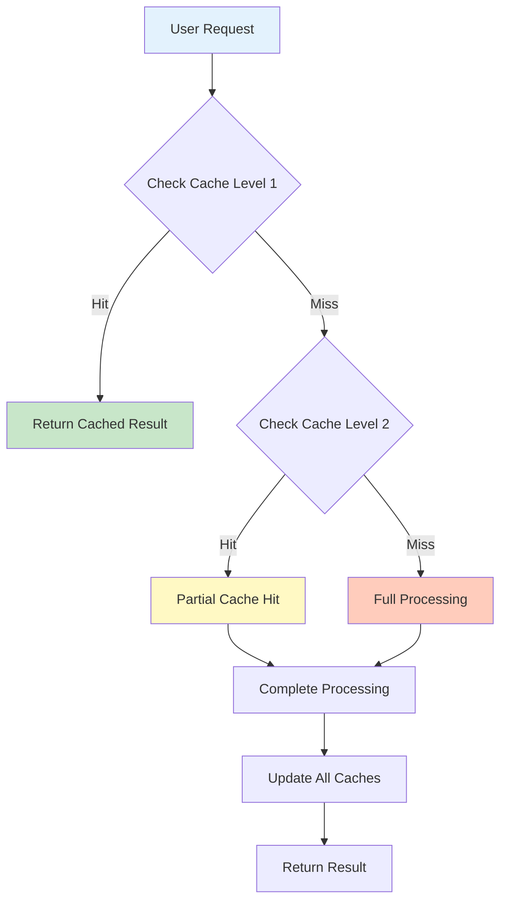

**Cache Levels:**

1. **Level 1: Response Cache**
   - Stores complete LLM responses
   - Key: Query hash + context hash
   - TTL: 1 hour
   - Size: 100 entries

2. **Level 2: Embedding Cache**
   - Stores document embeddings
   - Key: Document hash
   - TTL: Infinite (until document changes)
   - Size: All indexed documents

3. **Level 3: Cross-Encoder Score Cache**
   - Stores reranking scores
   - Key: Query hash + document hash
   - TTL: 1 hour
   - Size: 1000 entries (LRU)

4. **Level 4: Document Processing Cache**
   - Stores parsed resume entities
   - Key: File hash
   - TTL: Infinite
   - Storage: Joblib pickle + JSON

#### 7.1.2 Document Processing Cache

**Implementation:**

```python
import joblib
import hashlib
import json
from pathlib import Path

class DocumentCache:
    def __init__(self, cache_dir="data/cache"):
        self.cache_dir = Path(cache_dir)
        self.cache_dir.mkdir(parents=True, exist_ok=True)
        
        self.json_cache = self.cache_dir / "processed_resumes.json"
        self.pickle_cache = self.cache_dir / "processed_resumes.pkl"
        
        self.memory_cache = self._load_cache()
    
    def _compute_file_hash(self, file_path):
        """Compute SHA256 hash of file"""
        sha256 = hashlib.sha256()
        with open(file_path, 'rb') as f:
            for chunk in iter(lambda: f.read(4096), b''):
                sha256.update(chunk)
        return sha256.hexdigest()
    
    def _load_cache(self):
        """Load cache from disk"""
        try:
            # Try pickle first (faster)
            if self.pickle_cache.exists():
                return joblib.load(self.pickle_cache)
            # Fallback to JSON
            elif self.json_cache.exists():
                with open(self.json_cache, 'r') as f:
                    return json.load(f)
        except Exception as e:
            logging.warning(f"Cache load failed: {e}")
        
        return {}
    
    def _save_cache(self):
        """Save cache to disk"""
        try:
            # Save as pickle (faster loading)
            joblib.dump(self.memory_cache, self.pickle_cache)
            
            # Also save as JSON (human-readable backup)
            with open(self.json_cache, 'w') as f:
                json.dump(self.memory_cache, f, indent=2)
        except Exception as e:
            logging.error(f"Cache save failed: {e}")
    
    def get(self, file_path):
        """Get cached processing result"""
        file_hash = self._compute_file_hash(file_path)
        return self.memory_cache.get(file_hash)
    
    def set(self, file_path, result):
        """Cache processing result"""
        file_hash = self._compute_file_hash(file_path)
        self.memory_cache[file_hash] = {
            'file_path': str(file_path),
            'file_hash': file_hash,
            'timestamp': time.time(),
            'result': result
        }
        self._save_cache()
    
    def invalidate(self, file_path):
        """Invalidate cache for specific file"""
        file_hash = self._compute_file_hash(file_path)
        if file_hash in self.memory_cache:
            del self.memory_cache[file_hash]
            self._save_cache()
```

**Usage:**

```python
cache = DocumentCache()

def process_resume(file_path):
    # Check cache
    cached = cache.get(file_path)
    if cached:
        logging.info(f"Cache hit: {file_path}")
        return cached['result']
    
    # Process document
    logging.info(f"Cache miss: {file_path}")
    result = extract_comprehensive_entities(file_path)
    
    # Update cache
    cache.set(file_path, result)
    
    return result
```

**Benefits:**
- Avoids reprocessing unchanged documents
- Speeds up restart/reload by 10-20x
- Preserves work across sessions
- Dual format (pickle + JSON) for reliability

#### 7.1.3 Embedding Cache

**Strategy:** Store embeddings with document hash

```python
class EmbeddingCache:
    def __init__(self):
        self.cache = {}
    
    def get_embeddings(self, texts, is_query=False):
        """Get embeddings with caching"""
        # Compute hashes
        hashes = [
            hashlib.md5(f"{is_query}|{text}".encode()).hexdigest()
            for text in texts
        ]
        
        # Check cache
        cached_embeddings = []
        uncached_indices = []
        uncached_texts = []
        
        for i, (text, hash_key) in enumerate(zip(texts, hashes)):
            if hash_key in self.cache:
                cached_embeddings.append((i, self.cache[hash_key]))
            else:
                uncached_indices.append(i)
                uncached_texts.append(text)
        
        # Generate missing embeddings
        if uncached_texts:
            new_embeddings = self.model.encode(uncached_texts, is_query=is_query)
            
            # Update cache
            for idx, text, embedding in zip(uncached_indices, uncached_texts, new_embeddings):
                hash_key = hashlib.md5(f"{is_query}|{text}".encode()).hexdigest()
                self.cache[hash_key] = embedding
                cached_embeddings.append((idx, embedding))
        
        # Sort by original index
        cached_embeddings.sort(key=lambda x: x[0])
        embeddings = [emb for _, emb in cached_embeddings]
        
        return embeddings
```

**Cache Hit Scenarios:**
- Same document re-indexed: 100% hit
- Similar chunks (rare): 0% hit
- Query repeated: 100% hit

**Storage Size:**
```
Per embedding: 384 floats × 4 bytes = 1.5 KB
100 documents × 10 chunks × 1.5 KB = 1.5 MB
1000 documents × 10 chunks × 1.5 KB = 15 MB

Conclusion: Reasonable memory footprint
```

### 7.2 Batch Processing

#### 7.2.1 Document Batch Processing

**Parallel Document Processing:**

```python
def process_multiple_documents(file_paths, max_workers=2):
    """
    Process multiple documents in parallel
    
    Args:
        file_paths: List of document paths
        max_workers: Number of parallel workers
    """
    from joblib import Parallel, delayed
    
    def process_single(file_path):
        try:
            # Check cache first
            cached = cache.get(file_path)
            if cached:
                return {'success': True, 'cached': True, 'data': cached['result']}
            
            # Process document
            result = extract_comprehensive_entities(file_path)
            
            # Cache result
            cache.set(file_path, result)
            
            return {'success': True, 'cached': False, 'data': result}
            
        except Exception as e:
            return {'success': False, 'error': str(e), 'file': file_path}
    
    # Process in parallel with timeout
    results = Parallel(n_jobs=max_workers, backend='threading', timeout=300)(
        delayed(process_single)(fp) for fp in file_paths
    )
    
    return results
```

**Benefits:**
- 2x speedup with 2 workers
- Utilizes multi-core CPUs
- Timeout protection prevents hangs

#### 7.2.2 Embedding Batch Processing

**Optimal Batch Sizes:**

```python
def determine_batch_size():
    """
    Determine optimal batch size based on hardware
    """
    import torch
    
    # Check if CUDA available
    if torch.cuda.is_available():
        gpu_memory = torch.cuda.get_device_properties(0).total_memory
        
        if gpu_memory > 16 * 1024**3:  # > 16GB
            return 128
        elif gpu_memory > 8 * 1024**3:  # > 8GB
            return 64
        else:
            return 32
    else:
        # CPU only
        import psutil
        ram = psutil.virtual_memory().total
        
        if ram > 16 * 1024**3:  # > 16GB RAM
            return 32
        else:
            return 16
```

**Batching Strategy:**

```python
def embed_documents_batched(documents, batch_size=32):
    """
    Generate embeddings in optimal batches
    """
    all_embeddings = []
    
    for i in range(0, len(documents), batch_size):
        batch = documents[i:i + batch_size]
        
        # Log progress
        if i % (batch_size * 10) == 0:
            logging.info(f"Embedding progress: {i}/{len(documents)}")
        
        # Generate embeddings
        batch_embeddings = model.encode(batch)
        all_embeddings.extend(batch_embeddings)
    
    return np.array(all_embeddings)
```

### 7.3 Index Optimization

#### 7.3.1 FAISS Index Selection

**Index Types by Scale:**

```
< 10,000 vectors:
- IndexFlatIP (current)
- Exact search
- No training needed
- Fast enough

10,000 - 100,000 vectors:
- IndexIVFFlat
- Train with sample
- 10-20x faster
- 90-95% recall

100,000 - 1,000,000 vectors:
- IndexIVFPQ
- Product quantization
- 50-100x faster
- 85-90% recall

> 1,000,000 vectors:
- IndexHNSW
- Graph-based
- 100-500x faster
- 90-95% recall
```

**Migration Strategy:**

```python
def build_optimized_index(embeddings, index_type="auto"):
    """
    Build appropriate FAISS index based on size
    """
    n_vectors = len(embeddings)
    dimension = embeddings.shape[1]
    
    if index_type == "auto":
        if n_vectors < 10000:
            index_type = "flat"
        elif n_vectors < 100000:
            index_type = "ivf"
        else:
            index_type = "hnsw"
    
    if index_type == "flat":
        # Exact search
        index = faiss.IndexFlatIP(dimension)
        index.add(embeddings)
        
    elif index_type == "ivf":
        # Inverted file index
        n_clusters = min(int(np.sqrt(n_vectors)), 1000)
        quantizer = faiss.IndexFlatIP(dimension)
        index = faiss.IndexIVFFlat(quantizer, dimension, n_clusters)
        
        # Train index
        index.train(embeddings)
        index.add(embeddings)
        
        # Set search parameters
        index.nprobe = min(10, n_clusters)  # Check 10 clusters
        
    elif index_type == "hnsw":
        # Hierarchical Navigable Small World
        index = faiss.IndexHNSWFlat(dimension, 32)  # 32 = M parameter
        index.add(embeddings)
    
    return index
```

#### 7.3.2 Qdrant Index Optimization

**Collection Configuration:**

```python
from qdrant_client.models import (
    Distance, VectorParams, OptimizersConfigDiff,
    HnswConfigDiff
)

client.create_collection(
    collection_name="resume_embeddings",
    vectors_config=VectorParams(
        size=384,
        distance=Distance.COSINE
    ),
    optimizers_config=OptimizersConfigDiff(
        indexing_threshold=10000,  # Start indexing after 10k vectors
        memmap_threshold=20000     # Use memory mapping after 20k
    ),
    hnsw_config=HnswConfigDiff(
        m=16,                      # Number of connections
        ef_construct=100,          # Construction time quality
        full_scan_threshold=10000  # Brute force below this size
    )
)
```

**Search Optimization:**

```python
def optimized_search(query_vector, top_k=10, ef=50):
    """
    Search with optimized parameters
    
    Args:
        ef: Higher = better quality, slower
            Recommended: 50-200 for prod
    """
    results = client.search(
        collection_name="resume_embeddings",
        query_vector=query_vector,
        limit=top_k,
        search_params={
            "hnsw_ef": ef,  # Quality parameter
            "exact": False  # Approximate search
        }
    )
    
    return results
```

### 7.4 Memory Management

#### 7.4.1 Memory Profiling

**Monitor Memory Usage:**

```python
import psutil
import os

def get_memory_usage():
    """Get current memory usage in MB"""
    process = psutil.Process(os.getpid())
    return process.memory_info().rss / 1024**2

def log_memory_usage(operation):
    """Decorator to log memory usage"""
    def decorator(func):
        def wrapper(*args, **kwargs):
            mem_before = get_memory_usage()
            result = func(*args, **kwargs)
            mem_after = get_memory_usage()
            
            logging.info(
                f"{operation}: "
                f"Memory before: {mem_before:.1f}MB, "
                f"after: {mem_after:.1f}MB, "
                f"delta: {mem_after - mem_before:.1f}MB"
            )
            
            return result
        return wrapper
    return decorator

@log_memory_usage("Document Processing")
def process_resume(file_path):
    # Process resume
    pass
```

#### 7.4.2 Memory Optimization Techniques

**1. Lazy Loading:**

```python
class LazyEmbeddingLoader:
    """Load embeddings only when needed"""
    
    def __init__(self, embedding_file):
        self.embedding_file = embedding_file
        self._embeddings = None
    
    @property
    def embeddings(self):
        if self._embeddings is None:
            self._embeddings = np.load(self.embedding_file)
        return self._embeddings
    
    def unload(self):
        """Free memory"""
        self._embeddings = None
        import gc
        gc.collect()
```

**2. Streaming Processing:**

```python
def process_large_file_streaming(file_path, chunk_size=1000):
    """
    Process large files in chunks to avoid loading entire file
    """
    with open(file_path, 'r') as f:
        buffer = []
        
        for line in f:
            buffer.append(line)
            
            if len(buffer) >= chunk_size:
                # Process chunk
                yield process_chunk(buffer)
                buffer = []
        
        # Process remaining
        if buffer:
            yield process_chunk(buffer)
```

**3. Garbage Collection:**

```python
import gc

def cleanup_memory():
    """Force garbage collection"""
    gc.collect()
    
    # Additional: Clear CUDA cache if using GPU
    try:
        import torch
        torch.cuda.empty_cache()
    except:
        pass
```

### 7.5 Performance Monitoring

#### 7.5.1 Timing Decorators

```python
import time
from functools import wraps

def timing(operation_name):
    """Decorator to measure execution time"""
    def decorator(func):
        @wraps(func)
        def wrapper(*args, **kwargs):
            start = time.time()
            result = func(*args, **kwargs)
            elapsed = time.time() - start
            
            logging.info(f"{operation_name}: {elapsed:.3f}s")
            
            return result
        return wrapper
    return decorator

@timing("Document Processing")
def process_document(file_path):
    # Processing logic
    pass

@timing("Embedding Generation")
def generate_embeddings(texts):
    # Embedding logic
    pass
```

#### 7.5.2 Performance Metrics

**Key Metrics to Track:**

```python
class PerformanceMetrics:
    def __init__(self):
        self.metrics = {
            'document_processing': [],
            'embedding_generation': [],
            'search_latency': [],
            'llm_latency': [],
            'end_to_end': []
        }
    
    def record(self, metric_name, value):
        if metric_name in self.metrics:
            self.metrics[metric_name].append(value)
    
    def get_stats(self, metric_name):
        values = self.metrics.get(metric_name, [])
        if not values:
            return None
        
        return {
            'count': len(values),
            'mean': np.mean(values),
            'median': np.median(values),
            'p95': np.percentile(values, 95),
            'p99': np.percentile(values, 99),
            'min': np.min(values),
            'max': np.max(values)
        }
    
    def print_summary(self):
        print("\n=== Performance Summary ===")
        for metric_name in self.metrics:
            stats = self.get_stats(metric_name)
            if stats:
                print(f"\n{metric_name}:")
                print(f"  Mean: {stats['mean']:.3f}s")
                print(f"  P95: {stats['p95']:.3f}s")
                print(f"  P99: {stats['p99']:.3f}s")
```

**Target Performance:**

```
Document Processing: < 5s per resume
Embedding Generation: < 2s per batch (32 chunks)
Search (Hybrid): < 100ms
Cross-Encoder Reranking: < 150ms (first), < 50ms (cached)
LLM Response: < 3s
End-to-End Query: < 4s
```

---

## Section 8: Data Processing & Storage

### 8.1 File Upload and Validation

#### 8.1.1 Upload Flow

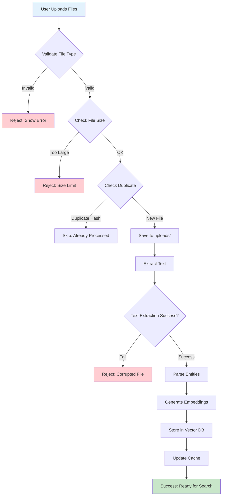

#### 8.1.2 File Type Validation

**Supported Formats:**

```python
SUPPORTED_EXTENSIONS = {
    '.pdf': 'application/pdf',
    '.docx': 'application/vnd.openxmlformats-officedocument.wordprocessingml.document',
    '.doc': 'application/msword'
}

MAX_FILE_SIZE = 10 * 1024 * 1024  # 10 MB

def validate_file(file_path):
    """
    Validate uploaded file
    
    Returns:
        dict: {valid: bool, error: str or None}
    """
    # Check if file exists
    if not os.path.exists(file_path):
        return {'valid': False, 'error': 'File not found'}
    
    # Check extension
    file_ext = os.path.splitext(file_path)[1].lower()
    if file_ext not in SUPPORTED_EXTENSIONS:
        return {
            'valid': False,
            'error': f'Unsupported format. Allowed: {", ".join(SUPPORTED_EXTENSIONS.keys())}'
        }
    
    # Check file size
    file_size = os.path.getsize(file_path)
    if file_size > MAX_FILE_SIZE:
        return {
            'valid': False,
            'error': f'File too large. Max size: {MAX_FILE_SIZE / 1024**2:.0f}MB'
        }
    
    if file_size == 0:
        return {'valid': False, 'error': 'File is empty'}
    
    # Check file integrity
    try:
        if file_ext == '.pdf':
            import fitz
            doc = fitz.open(file_path)
            if doc.page_count == 0:
                return {'valid': False, 'error': 'PDF has no pages'}
            doc.close()
        
        elif file_ext in ['.doc', '.docx']:
            from docx import Document
            doc = Document(file_path)
            if len(doc.paragraphs) == 0:
                return {'valid': False, 'error': 'Document is empty'}
    
    except Exception as e:
        return {'valid': False, 'error': f'Corrupted file: {str(e)}'}
    
    return {'valid': True, 'error': None}
```

#### 8.1.3 Duplicate Detection

**File Hash-Based Deduplication:**

```python
def compute_file_hash(file_path):
    """
    Compute SHA256 hash of file content
    Fast duplicate detection
    """
    sha256 = hashlib.sha256()
    
    with open(file_path, 'rb') as f:
        # Read in chunks to handle large files
        for chunk in iter(lambda: f.read(8192), b''):
            sha256.update(chunk)
    
    return sha256.hexdigest()

def is_duplicate(file_path, cache):
    """
    Check if file already processed
    
    Returns:
        tuple: (is_dup, existing_entry or None)
    """
    file_hash = compute_file_hash(file_path)
    
    # Check in cache
    for hash_key, entry in cache.memory_cache.items():
        if hash_key == file_hash:
            return True, entry
    
    return False, None

def handle_upload(file_path, cache):
    """
    Handle file upload with duplicate check
    """
    # Validate
    validation = validate_file(file_path)
    if not validation['valid']:
        return {'success': False, 'error': validation['error']}
    
    # Check duplicate
    is_dup, existing = is_duplicate(file_path, cache)
    if is_dup:
        return {
            'success': True,
            'duplicate': True,
            'message': f"File already processed: {existing['result']['candidate_name']}",
            'data': existing['result']
        }
    
    # Process new file
    try:
        result = process_resume(file_path)
        return {
            'success': True,
            'duplicate': False,
            'data': result
        }
    except Exception as e:
        return {'success': False, 'error': str(e)}
```

### 8.2 Text Extraction

#### 8.2.1 PDF Text Extraction

**Using PyMuPDF (fitz):**

```python
import fitz  # PyMuPDF

def extract_text_from_pdf(pdf_path):
    """
    Extract text from PDF with layout preservation
    
    Features:
    - Preserves line breaks and spacing
    - Handles multi-column layouts
    - Extracts text blocks in reading order
    """
    try:
        doc = fitz.open(pdf_path)
        text_parts = []
        
        for page_num in range(doc.page_count):
            page = doc[page_num]
            
            # Extract text with layout
            text = page.get_text("text")
            
            # Alternative: Extract with better structure
            # blocks = page.get_text("blocks")
            # for block in blocks:
            #     text_parts.append(block[4])  # block[4] is text content
            
            text_parts.append(text)
        
        doc.close()
        
        full_text = "\n\n".join(text_parts)
        
        # Clean text
        full_text = clean_extracted_text(full_text)
        
        return full_text
    
    except Exception as e:
        raise Exception(f"PDF extraction failed: {str(e)}")
```

**Advanced: OCR for Scanned PDFs:**

```python
def extract_with_ocr_fallback(pdf_path):
    """
    Extract text with OCR fallback for scanned PDFs
    """
    # Try regular extraction first
    text = extract_text_from_pdf(pdf_path)
    
    # Check if text is meaningful
    if len(text.strip()) < 100:
        # Likely scanned PDF, use OCR
        logging.info("Low text content, attempting OCR...")
        text = extract_with_ocr(pdf_path)
    
    return text

def extract_with_ocr(pdf_path):
    """
    Extract text using OCR (requires pytesseract)
    """
    try:
        import pytesseract
        from PIL import Image
        import fitz
        
        doc = fitz.open(pdf_path)
        text_parts = []
        
        for page_num in range(doc.page_count):
            page = doc[page_num]
            
            # Convert page to image
            pix = page.get_pixmap(matrix=fitz.Matrix(2, 2))  # 2x scale
            img = Image.frombytes("RGB", [pix.width, pix.height], pix.samples)
            
            # OCR
            text = pytesseract.image_to_string(img)
            text_parts.append(text)
        
        doc.close()
        
        return "\n\n".join(text_parts)
    
    except ImportError:
        logging.warning("pytesseract not installed, OCR unavailable")
        return ""
```

#### 8.2.2 DOCX Text Extraction

**Using python-docx:**

```python
from docx import Document

def extract_text_from_docx(docx_path):
    """
    Extract text from DOCX with structure preservation
    
    Features:
    - Preserves paragraphs
    - Extracts tables
    - Handles headers/footers
    """
    try:
        doc = Document(docx_path)
        text_parts = []
        
        # Extract paragraphs
        for para in doc.paragraphs:
            if para.text.strip():
                text_parts.append(para.text)
        
        # Extract tables
        for table in doc.tables:
            for row in table.rows:
                row_text = " | ".join(cell.text.strip() for cell in row.cells)
                if row_text.strip():
                    text_parts.append(row_text)
        
        full_text = "\n".join(text_parts)
        
        # Clean text
        full_text = clean_extracted_text(full_text)
        
        return full_text
    
    except Exception as e:
        raise Exception(f"DOCX extraction failed: {str(e)}")
```

#### 8.2.3 Text Cleaning

**Normalization Pipeline:**

```python
import re

def clean_extracted_text(text):
    """
    Clean and normalize extracted text
    
    Steps:
    1. Remove excessive whitespace
    2. Normalize line breaks
    3. Remove special characters (preserve structure)
    4. Fix encoding issues
    """
    # Remove null bytes
    text = text.replace('\x00', '')
    
    # Fix common encoding issues
    text = text.encode('utf-8', errors='ignore').decode('utf-8')
    
    # Normalize unicode
    import unicodedata
    text = unicodedata.normalize('NFKD', text)
    
    # Remove excessive blank lines
    text = re.sub(r'\n\s*\n\s*\n+', '\n\n', text)
    
    # Remove excessive spaces
    text = re.sub(r' {2,}', ' ', text)
    
    # Remove leading/trailing whitespace per line
    lines = [line.strip() for line in text.split('\n')]
    text = '\n'.join(lines)
    
    return text.strip()
```

### 8.3 Vector Database Storage

#### 8.3.1 Qdrant Schema

**Collection Structure:**

```python
from qdrant_client.models import Distance, VectorParams, PointStruct

COLLECTION_NAME = "resume_embeddings"
VECTOR_SIZE = 384  # BAAI/bge-small-en-v1.5 dimension

def initialize_qdrant_collection(client):
    """
    Initialize or recreate Qdrant collection
    """
    # Check if collection exists
    collections = client.get_collections().collections
    collection_exists = any(c.name == COLLECTION_NAME for c in collections)
    
    if collection_exists:
        logging.info(f"Collection '{COLLECTION_NAME}' already exists")
        return
    
    # Create collection
    client.create_collection(
        collection_name=COLLECTION_NAME,
        vectors_config=VectorParams(
            size=VECTOR_SIZE,
            distance=Distance.COSINE
        )
    )
    
    logging.info(f"Created collection '{COLLECTION_NAME}'")
```

**Point Structure:**

```python
{
    "id": "unique_chunk_id",          # UUID or hash-based ID
    "vector": [0.123, -0.456, ...],   # 384-dim embedding
    "payload": {
        # Document metadata
        "resume_name": "john_smith_resume.pdf",
        "candidate_name": "John Smith",
        "file_hash": "abc123...",
        
        # Chunk metadata
        "chunk_id": 0,
        "section": "experience",
        "text": "Senior Software Engineer at Tech Corp...",
        
        # Extracted entities
        "skills": ["Python", "AWS", "Docker"],
        "experience_years": 7,
        "education_level": "Master's",
        "certifications": ["AWS Solutions Architect"],
        
        # Timestamps
        "uploaded_at": "2025-10-04T12:34:56",
        "processed_at": "2025-10-04T12:35:12"
    }
}
```

#### 8.3.2 Storing Embeddings

**Batch Upload:**

```python
def store_embeddings_qdrant(client, embeddings, metadata_list):
    """
    Store embeddings in Qdrant with metadata
    
    Args:
        embeddings: np.array of shape (n, 384)
        metadata_list: List of metadata dicts
    """
    points = []
    
    for i, (embedding, metadata) in enumerate(zip(embeddings, metadata_list)):
        point = PointStruct(
            id=str(uuid.uuid4()),  # Unique ID
            vector=embedding.tolist(),
            payload=metadata
        )
        points.append(point)
    
    # Upload in batches
    batch_size = 100
    for i in range(0, len(points), batch_size):
        batch = points[i:i + batch_size]
        client.upsert(
            collection_name=COLLECTION_NAME,
            points=batch
        )
        
        logging.info(f"Uploaded batch {i // batch_size + 1}/{(len(points) + batch_size - 1) // batch_size}")
    
    logging.info(f"Successfully stored {len(points)} embeddings")
```

**Update vs Insert:**

```python
def upsert_resume(client, resume_data):
    """
    Insert or update resume in vector database
    
    Strategy:
    1. Delete existing points with same file_hash
    2. Insert new points
    """
    file_hash = resume_data['file_hash']
    
    # Delete existing
    client.delete(
        collection_name=COLLECTION_NAME,
        points_selector={
            "filter": {
                "must": [
                    {
                        "key": "file_hash",
                        "match": {"value": file_hash}
                    }
                ]
            }
        }
    )
    
    # Insert new
    store_embeddings_qdrant(
        client,
        resume_data['embeddings'],
        resume_data['metadata_list']
    )
```

#### 8.3.3 Querying Qdrant

**Basic Search:**

```python
def search_qdrant(client, query_embedding, top_k=10, filters=None):
    """
    Search Qdrant with optional filters
    
    Args:
        query_embedding: np.array of shape (384,)
        top_k: Number of results
        filters: Optional filter conditions
    """
    search_params = {
        "collection_name": COLLECTION_NAME,
        "query_vector": query_embedding.tolist(),
        "limit": top_k
    }
    
    if filters:
        search_params["query_filter"] = filters
    
    results = client.search(**search_params)
    
    return results
```

**Filtered Search:**

```python
def search_with_filters(client, query_embedding, skills=None, min_experience=None):
    """
    Search with entity filters
    
    Example filters:
    - Required skills
    - Minimum experience years
    - Education level
    - Certifications
    """
    filter_conditions = {"must": []}
    
    # Filter by skills
    if skills:
        for skill in skills:
            filter_conditions["must"].append({
                "key": "skills",
                "match": {"any": [skill]}
            })
    
    # Filter by experience
    if min_experience:
        filter_conditions["must"].append({
            "key": "experience_years",
            "range": {"gte": min_experience}
        })
    
    results = client.search(
        collection_name=COLLECTION_NAME,
        query_vector=query_embedding.tolist(),
        limit=20,
        query_filter=filter_conditions if filter_conditions["must"] else None
    )
    
    return results
```

### 8.4 FAISS Index Storage

#### 8.4.1 Index Persistence

**Save Index:**

```python
def save_faiss_index(index, index_path="data/index/faiss.index"):
    """
    Save FAISS index to disk
    """
    os.makedirs(os.path.dirname(index_path), exist_ok=True)
    faiss.write_index(index, index_path)
    logging.info(f"FAISS index saved to {index_path}")

def load_faiss_index(index_path="data/index/faiss.index"):
    """
    Load FAISS index from disk
    """
    if not os.path.exists(index_path):
        return None
    
    index = faiss.read_index(index_path)
    logging.info(f"FAISS index loaded from {index_path}")
    return index
```

**Metadata Storage:**

```python
def save_faiss_metadata(metadata_list, metadata_path="data/index/faiss_metadata.pkl"):
    """
    Save metadata corresponding to FAISS index
    
    Note: FAISS only stores vectors, metadata stored separately
    """
    import pickle
    
    os.makedirs(os.path.dirname(metadata_path), exist_ok=True)
    
    with open(metadata_path, 'wb') as f:
        pickle.dump(metadata_list, f)
    
    logging.info(f"Metadata saved to {metadata_path}")

def load_faiss_metadata(metadata_path="data/index/faiss_metadata.pkl"):
    """
    Load metadata for FAISS index
    """
    if not os.path.exists(metadata_path):
        return []
    
    import pickle
    
    with open(metadata_path, 'rb') as f:
        metadata_list = pickle.load(f)
    
    logging.info(f"Metadata loaded from {metadata_path}")
    return metadata_list
```

#### 8.4.2 Index Updates

**Incremental Updates:**

```python
class FAISSIndexManager:
    def __init__(self, index_path, metadata_path):
        self.index_path = index_path
        self.metadata_path = metadata_path
        
        # Load or create
        self.index = load_faiss_index(index_path)
        self.metadata = load_faiss_metadata(metadata_path)
        
        if self.index is None:
            # Create new index
            self.index = faiss.IndexFlatIP(384)
            self.metadata = []
    
    def add_embeddings(self, embeddings, metadata_list):
        """
        Add new embeddings to index
        """
        # Add to FAISS
        self.index.add(embeddings)
        
        # Add metadata
        self.metadata.extend(metadata_list)
        
        # Save
        self.save()
    
    def remove_by_file_hash(self, file_hash):
        """
        Remove embeddings by file hash
        
        Note: FAISS doesn't support deletion directly
        Strategy: Rebuild index without the removed entries
        """
        # Find indices to keep
        keep_indices = [
            i for i, meta in enumerate(self.metadata)
            if meta.get('file_hash') != file_hash
        ]
        
        if len(keep_indices) == len(self.metadata):
            logging.info(f"No entries found for file_hash: {file_hash}")
            return
        
        # Rebuild index
        new_index = faiss.IndexFlatIP(384)
        new_metadata = []
        
        for idx in keep_indices:
            # Get vector from old index
            vector = self.index.reconstruct(idx)
            
            # Add to new index
            new_index.add(np.array([vector]))
            new_metadata.append(self.metadata[idx])
        
        self.index = new_index
        self.metadata = new_metadata
        
        self.save()
        
        logging.info(f"Removed {len(self.metadata) - len(keep_indices)} entries")
    
    def save(self):
        """Save index and metadata"""
        save_faiss_index(self.index, self.index_path)
        save_faiss_metadata(self.metadata, self.metadata_path)
    
    def search(self, query_embedding, top_k=10):
        """
        Search index
        
        Returns:
            List of (score, metadata) tuples
        """
        if self.index.ntotal == 0:
            return []
        
        scores, indices = self.index.search(
            np.array([query_embedding]),
            min(top_k, self.index.ntotal)
        )
        
        results = []
        for score, idx in zip(scores[0], indices[0]):
            if idx == -1:  # FAISS returns -1 for empty slots
                continue
            results.append({
                'score': float(score),
                'metadata': self.metadata[idx]
            })
        
        return results
```

### 8.5 Cache Management

#### 8.5.1 Cache File Formats

**JSON Format (Human-Readable):**

```python
# data/cache/processed_resumes.json
{
    "abc123def456...": {
        "file_path": "/path/to/resume.pdf",
        "file_hash": "abc123def456...",
        "timestamp": 1696435200.123,
        "result": {
            "candidate_name": "John Smith",
            "skills": ["Python", "AWS"],
            "experience": [...],
            "education": [...]
        }
    }
}
```

**Pickle Format (Fast Loading):**

```python
# data/cache/processed_resumes.pkl
# Binary format, 5-10x faster loading than JSON
# Used for production, JSON for debugging
```

#### 8.5.2 Cache Invalidation

**Strategies:**

```python
class CacheManager:
    def invalidate_by_file(self, file_path):
        """Invalidate specific file"""
        file_hash = compute_file_hash(file_path)
        if file_hash in self.memory_cache:
            del self.memory_cache[file_hash]
            self._save_cache()
    
    def invalidate_by_age(self, max_age_days=30):
        """Remove entries older than specified days"""
        current_time = time.time()
        cutoff_time = current_time - (max_age_days * 86400)
        
        removed = 0
        for hash_key, entry in list(self.memory_cache.items()):
            if entry['timestamp'] < cutoff_time:
                del self.memory_cache[hash_key]
                removed += 1
        
        if removed > 0:
            self._save_cache()
            logging.info(f"Removed {removed} old cache entries")
    
    def clear_all(self):
        """Clear entire cache"""
        self.memory_cache = {}
        self._save_cache()
        logging.info("Cache cleared")
    
    def get_cache_stats(self):
        """Get cache statistics"""
        total_entries = len(self.memory_cache)
        total_size = 0
        
        if self.pickle_cache.exists():
            total_size = self.pickle_cache.stat().st_size
        
        oldest_entry = None
        newest_entry = None
        
        for entry in self.memory_cache.values():
            timestamp = entry['timestamp']
            if oldest_entry is None or timestamp < oldest_entry:
                oldest_entry = timestamp
            if newest_entry is None or timestamp > newest_entry:
                newest_entry = timestamp
        
        return {
            'total_entries': total_entries,
            'total_size_mb': total_size / 1024**2,
            'oldest_entry': oldest_entry,
            'newest_entry': newest_entry
        }
```

### 8.6 Data Cleanup and Retention

#### 8.6.1 Temporary File Cleanup

```python
def cleanup_temp_files(uploads_dir="data/uploads", max_age_hours=24):
    """
    Remove old uploaded files
    
    Strategy:
    - Keep files for 24 hours after processing
    - Remove if corresponding entry not in cache
    """
    current_time = time.time()
    cutoff_time = current_time - (max_age_hours * 3600)
    
    removed = 0
    
    for file_path in Path(uploads_dir).glob("*"):
        if file_path.is_file():
            # Check file age
            file_mtime = file_path.stat().st_mtime
            
            if file_mtime < cutoff_time:
                try:
                    file_path.unlink()
                    removed += 1
                except Exception as e:
                    logging.warning(f"Failed to remove {file_path}: {e}")
    
    logging.info(f"Cleaned up {removed} old files from {uploads_dir}")
```

#### 8.6.2 Index Maintenance

```python
def maintain_vector_database(client):
    """
    Perform regular maintenance on vector database
    
    Tasks:
    - Remove orphaned entries
    - Optimize index
    - Vacuum deleted records
    """
    # Get collection info
    collection_info = client.get_collection(COLLECTION_NAME)
    total_points = collection_info.points_count
    
    logging.info(f"Maintaining collection with {total_points} points")
    
    # Optimize (Qdrant-specific)
    try:
        client.optimize_collection(COLLECTION_NAME)
        logging.info("Collection optimized")
    except Exception as e:
        logging.warning(f"Optimization failed: {e}")
```

### 8.7 Backup and Recovery

#### 8.7.1 Backup Strategy

```python
def backup_data(backup_dir="backups"):
    """
    Create full backup of data
    
    Includes:
    - Cache files
    - FAISS index
    - Qdrant snapshot
    """
    timestamp = datetime.now().strftime("%Y%m%d_%H%M%S")
    backup_path = Path(backup_dir) / f"backup_{timestamp}"
    backup_path.mkdir(parents=True, exist_ok=True)
    
    # Backup cache
    cache_src = Path("data/cache")
    cache_dst = backup_path / "cache"
    if cache_src.exists():
        shutil.copytree(cache_src, cache_dst)
    
    # Backup FAISS index
    faiss_src = Path("data/index")
    faiss_dst = backup_path / "index"
    if faiss_src.exists():
        shutil.copytree(faiss_src, faiss_dst)
    
    # Backup Qdrant (create snapshot)
    try:
        snapshot_info = client.create_snapshot(COLLECTION_NAME)
        snapshot_name = snapshot_info.name
        
        # Save snapshot info
        with open(backup_path / "qdrant_snapshot.txt", 'w') as f:
            f.write(snapshot_name)
        
        logging.info(f"Qdrant snapshot created: {snapshot_name}")
    except Exception as e:
        logging.warning(f"Qdrant backup failed: {e}")
    
    logging.info(f"Backup completed: {backup_path}")
    
    return backup_path
```

#### 8.7.2 Recovery

```python
def restore_from_backup(backup_path):
    """
    Restore data from backup
    """
    backup_path = Path(backup_path)
    
    if not backup_path.exists():
        raise Exception(f"Backup not found: {backup_path}")
    
    # Restore cache
    cache_src = backup_path / "cache"
    cache_dst = Path("data/cache")
    if cache_src.exists():
        if cache_dst.exists():
            shutil.rmtree(cache_dst)
        shutil.copytree(cache_src, cache_dst)
    
    # Restore FAISS index
    faiss_src = backup_path / "index"
    faiss_dst = Path("data/index")
    if faiss_src.exists():
        if faiss_dst.exists():
            shutil.rmtree(faiss_dst)
        shutil.copytree(faiss_src, faiss_dst)
    
    # Restore Qdrant snapshot
    snapshot_file = backup_path / "qdrant_snapshot.txt"
    if snapshot_file.exists():
        with open(snapshot_file, 'r') as f:
            snapshot_name = f.read().strip()
        
        try:
            client.restore_snapshot(COLLECTION_NAME, snapshot_name)
            logging.info(f"Qdrant restored from snapshot: {snapshot_name}")
        except Exception as e:
            logging.warning(f"Qdrant restore failed: {e}")
    
    logging.info(f"Restore completed from: {backup_path}")
```

---

## Section 9: API Design & Interface Layer

### 9.1 Streamlit Application Architecture

#### 9.1.1 Application Structure

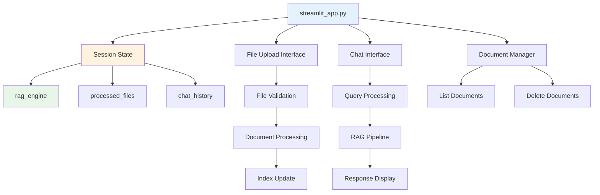

#### 9.1.2 Session State Management

**Persistent State:**

```python
import streamlit as st

def initialize_session_state():
    """
    Initialize Streamlit session state
    
    Session variables:
    - rag_engine: RAG engine instance
    - processed_files: Set of processed file names
    - chat_history: List of (question, answer) tuples
    - processing_status: Current processing state
    """
    if 'rag_engine' not in st.session_state:
        st.session_state.rag_engine = None
    
    if 'processed_files' not in st.session_state:
        st.session_state.processed_files = set()
    
    if 'chat_history' not in st.session_state:
        st.session_state.chat_history = []
    
    if 'processing_status' not in st.session_state:
        st.session_state.processing_status = {
            'active': False,
            'message': '',
            'progress': 0
        }
    
    if 'search_mode' not in st.session_state:
        st.session_state.search_mode = "hybrid"  # hybrid, semantic, keyword
```

**State Persistence Across Reruns:**

```python
def preserve_state(func):
    """
    Decorator to preserve state across reruns
    """
    def wrapper(*args, **kwargs):
        # Store current state
        old_state = {
            k: v for k, v in st.session_state.items()
        }
        
        # Execute function
        result = func(*args, **kwargs)
        
        # Restore critical state if lost
        for key in ['rag_engine', 'processed_files', 'chat_history']:
            if key not in st.session_state and key in old_state:
                st.session_state[key] = old_state[key]
        
        return result
    
    return wrapper
```

### 9.2 File Upload Interface

#### 9.2.1 Multi-File Uploader

```python
def render_file_uploader():
    """
    Render file upload interface
    """
    st.header("📁 Upload Resumes")
    
    uploaded_files = st.file_uploader(
        "Choose PDF or DOCX files",
        type=['pdf', 'docx', 'doc'],
        accept_multiple_files=True,
        help="Upload one or more resume files (max 10MB each)"
    )
    
    if uploaded_files:
        if st.button("Process Resumes", type="primary"):
            process_uploaded_files(uploaded_files)

def process_uploaded_files(uploaded_files):
    """
    Process multiple uploaded files with progress tracking
    """
    # Initialize progress bar
    progress_bar = st.progress(0)
    status_text = st.empty()
    
    results = {
        'success': [],
        'failed': [],
        'duplicate': []
    }
    
    total_files = len(uploaded_files)
    
    for i, uploaded_file in enumerate(uploaded_files):
        # Update progress
        progress = (i + 1) / total_files
        progress_bar.progress(progress)
        status_text.text(f"Processing {i+1}/{total_files}: {uploaded_file.name}")
        
        try:
            # Save to temp location
            temp_path = Path("data/uploads") / uploaded_file.name
            temp_path.parent.mkdir(parents=True, exist_ok=True)
            
            with open(temp_path, 'wb') as f:
                f.write(uploaded_file.getbuffer())
            
            # Process file
            result = process_resume_with_validation(temp_path)
            
            if result['success']:
                if result.get('duplicate'):
                    results['duplicate'].append(uploaded_file.name)
                else:
                    results['success'].append(uploaded_file.name)
                    st.session_state.processed_files.add(uploaded_file.name)
            else:
                results['failed'].append({
                    'name': uploaded_file.name,
                    'error': result.get('error', 'Unknown error')
                })
        
        except Exception as e:
            results['failed'].append({
                'name': uploaded_file.name,
                'error': str(e)
            })
    
    # Clear progress
    progress_bar.empty()
    status_text.empty()
    
    # Show results
    display_processing_results(results)
    
    # Reindex if needed
    if results['success']:
        st.session_state.rag_engine.rebuild_index()
        st.success(f"✅ Successfully processed {len(results['success'])} resumes")

def display_processing_results(results):
    """
    Display processing results in organized format
    """
    col1, col2, col3 = st.columns(3)
    
    with col1:
        st.metric("✅ Success", len(results['success']))
    
    with col2:
        st.metric("🔄 Duplicates", len(results['duplicate']))
    
    with col3:
        st.metric("❌ Failed", len(results['failed']))
    
    # Show details for failed files
    if results['failed']:
        with st.expander("❌ Failed Files"):
            for item in results['failed']:
                st.error(f"**{item['name']}**: {item['error']}")
    
    # Show duplicate info
    if results['duplicate']:
        with st.expander("🔄 Duplicate Files"):
            for name in results['duplicate']:
                st.info(f"**{name}**: Already processed (skipped)")
```

#### 9.2.2 Drag-and-Drop Interface

```python
def render_drag_drop_uploader():
    """
    Enhanced upload interface with drag-and-drop
    """
    st.markdown("""
        <style>
        .uploadedFile {
            border: 2px dashed #4CAF50;
            border-radius: 10px;
            padding: 20px;
            text-align: center;
            background-color: #f0f8ff;
        }
        </style>
    """, unsafe_allow_html=True)
    
    st.markdown('<div class="uploadedFile">', unsafe_allow_html=True)
    uploaded_files = st.file_uploader(
        "Drag and drop files here",
        type=['pdf', 'docx', 'doc'],
        accept_multiple_files=True,
        label_visibility="collapsed"
    )
    st.markdown('</div>', unsafe_allow_html=True)
    
    return uploaded_files
```

### 9.3 Chat Interface

#### 9.3.1 Chat UI Components

```python
def render_chat_interface():
    """
    Render chat interface with history
    """
    st.header("💬 Ask Questions")
    
    # Display chat history
    chat_container = st.container()
    
    with chat_container:
        for i, (question, answer) in enumerate(st.session_state.chat_history):
            # User message
            with st.chat_message("user"):
                st.write(question)
            
            # Assistant message
            with st.chat_message("assistant"):
                st.write(answer)
    
    # Input for new question
    user_question = st.chat_input("Ask about the resumes...")
    
    if user_question:
        handle_user_question(user_question)

def handle_user_question(question):
    """
    Process user question and generate response
    """
    # Add to history immediately (user message)
    st.session_state.chat_history.append((question, None))
    
    # Show user message
    with st.chat_message("user"):
        st.write(question)
    
    # Show thinking indicator
    with st.chat_message("assistant"):
        with st.spinner("Thinking..."):
            try:
                # Get response from RAG
                response = st.session_state.rag_engine.query(question)
                
                # Update history with response
                st.session_state.chat_history[-1] = (question, response)
                
                # Display response
                st.write(response)
            
            except Exception as e:
                error_msg = f"❌ Error: {str(e)}"
                st.session_state.chat_history[-1] = (question, error_msg)
                st.error(error_msg)
```

#### 9.3.2 Streaming Responses

```python
def render_streaming_chat():
    """
    Chat interface with streaming responses
    """
    user_question = st.chat_input("Ask about the resumes...")
    
    if user_question:
        # User message
        with st.chat_message("user"):
            st.write(user_question)
        
        # Streaming assistant message
        with st.chat_message("assistant"):
            response_placeholder = st.empty()
            full_response = ""
            
            # Stream response
            for chunk in stream_response(user_question):
                full_response += chunk
                response_placeholder.markdown(full_response + "▌")
            
            # Final response
            response_placeholder.markdown(full_response)
        
        # Save to history
        st.session_state.chat_history.append((user_question, full_response))

def stream_response(question):
    """
    Generate streaming response
    
    Yields:
        str: Response chunks
    """
    # Get response from RAG
    response = st.session_state.rag_engine.query(question)
    
    # Simulate streaming (for LLMs that support it)
    words = response.split()
    for i, word in enumerate(words):
        yield word + " "
        time.sleep(0.02)  # Small delay for visual effect
```

### 9.4 Document Management Interface

#### 9.4.1 Document List View

```python
def render_document_manager():
    """
    Document management interface
    """
    st.header("📋 Manage Documents")
    
    if not st.session_state.processed_files:
        st.info("No documents processed yet. Upload some resumes to get started!")
        return
    
    # Get detailed document info
    docs_info = get_documents_info()
    
    # Display as table
    df = pd.DataFrame(docs_info)
    
    st.dataframe(
        df,
        column_config={
            "name": "File Name",
            "candidate": "Candidate",
            "uploaded": "Upload Date",
            "chunks": "Chunks",
            "size": "Size (KB)"
        },
        hide_index=True,
        use_container_width=True
    )
    
    # Action buttons
    col1, col2, col3 = st.columns([1, 1, 2])
    
    with col1:
        if st.button("🔄 Refresh", use_container_width=True):
            st.rerun()
    
    with col2:
        if st.button("🗑️ Clear All", use_container_width=True, type="secondary"):
            if confirm_clear_all():
                clear_all_documents()
                st.success("All documents cleared")
                st.rerun()

def get_documents_info():
    """
    Get detailed info about processed documents
    """
    docs_info = []
    
    cache = DocumentCache()
    
    for file_name in st.session_state.processed_files:
        # Get from cache
        cached = cache.get(f"data/uploads/{file_name}")
        
        if cached:
            result = cached['result']
            
            docs_info.append({
                'name': file_name,
                'candidate': result.get('candidate_name', 'Unknown'),
                'uploaded': datetime.fromtimestamp(cached['timestamp']).strftime("%Y-%m-%d %H:%M"),
                'chunks': len(result.get('chunks', [])),
                'size': os.path.getsize(f"data/uploads/{file_name}") / 1024
            })
    
    return docs_info
```

#### 9.4.2 Document Deletion

```python
def render_delete_interface():
    """
    Interface to delete specific documents
    """
    st.subheader("Delete Documents")
    
    # Multi-select for deletion
    files_to_delete = st.multiselect(
        "Select files to delete",
        options=list(st.session_state.processed_files),
        help="Select one or more files to remove"
    )
    
    if files_to_delete:
        if st.button("🗑️ Delete Selected", type="primary"):
            delete_documents(files_to_delete)
            st.success(f"Deleted {len(files_to_delete)} documents")
            st.rerun()

def delete_documents(file_names):
    """
    Delete documents and update indices
    """
    cache = DocumentCache()
    
    for file_name in file_names:
        file_path = f"data/uploads/{file_name}"
        
        # Remove from cache
        cache.invalidate(file_path)
        
        # Remove from vector DB
        file_hash = compute_file_hash(file_path)
        
        # Qdrant
        client.delete(
            collection_name=COLLECTION_NAME,
            points_selector={
                "filter": {
                    "must": [{"key": "file_hash", "match": {"value": file_hash}}]
                }
            }
        )
        
        # Remove from session state
        st.session_state.processed_files.discard(file_name)
        
        # Delete file
        if os.path.exists(file_path):
            os.remove(file_path)
    
    # Rebuild index
    st.session_state.rag_engine.rebuild_index()
```

### 9.5 Configuration Interface

#### 9.5.1 Settings Panel

```python
def render_settings():
    """
    Application settings interface
    """
    with st.sidebar:
        st.header("⚙️ Settings")
        
        # Search mode
        search_mode = st.selectbox(
            "Search Mode",
            options=["hybrid", "semantic", "keyword"],
            index=["hybrid", "semantic", "keyword"].index(
                st.session_state.search_mode
            ),
            help="Choose search strategy"
        )
        
        if search_mode != st.session_state.search_mode:
            st.session_state.search_mode = search_mode
        
        # Top-k results
        top_k = st.slider(
            "Number of Results",
            min_value=5,
            max_value=50,
            value=10,
            step=5,
            help="How many results to retrieve"
        )
        
        # LLM temperature
        temperature = st.slider(
            "LLM Temperature",
            min_value=0.0,
            max_value=1.0,
            value=0.1,
            step=0.1,
            help="Controls randomness (0=deterministic, 1=creative)"
        )
        
        # Apply settings
        if st.button("Apply Settings"):
            apply_settings(search_mode, top_k, temperature)
            st.success("Settings applied!")
```

### 9.6 Error Handling and User Feedback

#### 9.6.1 Error Display

```python
def handle_error(error, context=""):
    """
    Display user-friendly error messages
    """
    error_msg = str(error)
    
    # Map technical errors to user-friendly messages
    if "timeout" in error_msg.lower():
        st.error(
            f"⏱️ Operation timed out. {context}\n\n"
            "This usually happens with very large files. Try:\n"
            "- Splitting the file into smaller parts\n"
            "- Checking your internet connection"
        )
    
    elif "memory" in error_msg.lower():
        st.error(
            f"💾 Out of memory. {context}\n\n"
            "Try:\n"
            "- Processing fewer files at once\n"
            "- Closing other applications\n"
            "- Restarting the application"
        )
    
    elif "api" in error_msg.lower() or "key" in error_msg.lower():
        st.error(
            f"🔑 API authentication failed. {context}\n\n"
            "Check your API keys in the .env file"
        )
    
    else:
        st.error(f"❌ Error: {error_msg}\n\n{context}")
    
    # Log detailed error
    logging.error(f"Error in {context}: {error_msg}", exc_info=True)
```

#### 9.6.2 Success Feedback

```python
def show_success_message(message, details=None):
    """
    Show success message with optional details
    """
    st.success(message)
    
    if details:
        with st.expander("Details"):
            st.json(details)

def show_processing_feedback(operation, duration):
    """
    Show feedback about operation completion
    """
    st.info(f"✅ {operation} completed in {duration:.2f}s")
```

### 9.7 Graceful Shutdown

#### 9.7.1 Cleanup on Exit

```python
import atexit
import signal

def cleanup_on_exit():
    """
    Cleanup function called on application exit
    """
    logging.info("Application shutting down, performing cleanup...")
    
    try:
        # Save cache
        if 'cache' in globals():
            cache._save_cache()
        
        # Close database connections
        if 'client' in globals():
            client.close()
        
        # Save session state (if needed)
        # ...
        
        logging.info("Cleanup completed")
    
    except Exception as e:
        logging.error(f"Cleanup failed: {e}")

# Register cleanup handlers
atexit.register(cleanup_on_exit)

def signal_handler(sig, frame):
    """Handle interrupt signals"""
    logging.info(f"Received signal {sig}, shutting down...")
    cleanup_on_exit()
    sys.exit(0)

signal.signal(signal.SIGINT, signal_handler)
signal.signal(signal.SIGTERM, signal_handler)
```

---

## Section 10: Testing, Debugging & Troubleshooting

### 10.1 Testing Strategy

#### 10.1.1 Testing Pyramid

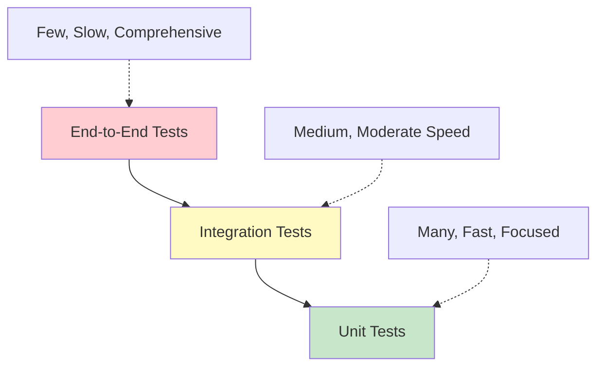

**Distribution:**
- Unit Tests: 70% (fast, focused on individual functions)
- Integration Tests: 20% (moderate, test component interaction)
- End-to-End Tests: 10% (slow, test complete workflows)

#### 10.1.2 Test Script Architecture

**test_fixes.py Structure:**

```python
import unittest
from pathlib import Path
import time

class TestResumeProcessing(unittest.TestCase):
    """Test resume parsing and entity extraction"""
    
    @classmethod
    def setUpClass(cls):
        """Setup test environment once"""
        cls.test_data_dir = Path("tests/data")
        cls.test_data_dir.mkdir(parents=True, exist_ok=True)
    
    def setUp(self):
        """Setup before each test"""
        self.start_time = time.time()
    
    def tearDown(self):
        """Cleanup after each test"""
        elapsed = time.time() - self.start_time
        print(f"\n{self._testMethodName}: {elapsed:.3f}s")
    
    def test_certification_extraction_accuracy(self):
        """Test certification extraction with known certifications"""
        test_cases = [
            {
                'text': 'AWS Certified Solutions Architect',
                'expected': ['AWS Solutions Architect'],
                'should_extract': True
            },
            {
                'text': 'Bachelor of Science in Computer Science',
                'expected': [],
                'should_extract': False  # Degree, not certification
            },
            {
                'text': 'Senior Software Engineer',
                'expected': [],
                'should_extract': False  # Job title, not certification
            }
        ]
        
        for case in test_cases:
            result = extract_certification_info(case['text'])
            
            if case['should_extract']:
                self.assertGreater(len(result), 0, 
                    f"Failed to extract: {case['expected']}")
            else:
                self.assertEqual(len(result), 0,
                    f"False positive: {case['text']}")
    
    def test_parallel_extraction_timeout(self):
        """Test that parallel extraction completes within timeout"""
        test_file = "tests/data/sample_resume.pdf"
        
        start = time.time()
        result = extract_comprehensive_entities(test_file)
        elapsed = time.time() - start
        
        # Should complete within 120s
        self.assertLess(elapsed, 120,
            f"Extraction took too long: {elapsed:.1f}s")
        
        # Should have all entity types
        expected_keys = [
            'name', 'skills', 'experience', 'education',
            'certifications', 'projects', 'languages'
        ]
        for key in expected_keys:
            self.assertIn(key, result,
                f"Missing entity type: {key}")

class TestEmbeddingGeneration(unittest.TestCase):
    """Test embedding generation and caching"""
    
    def test_embedding_dimensions(self):
        """Test that embeddings have correct dimensions"""
        texts = ["Software Engineer", "Python Developer"]
        
        embeddings = generate_embeddings(texts)
        
        self.assertEqual(embeddings.shape[0], 2)
        self.assertEqual(embeddings.shape[1], 384)
    
    def test_embedding_normalization(self):
        """Test that embeddings are normalized"""
        texts = ["Test text"]
        embeddings = generate_embeddings(texts)
        
        norm = np.linalg.norm(embeddings[0])
        self.assertAlmostEqual(norm, 1.0, places=5)
    
    def test_embedding_cache_hit(self):
        """Test that cache improves performance"""
        text = "Machine Learning Engineer"
        
        # First call (cache miss)
        start = time.time()
        emb1 = generate_embeddings([text])
        time1 = time.time() - start
        
        # Second call (cache hit)
        start = time.time()
        emb2 = generate_embeddings([text])
        time2 = time.time() - start
        
        # Cache should be faster
        self.assertLess(time2, time1 * 0.5,
            "Cache not improving performance")
        
        # Embeddings should be identical
        np.testing.assert_array_equal(emb1, emb2)

class TestSearchFunctionality(unittest.TestCase):
    """Test search and retrieval"""
    
    def test_hybrid_search(self):
        """Test hybrid search returns results"""
        query = "Python developer with AWS experience"
        
        results = hybrid_search(query, top_k=10)
        
        self.assertGreater(len(results), 0)
        self.assertLessEqual(len(results), 10)
        
        # Check result structure
        for result in results:
            self.assertIn('score', result)
            self.assertIn('metadata', result)
            self.assertIn('text', result)
    
    def test_search_relevance_ordering(self):
        """Test that results are ordered by relevance"""
        query = "Senior Machine Learning Engineer"
        
        results = hybrid_search(query, top_k=5)
        
        # Scores should be descending
        scores = [r['score'] for r in results]
        self.assertEqual(scores, sorted(scores, reverse=True))
    
    def test_filter_by_skills(self):
        """Test filtered search"""
        query = "software engineer"
        required_skills = ["Python", "AWS"]
        
        results = search_with_filters(
            query,
            skills=required_skills,
            top_k=10
        )
        
        # All results should have required skills
        for result in results:
            skills = result['metadata'].get('skills', [])
            for req_skill in required_skills:
                self.assertTrue(
                    any(req_skill.lower() in s.lower() for s in skills),
                    f"Missing required skill: {req_skill}"
                )

class TestLLMIntegration(unittest.TestCase):
    """Test LLM integration and response generation"""
    
    def test_llm_response_generation(self):
        """Test that LLM generates valid response"""
        context = "John Smith: 5 years Python, AWS certified"
        question = "Who has AWS certification?"
        
        response = generate_llm_response(context, question)
        
        self.assertIsInstance(response, str)
        self.assertGreater(len(response), 10)
        self.assertIn("John Smith", response)
    
    def test_llm_fallback(self):
        """Test LLM fallback mechanism"""
        # Simulate primary LLM failure
        with unittest.mock.patch('google.generativeai.GenerativeModel') as mock:
            mock.side_effect = Exception("API Error")
            
            context = "Test context"
            question = "Test question"
            
            # Should fallback to Ollama or simple response
            response = generate_llm_response(context, question)
            
            self.assertIsInstance(response, str)
            self.assertGreater(len(response), 0)
    
    def test_response_validation(self):
        """Test response validation catches issues"""
        # Test empty response
        result = validate_response("", "context", "question")
        self.assertFalse(result['valid'])
        
        # Test hallucinated names
        response = "Alice Johnson has 10 years experience"
        context = "Bob Smith: 5 years experience"
        result = validate_response(response, context, "who has experience?")
        
        self.assertFalse(result['valid'])
        self.assertIn('hallucinated', ' '.join(result['issues']).lower())

class TestCacheManagement(unittest.TestCase):
    """Test caching functionality"""
    
    def test_cache_save_load(self):
        """Test cache persistence"""
        cache = DocumentCache()
        
        # Add test data
        test_data = {
            'candidate_name': 'Test User',
            'skills': ['Python', 'Java']
        }
        
        test_file = "tests/data/test.pdf"
        cache.set(test_file, test_data)
        
        # Load cache
        retrieved = cache.get(test_file)
        
        self.assertIsNotNone(retrieved)
        self.assertEqual(retrieved['result'], test_data)
    
    def test_cache_invalidation(self):
        """Test cache invalidation"""
        cache = DocumentCache()
        
        test_file = "tests/data/test.pdf"
        cache.set(test_file, {'test': 'data'})
        
        # Invalidate
        cache.invalidate(test_file)
        
        # Should be gone
        result = cache.get(test_file)
        self.assertIsNone(result)
    
    def test_cache_deduplication(self):
        """Test that duplicate files are detected"""
        cache = DocumentCache()
        
        file1 = "tests/data/resume1.pdf"
        file2 = "tests/data/resume1_copy.pdf"  # Same content
        
        # Process first
        data1 = process_resume(file1)
        cache.set(file1, data1)
        
        # Check duplicate
        is_dup, existing = is_duplicate(file2, cache)
        
        self.assertTrue(is_dup)

if __name__ == '__main__':
    unittest.main(verbosity=2)
```

**Running Tests:**

```bash
# Run all tests
python test_fixes.py

# Run specific test class
python -m unittest test_fixes.TestResumeProcessing

# Run specific test
python -m unittest test_fixes.TestResumeProcessing.test_certification_extraction_accuracy

# Run with coverage
pip install coverage
coverage run -m unittest test_fixes
coverage report
coverage html  # Generate HTML report
```

### 10.2 Debugging Techniques

#### 10.2.1 Logging Configuration

**Comprehensive Logging Setup:**

```python
import logging
from logging.handlers import RotatingFileHandler
import sys

def setup_logging(log_level=logging.INFO):
    """
    Configure comprehensive logging
    
    Features:
    - Console output (colored)
    - File output (rotating)
    - Different formats for console vs file
    """
    # Create logs directory
    log_dir = Path("logs")
    log_dir.mkdir(exist_ok=True)
    
    # Root logger
    logger = logging.getLogger()
    logger.setLevel(log_level)
    
    # Console handler (colored)
    console_handler = logging.StreamHandler(sys.stdout)
    console_handler.setLevel(log_level)
    
    console_format = logging.Formatter(
        '%(levelname)s - %(message)s'
    )
    console_handler.setFormatter(console_format)
    
    # File handler (rotating, max 10MB, keep 5 files)
    file_handler = RotatingFileHandler(
        log_dir / "app.log",
        maxBytes=10 * 1024 * 1024,  # 10MB
        backupCount=5
    )
    file_handler.setLevel(logging.DEBUG)
    
    file_format = logging.Formatter(
        '%(asctime)s - %(name)s - %(levelname)s - %(funcName)s:%(lineno)d - %(message)s'
    )
    file_handler.setFormatter(file_format)
    
    # Add handlers
    logger.addHandler(console_handler)
    logger.addHandler(file_handler)
    
    # Log startup
    logging.info("=" * 60)
    logging.info("Application started")
    logging.info("=" * 60)

# Module-specific loggers
parser_logger = logging.getLogger('parser')
rag_logger = logging.getLogger('rag_engine')
extractor_logger = logging.getLogger('extractors')
```

**Contextual Logging:**

```python
def log_function_call(func):
    """Decorator to log function calls with arguments"""
    @wraps(func)
    def wrapper(*args, **kwargs):
        logger = logging.getLogger(func.__module__)
        
        # Log entry
        logger.debug(
            f"Calling {func.__name__} with "
            f"args={args[:2] if len(args) > 2 else args}, "  # Limit arg logging
            f"kwargs={list(kwargs.keys())}"
        )
        
        try:
            result = func(*args, **kwargs)
            
            # Log success
            logger.debug(f"{func.__name__} completed successfully")
            
            return result
        
        except Exception as e:
            # Log error with traceback
            logger.error(
                f"{func.__name__} failed: {str(e)}",
                exc_info=True
            )
            raise
    
    return wrapper

@log_function_call
def process_resume(file_path):
    # Processing logic
    pass
```

#### 10.2.2 Debug Mode

**Enhanced Debug Output:**

```python
DEBUG = os.getenv("DEBUG", "false").lower() == "true"

def debug_print(message, data=None):
    """Print debug information if DEBUG mode enabled"""
    if DEBUG:
        print(f"[DEBUG] {message}")
        if data:
            import pprint
            pprint.pprint(data)

def debug_search_results(query, results):
    """Debug search results in detail"""
    if not DEBUG:
        return
    
    print("\n" + "=" * 60)
    print(f"DEBUG: Search Results for '{query}'")
    print("=" * 60)
    
    for i, result in enumerate(results, 1):
        print(f"\n--- Result {i} ---")
        print(f"Score: {result['score']:.4f}")
        print(f"Candidate: {result['metadata'].get('candidate_name', 'Unknown')}")
        print(f"Section: {result['metadata'].get('section', 'Unknown')}")
        print(f"Text: {result['text'][:200]}...")
    
    print("\n" + "=" * 60)

def debug_embedding_stats(embeddings, label=""):
    """Debug embedding statistics"""
    if not DEBUG:
        return
    
    print(f"\n[DEBUG] Embedding Stats: {label}")
    print(f"  Shape: {embeddings.shape}")
    print(f"  Mean: {embeddings.mean():.4f}")
    print(f"  Std: {embeddings.std():.4f}")
    print(f"  Min: {embeddings.min():.4f}")
    print(f"  Max: {embeddings.max():.4f}")
    
    # Check normalization
    norms = np.linalg.norm(embeddings, axis=1)
    print(f"  Norm mean: {norms.mean():.4f} (should be ~1.0)")
```

#### 10.2.3 Profiling

**Performance Profiling:**

```python
import cProfile
import pstats
from io import StringIO

def profile_function(func):
    """Decorator to profile function performance"""
    @wraps(func)
    def wrapper(*args, **kwargs):
        profiler = cProfile.Profile()
        
        try:
            result = profiler.runcall(func, *args, **kwargs)
            
            # Print stats
            s = StringIO()
            ps = pstats.Stats(profiler, stream=s).sort_stats('cumulative')
            ps.print_stats(20)  # Top 20
            
            print(s.getvalue())
            
            return result
        
        finally:
            profiler.disable()
    
    return wrapper

@profile_function
def process_large_batch(files):
    # Processing logic
    pass
```

**Memory Profiling:**

```python
from memory_profiler import profile

@profile
def memory_intensive_function():
    """Profile memory usage line by line"""
    large_list = [i for i in range(1000000)]
    
    embeddings = generate_embeddings(texts)
    
    return embeddings

# Run with: python -m memory_profiler script.py
```

### 10.3 Common Issues and Solutions

#### 10.3.1 Timeout Errors

**Problem:** "1 (of 6) futures unfinished" in parallel extraction

**Root Cause:**
- Default timeout (60s) too short for complex resumes
- Individual task timeout (5s) insufficient for slow extractors

**Solution:**
```python
# Increase timeouts in parser.py
executor = ThreadPoolExecutor(max_workers=6)

futures = {
    executor.submit(extract_name, text): "name",
    # ... other extractors
}

# Wait with longer timeout
done, not_done = concurrent.futures.wait(
    futures.keys(),
    timeout=120,  # Increased from 60s
    return_when=concurrent.futures.FIRST_EXCEPTION
)

# Individual task timeout
try:
    result = future.result(timeout=30)  # Increased from 5s
except TimeoutError:
    logging.warning(f"Extractor {entity_type} timed out")
```

**Prevention:**
- Monitor extraction times
- Set timeouts based on P95 latency
- Implement per-extractor timeouts

#### 10.3.2 Certification Extraction False Positives

**Problem:** Job titles and degrees extracted as certifications

**Root Cause:**
- Similarity threshold too low (0.5)
- Insufficient false positive filtering

**Solution:**
```python
# Add false positive patterns
FALSE_POSITIVE_PATTERNS = [
    # Job titles
    r'\b(senior|junior|lead|principal|staff)\s+\w+\s+(engineer|developer)',
    
    # Degrees
    r'\b(bachelor|master|phd|doctorate)\s+(of|in)',
    
    # Generic patterns
    r'certified\s+\w+\s+(developer|engineer|specialist)$'
]

# Increase similarity threshold
def merge_certification_entries(certs):
    threshold = 0.65  # Increased from 0.5
    # ... merging logic

# Context-aware confidence adjustment
if 'experience' in section.lower():
    confidence -= 0.15  # Penalize if in experience section

if 'certification' in section.lower():
    confidence += 0.10  # Boost if in cert section
```

**Prevention:**
- Maintain false positive pattern list
- Use section context for confidence scoring
- Set minimum confidence threshold (0.6+)

#### 10.3.3 Memory Issues

**Problem:** Out of memory with large document sets

**Root Cause:**
- Loading all embeddings into memory
- No lazy loading
- Cache growing unbounded

**Solution:**
```python
# Implement lazy loading
class LazyEmbeddingLoader:
    def __init__(self, embedding_file):
        self.embedding_file = embedding_file
        self._embeddings = None
    
    @property
    def embeddings(self):
        if self._embeddings is None:
            self._embeddings = np.load(self.embedding_file)
        return self._embeddings
    
    def unload(self):
        self._embeddings = None
        gc.collect()

# Implement cache size limits
class BoundedCache:
    def __init__(self, max_size=1000):
        self.cache = OrderedDict()
        self.max_size = max_size
    
    def set(self, key, value):
        if len(self.cache) >= self.max_size:
            self.cache.popitem(last=False)  # Remove oldest
        self.cache[key] = value
```

**Prevention:**
- Monitor memory usage
- Implement cache eviction
- Use memory-mapped files for large arrays

#### 10.3.4 Vector Search Returns No Results

**Problem:** Search returns empty results

**Possible Causes & Solutions:**

```python
# Cause 1: Empty index
def check_index_status():
    """Check if index has data"""
    if faiss_index.ntotal == 0:
        logging.error("FAISS index is empty! Need to index documents first.")
        return False
    
    collection_info = client.get_collection(COLLECTION_NAME)
    if collection_info.points_count == 0:
        logging.error("Qdrant collection is empty!")
        return False
    
    return True

# Cause 2: Query embedding dimension mismatch
def validate_query_embedding(query_embedding):
    """Ensure query embedding has correct dimensions"""
    if query_embedding.shape[0] != 384:
        raise ValueError(
            f"Query embedding has wrong dimensions: "
            f"{query_embedding.shape[0]} (expected 384)"
        )

# Cause 3: Threshold too high
def search_with_debug(query, min_score=0.0):
    """Search with lowered threshold for debugging"""
    results = hybrid_search(query, top_k=50)
    
    if len(results) == 0:
        logging.warning("No results found, lowering threshold...")
        results = hybrid_search(query, top_k=50, min_score=-1.0)
    
    debug_print(f"Found {len(results)} results", results[:3])
    return results
```

#### 10.3.5 LLM Response Hallucination

**Problem:** LLM invents information not in context

**Detection:**
```python
def detect_hallucination(response, context):
    """
    Detect potential hallucinations
    
    Checks:
    - Candidate names not in context
    - Skills not mentioned in context
    - Numeric values that don't match
    """
    issues = []
    
    # Extract entities from response
    response_names = extract_names_from_response(response)
    response_skills = extract_skills_from_response(response)
    
    # Extract from context
    context_names = extract_names_from_context(context)
    context_skills = extract_skills_from_context(context)
    
    # Check names
    for name in response_names:
        if name not in context_names:
            issues.append(f"Hallucinated name: {name}")
    
    # Check skills
    for skill in response_skills:
        if skill not in context_skills:
            issues.append(f"Hallucinated skill: {skill}")
    
    return issues
```

**Prevention:**
```python
# Stronger prompt instructions
STRICT_PROMPT = """
CRITICAL INSTRUCTIONS:
1. Use ONLY information from the context above
2. Do NOT add, infer, or assume any information
3. If the answer is not in the context, say "Not found"
4. ALWAYS cite the candidate name when providing information
5. Do NOT invent names, numbers, or facts

CONTEXT:
{context}

QUESTION:
{question}
"""

# Lower temperature for factual responses
temperature = 0.0  # Completely deterministic
```

#### 10.3.6 Slow Query Performance

**Problem:** Queries taking > 5 seconds

**Diagnosis:**
```python
def diagnose_slow_query(query):
    """Break down query time to identify bottleneck"""
    times = {}
    
    # 1. Query embedding
    start = time.time()
    query_embedding = generate_embeddings([query])[0]
    times['embedding'] = time.time() - start
    
    # 2. Vector search
    start = time.time()
    vector_results = search_qdrant(query_embedding, top_k=100)
    times['vector_search'] = time.time() - start
    
    # 3. BM25 search
    start = time.time()
    bm25_results = bm25_search(query, top_k=100)
    times['bm25_search'] = time.time() - start
    
    # 4. Fusion
    start = time.time()
    fused_results = reciprocal_rank_fusion([vector_results, bm25_results])
    times['fusion'] = time.time() - start
    
    # 5. Cross-encoder reranking
    start = time.time()
    reranked = cross_encoder_rerank(query, fused_results)
    times['reranking'] = time.time() - start
    
    # 6. LLM response
    start = time.time()
    context = format_context(reranked[:10])
    response = generate_llm_response(context, query)
    times['llm'] = time.time() - start
    
    # Print breakdown
    total = sum(times.values())
    print("\nQuery Time Breakdown:")
    for stage, duration in times.items():
        pct = (duration / total) * 100
        print(f"  {stage:20s}: {duration:6.3f}s ({pct:5.1f}%)")
    print(f"  {'Total':20s}: {total:6.3f}s")
    
    return times
```

**Optimization:**
```python
# If embedding is slow: Use batch processing or smaller model
# If vector search is slow: Optimize index (see Section 7.3)
# If BM25 is slow: Reduce corpus size or use approximate BM25
# If reranking is slow: Enable cache, reduce candidates
# If LLM is slow: Use smaller model or reduce context
```

### 10.4 Error Tracking

#### 10.4.1 Error Monitoring

```python
class ErrorTracker:
    """Track and analyze errors"""
    
    def __init__(self):
        self.errors = []
    
    def log_error(self, error_type, message, context=None):
        """Log an error with context"""
        self.errors.append({
            'timestamp': time.time(),
            'type': error_type,
            'message': message,
            'context': context
        })
    
    def get_error_summary(self):
        """Get summary of errors"""
        if not self.errors:
            return "No errors logged"
        
        # Count by type
        error_counts = {}
        for error in self.errors:
            error_type = error['type']
            error_counts[error_type] = error_counts.get(error_type, 0) + 1
        
        # Find most common
        most_common = sorted(
            error_counts.items(),
            key=lambda x: x[1],
            reverse=True
        )
        
        summary = f"Total errors: {len(self.errors)}\n"
        summary += "\nMost common:\n"
        for error_type, count in most_common[:5]:
            summary += f"  {error_type}: {count}\n"
        
        return summary
    
    def get_recent_errors(self, n=10):
        """Get most recent errors"""
        return self.errors[-n:]

# Global error tracker
error_tracker = ErrorTracker()
```

#### 10.4.2 Crash Recovery

```python
def safe_execute(func, *args, **kwargs):
    """
    Execute function with crash recovery
    
    Returns:
        tuple: (success, result_or_error)
    """
    try:
        result = func(*args, **kwargs)
        return True, result
    
    except Exception as e:
        # Log error
        logging.error(f"Function {func.__name__} crashed: {e}", exc_info=True)
        error_tracker.log_error(
            error_type=type(e).__name__,
            message=str(e),
            context={'function': func.__name__, 'args': str(args)[:100]}
        )
        
        # Return error
        return False, str(e)

# Usage
success, result = safe_execute(process_resume, "path/to/resume.pdf")
if not success:
    st.error(f"Processing failed: {result}")
```

### 10.5 Health Checks

#### 10.5.1 System Health Monitor

```python
def check_system_health():
    """
    Comprehensive system health check
    
    Returns:
        dict: Health status for each component
    """
    health = {}
    
    # 1. Check index status
    try:
        if faiss_index and faiss_index.ntotal > 0:
            health['faiss_index'] = {
                'status': 'healthy',
                'vectors': faiss_index.ntotal
            }
        else:
            health['faiss_index'] = {
                'status': 'empty',
                'vectors': 0
            }
    except Exception as e:
        health['faiss_index'] = {
            'status': 'error',
            'message': str(e)
        }
    
    # 2. Check Qdrant
    try:
        collection_info = client.get_collection(COLLECTION_NAME)
        health['qdrant'] = {
            'status': 'healthy',
            'points': collection_info.points_count
        }
    except Exception as e:
        health['qdrant'] = {
            'status': 'error',
            'message': str(e)
        }
    
    # 3. Check cache
    try:
        cache_stats = cache.get_cache_stats()
        health['cache'] = {
            'status': 'healthy',
            'entries': cache_stats['total_entries'],
            'size_mb': cache_stats['total_size_mb']
        }
    except Exception as e:
        health['cache'] = {
            'status': 'error',
            'message': str(e)
        }
    
    # 4. Check LLM connectivity
    try:
        test_response = generate_llm_response("test", "test")
        health['llm'] = {
            'status': 'healthy',
            'provider': 'google' if 'gemini' in str(test_response).lower() else 'ollama'
        }
    except Exception as e:
        health['llm'] = {
            'status': 'error',
            'message': str(e)
        }
    
    # 5. Check memory
    import psutil
    mem = psutil.virtual_memory()
    health['memory'] = {
        'status': 'healthy' if mem.percent < 90 else 'warning',
        'used_percent': mem.percent,
        'available_gb': mem.available / 1024**3
    }
    
    # 6. Check disk space
    disk = psutil.disk_usage('/')
    health['disk'] = {
        'status': 'healthy' if disk.percent < 90 else 'warning',
        'used_percent': disk.percent,
        'available_gb': disk.free / 1024**3
    }
    
    return health

def render_health_dashboard():
    """Render health check dashboard in Streamlit"""
    st.header("System Health")
    
    health = check_system_health()
    
    for component, status in health.items():
        with st.expander(f"{component.replace('_', ' ').title()}"):
            if status['status'] == 'healthy':
                st.success("✅ Healthy")
            elif status['status'] == 'warning':
                st.warning("⚠️ Warning")
            else:
                st.error("❌ Error")
            
            st.json(status)
```

### 10.6 Performance Benchmarks

#### 10.6.1 Benchmark Suite

```python
class PerformanceBenchmark:
    """Performance benchmark suite"""
    
    def __init__(self):
        self.results = {}
    
    def benchmark_document_processing(self, test_files):
        """Benchmark document processing speed"""
        times = []
        
        for file_path in test_files:
            start = time.time()
            process_resume(file_path)
            elapsed = time.time() - start
            times.append(elapsed)
        
        self.results['document_processing'] = {
            'mean': np.mean(times),
            'median': np.median(times),
            'p95': np.percentile(times, 95),
            'p99': np.percentile(times, 99)
        }
    
    def benchmark_embedding_generation(self, texts, batch_sizes=[1, 8, 16, 32]):
        """Benchmark embedding generation at different batch sizes"""
        results = {}
        
        for batch_size in batch_sizes:
            times = []
            
            for i in range(0, len(texts), batch_size):
                batch = texts[i:i+batch_size]
                
                start = time.time()
                generate_embeddings(batch)
                elapsed = time.time() - start
                
                times.append(elapsed / len(batch))  # Per-item time
            
            results[f'batch_{batch_size}'] = {
                'mean_per_item': np.mean(times),
                'throughput': 1.0 / np.mean(times)
            }
        
        self.results['embedding_generation'] = results
    
    def benchmark_search(self, queries):
        """Benchmark search latency"""
        times = {
            'semantic': [],
            'keyword': [],
            'hybrid': []
        }
        
        for query in queries:
            # Semantic search
            start = time.time()
            semantic_search(query)
            times['semantic'].append(time.time() - start)
            
            # Keyword search
            start = time.time()
            bm25_search(query)
            times['keyword'].append(time.time() - start)
            
            # Hybrid search
            start = time.time()
            hybrid_search(query)
            times['hybrid'].append(time.time() - start)
        
        for search_type, type_times in times.items():
            self.results[f'search_{search_type}'] = {
                'mean': np.mean(type_times),
                'p95': np.percentile(type_times, 95)
            }
    
    def print_report(self):
        """Print benchmark report"""
        print("\n" + "=" * 60)
        print("PERFORMANCE BENCHMARK REPORT")
        print("=" * 60)
        
        for category, metrics in self.results.items():
            print(f"\n{category.upper()}:")
            
            if isinstance(metrics, dict):
                for metric, value in metrics.items():
                    if isinstance(value, dict):
                        print(f"  {metric}:")
                        for k, v in value.items():
                            print(f"    {k}: {v:.4f}")
                    else:
                        print(f"  {metric}: {value:.4f}")
        
        print("\n" + "=" * 60)

# Run benchmarks
benchmark = PerformanceBenchmark()
benchmark.benchmark_document_processing(test_files)
benchmark.benchmark_embedding_generation(test_texts)
benchmark.benchmark_search(test_queries)
benchmark.print_report()
```

#### 10.6.2 Performance Targets

**Target Latencies:**

```
Operation                    Target      Acceptable    Investigation
---------------------------------------------------------------------------
Document Processing          < 3s        < 5s          > 8s
Embedding (32 batch)        < 1s        < 2s          > 3s
Semantic Search             < 50ms      < 100ms       > 200ms
Keyword Search (BM25)       < 30ms      < 80ms        > 150ms
Hybrid Search               < 100ms     < 200ms       > 400ms
Cross-Encoder Rerank        < 100ms     < 200ms       > 500ms
LLM Response (Gemini)       < 2s        < 4s          > 6s
End-to-End Query            < 3s        < 5s          > 8s
```

### 10.7 Troubleshooting Checklist

#### 10.7.1 Quick Diagnostic Steps

**When Things Go Wrong:**

```
1. Check logs:
   - logs/app.log (application logs)
   - Look for ERROR or WARNING messages
   - Check timestamps for when issue started

2. Verify data:
   - Are documents indexed? (check collection count)
   - Is cache populated? (check cache stats)
   - Are embeddings generated? (check index size)

3. Test connectivity:
   - Qdrant server running? (http://localhost:6333/dashboard)
   - Ollama server running? (ollama list)
   - Google API key valid? (check .env)

4. Check resources:
   - Memory usage (htop or Task Manager)
   - Disk space (df -h)
   - CPU usage (top)

5. Validate configuration:
   - .env file present and correct?
   - Required packages installed? (pip list)
   - Correct Python version? (python --version)

6. Test components individually:
   - Can you extract text from a PDF?
   - Can you generate embeddings?
   - Can you search the index?
   - Can you get LLM response?

7. Check for updates:
   - Are dependencies up to date?
   - Any known issues in GitHub?
   - Check changelog for breaking changes
```

#### 10.7.2 Common Error Messages

**Error:** `ModuleNotFoundError: No module named 'XXX'`
- **Solution:** `pip install XXX` or `pip install -r requirements.txt`

**Error:** `CUDA out of memory`
- **Solution:** Reduce batch size, use CPU, or upgrade hardware

**Error:** `qdrant_client.http.exceptions.UnexpectedResponse: 404`
- **Solution:** Collection doesn't exist, run initialization

**Error:** `google.api_core.exceptions.PermissionDenied: 403`
- **Solution:** Invalid API key, check .env file

**Error:** `TimeoutError: Future timed out`
- **Solution:** Increase timeout values (see Section 10.3.1)

**Error:** `numpy.linalg.LinAlgError: Array must not contain infs or NaNs`
- **Solution:** Check embedding normalization, validate input data

**Error:** `RecursionError: maximum recursion depth exceeded`
- **Solution:** Check for circular references, reduce recursion depth

### 10.8 Documentation and Knowledge Base

#### 10.8.1 Maintaining Documentation

**Documentation Structure:**

```
docs/
├── README.md                    # Quick start guide
├── TECHNICAL_DOCUMENTATION.md   # This document
├── API_REFERENCE.md            # API documentation
├── TROUBLESHOOTING.md          # Common issues
├── CHANGELOG.md                # Version history
└── examples/
    ├── basic_usage.py
    ├── custom_extractors.py
    └── advanced_rag.py
```

**Keeping Documentation Updated:**

```python
def generate_api_docs():
    """Auto-generate API documentation from docstrings"""
    import inspect
    
    modules = [parser, rag_engine, utils]
    
    docs = []
    
    for module in modules:
        docs.append(f"## {module.__name__}\n")
        
        for name, obj in inspect.getmembers(module):
            if inspect.isfunction(obj) or inspect.isclass(obj):
                docs.append(f"### {name}\n")
                docs.append(f"{inspect.getdoc(obj)}\n")
    
    with open("docs/API_REFERENCE.md", "w") as f:
        f.write("\n".join(docs))
```

#### 10.8.2 FAQ Section

**Frequently Asked Questions:**

**Q: How do I add a new entity extractor?**
```python
# 1. Create new extractor file in app/extractors/
# 2. Implement extraction function
# 3. Add to parser.py extract_comprehensive_entities()
# 4. Test with sample resumes
```

**Q: How do I change the embedding model?**
```python
# In rag_engine.py:
from fastembed import TextEmbedding

# Change model name
model = TextEmbedding(
    model_name="sentence-transformers/all-MiniLM-L6-v2",  # New model
    max_length=512
)

# Remember to rebuild index with new embeddings
```

**Q: How do I backup my data?**
```python
from utils import backup_data

backup_path = backup_data(backup_dir="backups")
print(f"Backup saved to: {backup_path}")
```

**Q: How do I improve search accuracy?**
```
1. Use hybrid search (combines semantic + keyword)
2. Enable cross-encoder reranking
3. Increase top_k to get more candidates
4. Tune fusion weights (adjust semantic vs keyword importance)
5. Add query expansion for synonyms
```

### 10.9 Best Practices Summary

#### 10.9.1 Development Best Practices

1. **Always Use Version Control**
   - Commit frequently with meaningful messages
   - Use branches for new features
   - Tag releases

2. **Write Tests First (TDD)**
   - Write test before implementing feature
   - Run tests after every change
   - Aim for 80%+ code coverage

3. **Log Everything Important**
   - Log entry/exit of major functions
   - Log all errors with context
   - Use appropriate log levels

4. **Handle Errors Gracefully**
   - Use try-except blocks
   - Provide user-friendly error messages
   - Implement fallback mechanisms

5. **Optimize Lazily**
   - Make it work first
   - Profile before optimizing
   - Focus on bottlenecks

#### 10.9.2 Deployment Best Practices

1. **Environment Management**
   - Use virtual environments
   - Pin dependency versions
   - Document system requirements

2. **Configuration Management**
   - Use environment variables
   - Never commit secrets
   - Provide example config files

3. **Monitoring**
   - Set up health checks
   - Monitor resource usage
   - Track error rates

4. **Backup and Recovery**
   - Regular automated backups
   - Test restore procedures
   - Document recovery steps

5. **Documentation**
   - Keep docs up to date
   - Provide examples
   - Document breaking changes

---

## Conclusion

This comprehensive technical documentation covers all aspects of the RAG-Resume system from A to Z:

1. **Core Concepts** - Understanding RAG, NLP, and embeddings
2. **Architecture** - System design and patterns
3. **Entity Extraction** - 13 specialized extractors with parallel processing
4. **RAG Engine** - Embeddings, vector search, and BM25
5. **Search & Retrieval** - Query understanding, reranking, diverse retrieval
6. **LLM Integration** - Multi-provider support, prompt engineering
7. **Performance** - Caching, batching, and optimization
8. **Data Processing** - File handling, validation, storage
9. **Interface** - Streamlit UI, session management, error handling
10. **Testing & Debugging** - Comprehensive testing, troubleshooting, monitoring

### Key Takeaways

**For Developers:**
- System uses modern NLP techniques (embeddings, transformers)
- Hybrid search combines multiple approaches for accuracy
- Caching and batching critical for performance
- Comprehensive error handling and logging essential

**For System Administrators:**
- Monitor memory and disk usage
- Regular backups recommended
- Health checks detect issues early
- Log files essential for troubleshooting

**For Users:**
- Upload resumes in PDF or DOCX format
- System processes automatically with caching
- Natural language queries supported
- Results ranked by relevance

### Future Enhancements

Potential areas for improvement:
1. GPU acceleration for embeddings
2. Real-time indexing (no rebuild required)
3. Multi-language support
4. Advanced entity relationships
5. Batch query processing
6. API endpoints for programmatic access
7. Role-based access control
8. Audit logging

### Resources

- **Code Repository:** GitHub
- **Issue Tracker:** GitHub Issues
- **Documentation:** This file + inline docstrings
- **Community:** GitHub Discussions

---

*Last Updated: October 4, 2025*
